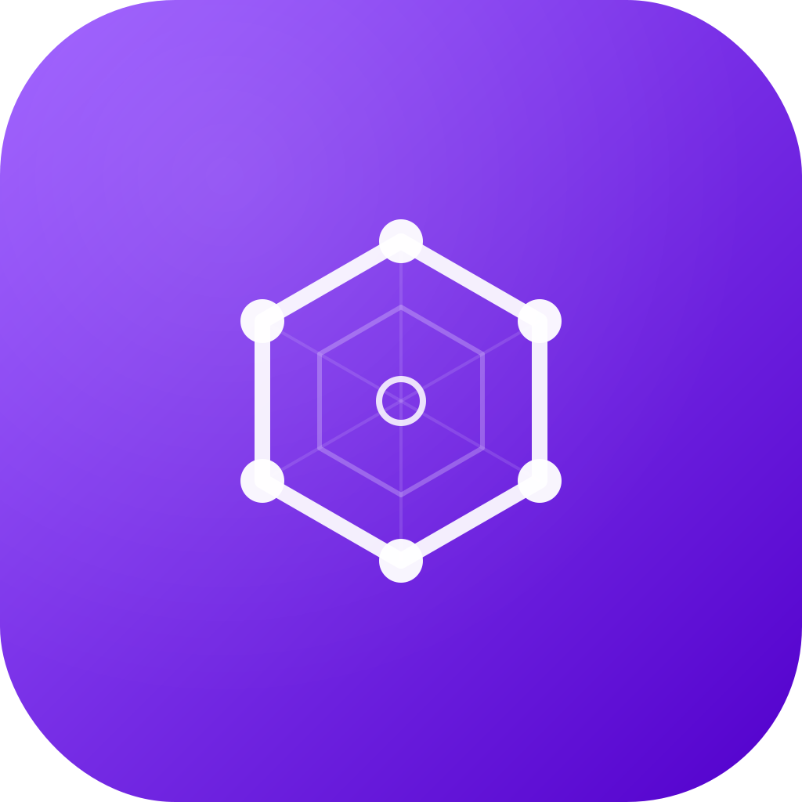
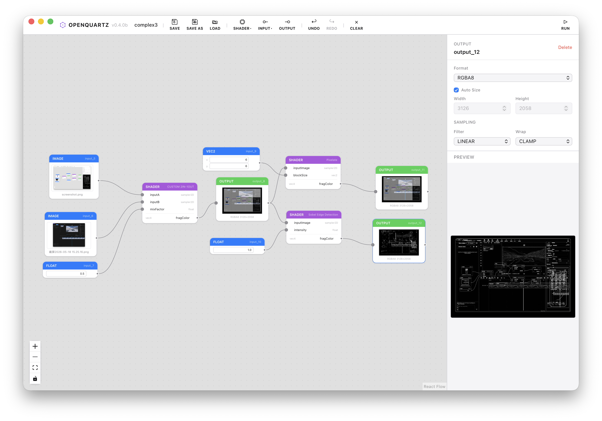

<p align="center">
  
</p>

<h1 align="center">Open Quartz</h1>

<p align="center">
  A real-time heterogeneous video pipeline editor — GPU shaders, neural networks, and CPU math in one graph.
</p>

<p align="center">
  
</p>

Open Quartz is a node-based, hardware-accelerated framework for authoring real-time video processing pipelines. It fuses WebGPU/WebGL shader execution, ONNX neural-network inference, and CPU-side math into a single heterogeneous graph that runs at interactive frame rates. Connect source nodes (camera, video files, images, raw framebuffers), processing nodes (31 GLSL shader presets, 29 math ops, 7 ONNX models + custom), and renderer outputs on an infinite canvas. Inspired by Apple Quartz Composer, Shadertoy, and chaiNNer.

## Node Catalog

### Source Nodes

| Node | Type | Output | Description |
|------|------|--------|-------------|
| **Image** | Input | `sampler2D` | Load images as GPU textures. Drag-and-drop or file picker. |
| **Video** | Input | `sampler2D` | Camera or video file input via `VideoTexture`. Auto-updates each frame. |
| **Framebuffer** | Input | `sampler2D` | Raw binary dump files with configurable format (RGBA8/RGBA32F/RG8/RG32F/R8/R32F/NV12), width, height, stride. |
| **Time** | System | `float` | Elapsed time in seconds since Play. |
| **Time Delta** | System | `float` | Frame delta time. |
| **Frame** | System | `int` | Current frame number. |
| **Mouse** | System | `vec4` | Mouse position and click state (Shadertoy `iMouse` convention). |
| **Resolution** | System | `vec3` | Canvas resolution and pixel ratio. |
| **float / int / vec2-4 / mat2-4** | Constant | Various | Editable scalar, vector, and matrix values. |

### Shader Nodes (31 presets + custom)

| Category | Shaders |
|----------|---------|
| **Filter** | Resample, Sobel Edge Detection, Gaussian Blur 3×3, Box Blur, Sharpen, Emboss, Pixelate |
| **Color** | Grayscale, Brightness/Contrast, Hue Rotate, Threshold, Sepia |
| **Generator** | Solid Color, Gradient, Checkerboard, Noise, Circle |
| **Blend** | Add, Multiply, Screen, Overlay, Difference, Exclusion, Soft Light |
| **Distortion** | Twirl, Ripple, Displacement, Barrel, Pinch |
| **Custom** | Custom Shader (1 input), Custom 2-in-1 (2 inputs). Full GLSL 300 es editor with syntax highlighting, linting, and autocompletion. |

### Math Nodes (29 operations)

| Category | Operations |
|----------|------------|
| **Arithmetic** | add, subtract, multiply, divide, negate, modulo |
| **Range** | min, max, clamp, saturate, step, smoothstep, abs, sign |
| **Trigonometry** | sin, cos, tan, asin, acos, atan |
| **Exponential** | pow, sqrt, exp, log |
| **Interpolation** | mix |
| **Rounding** | floor, ceil, round, fract |

Auto type inference from connected peers. CPU-only evaluation, results propagate to downstream shader uniforms.

### ONNX Neural Network Nodes (7 models + custom)

| Category | Model | Size | Input | Output | Task |
|----------|-------|------|-------|--------|------|
| **Detection** | YOLOv8n | 12.8MB | 640×640 | `roi` + `sampler2D` overlay | 80-class COCO object detection |
| **Super-Resolution** | Sub-pixel CNN 3× | 0.2MB | 224×224 fixed | `sampler2D` 3× upscaled | Lightweight Y-channel SR |
| **Super-Resolution** | Real-ESRGAN 4× | 4.9MB | dynamic | `sampler2D` 4× upscaled | Photo-realistic upscaling |
| **Background Removal** | U²Net-P | 4.4MB | 320×320 fixed | `sampler2D` RGBA (alpha=mask) | General-purpose foreground extraction |
| **Background Removal** | MODNet | 24.7MB | 512×512 fixed | `sampler2D` RGBA (alpha=matte) | Portrait-focused matting |
| **Depth Estimation** | MiDaS v2.1 Small | 63MB | 256×256 fixed | `sampler2D` grayscale depth | Monocular relative depth |
| **Custom** | User `.onnx` file | any | auto-introspected | auto-introspected | Load any ONNX model, ports generated from I/O metadata |

All models auto-download on first use. Tiled inference engine handles arbitrary input sizes. Adaptive WebGPU→WASM fallback for incompatible GPUs. Backend probe at load time — user sees "CPU fallback" badge before pressing Play.

### Output Nodes

| Node | Input | Description |
|------|-------|-------------|
| **Renderer** | `sampler2D` | Explicit output viewer (Quartz Composer QCView equivalent). In-place preview, fullscreen live view, frame capture as PNG. |

## Features

### Realtime Rendering
- **rAF-driven rendering loop** with PLAY / PAUSE / STOP transport controls
- **Host/Compositor architecture** inspired by Quartz Composer's QCRenderer
- **Shadertoy-compatible builtin uniforms**: `iTime`, `iTimeDelta`, `iFrame`, `iDate`, `iMouse`, `iResolution`
- **Static pipeline optimization** — graphs without time-varying inputs render one frame then stop; async texture loads awaited before first render
- **GPU-only output path** — no `readPixels` in the realtime loop; preview via mirror canvas blit
- **Feedback / Accumulator** — per-node ping-pong render targets with `previousFrame` uniform for temporal effects (reaction-diffusion, trails, fluid sim)

### Node Graph Editor
- Drag, connect, and arrange nodes on an infinite canvas (React Flow)
- Bezier curve edges with type-safe connections — ports carry GLSL type metadata
- MiniMap, box selection, fit-to-view

### Node Inspector (Side Panel)
- CodeMirror 6 shader editor with GLSL syntax highlighting, error linting, and autocompletion
- Read-only shader viewer for prebuilt catalog shaders (code visible for learning, not editable)
- Port inspector with color-coded type indicators and inline uniform editing
- Per-component vector editing (x/y/z/w) for vec2-4 uniforms
- Per-node live preview readback (selected node only, zero overhead when unselected)
- Output preview, Auto Size, sampling config (filter/wrap)

### Preview Lightbox
- Full-screen viewer with scroll-to-zoom, drag-to-pan, double-click reset
- Nearest-neighbor rendering for pixel inspection
- Save as PNG, color picker with coordinate display

### Project Management
- Save / Save As / Load (`.quartz.json` files)
- 50-level undo/redo with Cmd/Ctrl+Z / Cmd/Ctrl+Shift+Z

### Desktop App (Tauri)
- Native desktop application via Tauri 2
- Custom titlebar (macOS traffic lights, Windows min/max/close)
- Video file persistence via asset protocol

## Getting Started

```bash
npm install
npm run dev
```

Open http://localhost:5173 in your browser. See `docs/` for architecture and design documents.

## Testing

```bash
npm test               # 1124 unit tests (fast, CI gate)
npm run test:models    # 15 ONNX functional tests (real models, real inference)
npm run test:shaders   # 6 WebGL2 bit-true tests (system browser, real GPU)
```

## Desktop app (Tauri)

```bash
npm run tauri dev      # development
npm run tauri build    # production installer
```

## Build (web)

```bash
npm run build          # output to dist/
```

## Tech Stack

React 19 · TypeScript 6 · Vite 8 · React Flow 12 · Three.js · Zustand 5 · Immer · CodeMirror 6 · Tailwind CSS 4 · Tauri 2 · onnxruntime-web/node

## Roadmap

### Full GPU Pipeline (primary focus)

The current pipeline has two CPU roundtrips per ONNX inference frame — `readPixels` to feed the model, and `readback` to consume the result. The goal is a **zero-copy, all-GPU datapath**: WebGPU shaders → ONNX WebGPU inference → WebGPU compute post-processing → WebGPU shaders, with data never leaving VRAM.

| Phase | What | Status |
|-------|------|--------|
| **1. Delete Rust WASM** | Rewrite YOLO decode + NMS in TypeScript (~200 lines), remove `rust/crates/`, `wasm-pack` dependency | 🔜 Next |
| **2. Node-based post-processing** | Decode/NMS as independent graph nodes, Overlay as shader node — detection pipeline becomes composable | Planned |
| **3. WebGPU renderer** | Three.js `WebGLRenderer` → `WebGPURenderer` — shader output becomes `GPUTexture` | Planned |
| **4. ORT I/O binding** | ONNX inference reads/writes `GPUTexture` directly via `io_binding` — eliminates readPixels bottleneck | Planned |
| **5. Compute shader post-processing** | Decode/NMS as WebGPU compute shaders + `tensor` data type — eliminates CPU readback for post-processing | Planned |
| **6. Shared GPUDevice** | Three.js and ORT share one `GPUDevice` — true zero-copy end-to-end | Planned |

### Quartz Composer parity

| Patch | Description | Complexity |
|-------|-------------|------------|
| **Delay (1-frame)** | Read another node's previous frame output | Shares ping-pong infra with Accumulator |
| **Image Transition** | Animated wipe/dissolve/push between two images | Shader preset + iTime |
| **Iterator / Replicate** | Execute a sub-graph N times per frame with varying params | Graph engine loop construct |
| **Macro Patch** | Collapse a sub-graph into a reusable compound node | Graph serialization + UI |
| **Bloom** | Multi-pass blur + additive blend (CIFilter equivalent) | Multi-pass rendering |
| **Motion Blur** | Directional / radial blur driven by velocity | Feedback or multi-sample |
| **Sample & Hold** | Latch a value and hold until triggered | Stateful node type |

## License

MIT — see [LICENSE](LICENSE).
