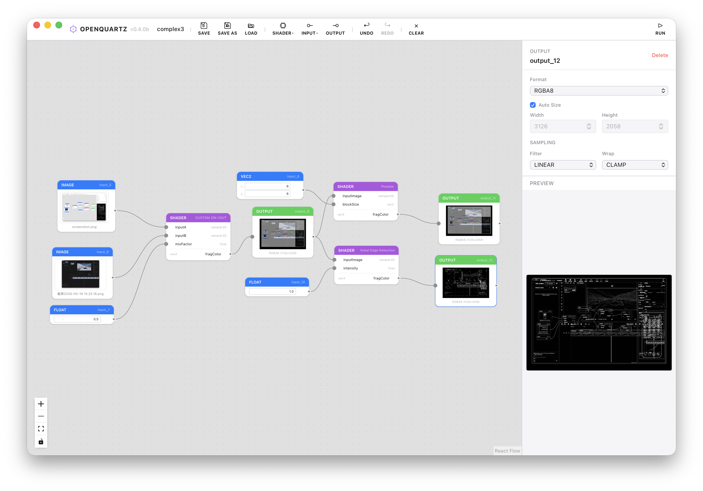

<p align="center">
  
</p>

<h1 align="center">Open Quartz</h1>

<p align="center">
  A real-time heterogeneous video pipeline editor — GPU shaders, neural networks, and CPU math in one graph.
</p>

<p align="center">
  
</p>

Open Quartz is a node-based, hardware-accelerated framework for authoring real-time video processing pipelines. It fuses WebGPU shader execution (WGSL), ONNX neural-network inference, and CPU-side math into a single heterogeneous graph that runs at interactive frame rates. Connect source nodes (camera, video files, images, raw framebuffers), processing nodes (28 WGSL shader presets, 29 math ops, 7 ONNX models + custom), and renderer outputs on an infinite canvas. Inspired by Apple Quartz Composer, Shadertoy, and chaiNNer.

## Node Catalog

### Source Nodes

| Node | Type | Output | Description |
|------|------|--------|-------------|
| **Image** | Input | `sampler2D` | Load images as GPU textures. Drag-and-drop or file picker. |
| **Video** | Input | `sampler2D` | Camera or video file input via browser HTML media; native FFmpeg decoding is available in the Tauri capability runtime. |
| **Framebuffer** | Input | `sampler2D` | Raw binary dump files with configurable format (RGBA8/RGBA32F/RG8/RG32F/R8/R32F/NV12), width, height, stride. |
| **Time** | System | `float` | Elapsed time in seconds since Play. |
| **Time Delta** | System | `float` | Frame delta time. |
| **Frame** | System | `int` | Current frame number. |
| **Mouse** | System | `vec4` | Mouse position and click state (Shadertoy `iMouse` convention). |
| **Resolution** | System | `vec3` | Canvas resolution and pixel ratio. |
| **float / int / vec2-4 / mat2-4** | Constant | Various | Editable scalar, vector, and matrix values. |

### Shader Nodes (28 presets + custom)

| Category | Shaders |
|----------|---------|
| **Filter** | Resample, Sobel Edge Detection, Gaussian Blur 3×3, Box Blur, Sharpen, Emboss, Pixelate |
| **Color** | Grayscale, Brightness/Contrast, Hue Rotate, Threshold, Sepia |
| **Generator** | Solid Color, Gradient, Checkerboard, Noise, Circle |
| **Blend** | Add, Multiply, Screen, Overlay, Difference, Exclusion, Soft Light |
| **Distortion** | Twirl, Ripple, Displacement, Barrel, Pinch |
| **Custom** | Custom Shader (1 input), Custom 2-in-1 (2 inputs). Full WGSL editor with syntax highlighting, GPU validation linting, and shader/port documentation tooltips. |

### Math Nodes (29 operations)

| Category | Operations |
|----------|------------|
| **Arithmetic** | add, subtract, multiply, divide, negate, modulo |
| **Range** | min, max, clamp, saturate, step, smoothstep, abs, sign |
| **Trigonometry** | sin, cos, tan, asin, acos, atan |
| **Exponential** | pow, sqrt, exp, log |
| **Interpolation** | mix |
| **Rounding** | floor, ceil, round, fract |

Auto type inference from connected peers. CPU-only evaluation, results propagate to downstream shader uniforms.

### ONNX Neural Network Nodes (7 models + custom)

| Category | Model | Size | Input | Output | Task |
|----------|-------|------|-------|--------|------|
| **Detection** | YOLOv8n | 12.8MB | 640×640 | `roi` + `sampler2D` overlay | 80-class COCO object detection |
| **Super-Resolution** | Sub-pixel CNN 3× | 0.2MB | 224×224 fixed | `sampler2D` 3× upscaled | Lightweight Y-channel SR |
| **Super-Resolution** | Real-ESRGAN 4× | 4.9MB | dynamic | `sampler2D` 4× upscaled | Photo-realistic upscaling |
| **Background Removal** | U²Net-P | 4.4MB | 320×320 fixed | `sampler2D` RGBA (alpha=mask) | General-purpose foreground extraction |
| **Background Removal** | MODNet | 24.7MB | 512×512 fixed | `sampler2D` RGBA (alpha=matte) | Portrait-focused matting |
| **Depth Estimation** | MiDaS v2.1 Small | 63MB | 256×256 fixed | `sampler2D` grayscale depth | Monocular relative depth |
| **Custom** | User `.onnx` file | any | auto-introspected | auto-introspected | Load any ONNX model, ports generated from I/O metadata |

All models auto-download on first use. Browser hosts use adaptive WebGPU→WASM fallback. Tauri hosts run graph-integrated native ORT on CPU or DirectML with observable fallback, async texture/tensor completion, task data, and downstream GPU continuation.

### Output Nodes

| Node | Input | Description |
|------|-------|-------------|
| **Renderer** | `sampler2D` | Explicit output viewer (Quartz Composer QCView equivalent) with in-place preview and fullscreen output mirror. |

## Features

- **Worker-owned realtime rendering** — browser playback runs in a dedicated Worker with `OffscreenCanvas`; the Rust/WASM runtime owns clock, graph work batches, lifecycle, and output delivery. The React thread receives typed frame/output projections only.
- **GPU-first output path** — the main realtime output stays on GPU; only selected preview or explicit screenshot/output requests perform readback.
- **Multi-presenter GPU boundary** — Rust presentation sinks receive retained GPU handles through independent latest-frame mailboxes. Windows native consumers can acquire leased shared DXGI textures with NT resource/fence handles; a three-slot pool provides explicit backpressure without moving pixels through CPU memory.
- **Feedback / Accumulator** — Rust-planned per-node ping-pong work is executed by the browser GPU adapter for temporal effects.

### Node Graph Editor
- Drag, connect, and arrange nodes on an infinite canvas (React Flow)
- Bezier curve edges with type-safe connections — ports carry WGSL type metadata
- MiniMap, box selection, fit-to-view

### Node Inspector (Side Panel)
- CodeMirror 6 shader editor with WGSL syntax highlighting, GPU validation (red squiggly lines via `createShaderModule`), and debounced port reparse
- Read-only shader viewer for prebuilt catalog shaders (code visible for learning, not editable)
- Port inspector with color-coded type indicators and inline uniform editing
- Per-component vector editing (x/y/z/w) for vec2-4 uniforms
- Per-node live preview readback (selected node only, zero overhead when unselected)
- Output preview, Auto Size, sampling config (filter/wrap)

### Preview Lightbox
- Full-screen viewer with scroll-to-zoom, drag-to-pan, double-click reset
- Nearest-neighbor rendering for pixel inspection
- Save as PNG, color picker with coordinate display

### Project Management
- Save / Save As / Load (`.quartz.json` files)
- 50-level undo/redo with Cmd/Ctrl+Z / Cmd/Ctrl+Shift+Z

### Desktop App (Tauri)
- Native desktop application via Tauri 2
- Custom titlebar (macOS traffic lights, Windows min/max/close)
- Video file persistence via asset protocol
- Native Rust production runtime with an offscreen wgpu executor, DX12/Metal/Vulkan backend selection, FFmpeg file/camera decoding, Windows x64 file-source D3D12VA→P010 GPU import, and CPU/DirectML ONNX graph execution
- `PipelineService` selects exactly one host runtime: browser uses `RealtimeHost`; Tauri uses `NativePipelineRuntime` and draws bounded native previews directly into existing Renderer canvases—no separate output window
- Native graph metadata, media/model resources, decoded frames, ONNX task pixels, and per-frame commands stay on their owning side of the Tauri boundary; renderer previews are coalesced and size-bounded, while SAVE/screenshot performs an explicit full-resolution readback
- Shared-texture and hardware-frame contracts cover DXGI/IOSurface/DMA-BUF. Windows x64 file-video now uses D3D12VA→wgpu P010 import and a WebView2 TextureStream consumer with StartRequested handling, reusable texture allocation, adapter-capability retry, first-frame handshake, and accurate presented-frame cadence telemetry; the tested 1920×1080 H.264 path sustains 61.31 FPS over a 10-second native benchmark with zero CPU-copy bytes. Camera/non-Windows video retains the explicit CPU-copy fallback; IOSurface, DMA-BUF, and camera hardware-frame adapters remain follow-up work.
- WebView fallback remains lossless bounded RGBA readback. No H.264 preview path is used because Renderer output must preserve exact pixels; SAVE/screenshot always performs explicit lossless capture.
- Restricted Content Security Policy and asset protocol scope for app data, bundled resources, and user media directories

### Rust SDK and Structured Runtime
- Dual-target `open_quartz` crate for native and WASM graph semantics
- Rust-backed production WGSL parser/compiler validation via `naga`
- Topological planning, downstream dirty propagation, typed frame inputs, graph revisions, node resource generations, and feedback state preservation
- Native `wgpu` pipeline/target/readback primitives and a Tauri-owned render thread
- Structured SDK capabilities, errors, lifecycle, and bounded events

## Getting Started

```bash
npm install
npm run dev
```

Open http://localhost:5173 in your browser. See `docs/` for architecture and design documents.

## Testing

```bash
npm test               # 990 unit tests across 41 files (fast, CI gate)
npm run test:models    # 18 ONNX functional tests (real models, real inference)
npm run test:shaders   # 56 WebGPU bit-true + pipeline tests (system browser, real GPU)
```

## Desktop app (Tauri)

```bash
npm run tauri dev      # development
npm run tauri build    # production installer
```

## Build (web)

```bash
npm run build          # output to dist/
```

## Tech Stack

React 19 · TypeScript 6 · Vite 8 · React Flow 12 · Zustand 5 · CodeMirror 6 · Tailwind CSS 4 · Tauri 2 · Rust · wgpu 27 · naga · ort · FFmpeg · onnxruntime-web/node

## Roadmap

### Rust SDK and native runtime

Open Quartz shares graph and engine semantics in Rust while retaining host-specific browser and Tauri GPU/media implementations. Production host selection is explicit: browser runs `BrowserPipelineRuntime`; Tauri runs `NativePipelineRuntime` with no hidden dual-runtime fallback.

| Stage | What | Status |
|-------|------|--------|
| **A. Structured FFI contract** | API version/capabilities, typed errors/events, WASM package | Done |
| **B. Stateless cutover** | Rust `naga` parser used by production UI | Done |
| **C. Stateful Engine core** | Revisions, generations, dirty execution, typed frames, lifecycle | Done |
| **D. Native GPU runtime** | Rust render thread, offscreen `GpuExecutor`, in-editor Renderer output | Done |
| **E. Native resource/output parity** | Image/video resources, FFmpeg, preview/screenshot readback, packaging | Done |
| **F. Native ONNX graph cutover** | Async texture/tensor execution, six-task parity, cascade, provider/output events | Done |
| **G. Production switch** | `PipelineService` selects one explicit runtime per host | Done |

### Quartz Composer parity

| Patch | Description | Complexity |
|-------|-------------|------------|
| **3D Object / Mesh** | Load and render 3D models (GLTF/OBJ) as scene nodes | Three.js WebGPU + node material |
| **Lighting / Camera** | Directional, point, spot lights + perspective/ortho camera | Three.js built-in |
| **Delay (1-frame)** | Read another node's previous frame output | Shares ping-pong infra with Accumulator |
| **Image Transition** | Animated wipe/dissolve/push between two images | Shader preset + iTime |
| **Iterator / Replicate** | Execute a sub-graph N times per frame with varying params | Graph engine loop construct |
| **Macro Patch** | Collapse a sub-graph into a reusable compound node | Graph serialization + UI |
| **Bloom** | Multi-pass blur + additive blend (CIFilter equivalent) | Multi-pass rendering |
| **Motion Blur** | Directional / radial blur driven by velocity | Feedback or multi-sample |
| **Sample & Hold** | Latch a value and hold until triggered | Stateful node type |

## License

MIT — see [LICENSE](LICENSE).
