# Open Quartz 软件架构设计

> 架构基线：v0.19.0b（2026-08-10）
>
> 本文只描述当前源码中可验证的结构，并单独标出目标边界和已发现的边界漂移。
> `当前`、`遗留`、`目标`不能混写；性能结果不等同于分层正确性。

## 0. 阅读指南

本文优先回答四个问题：

1. TypeScript、WASM、Tauri 和 Rust 各自负责什么，依赖方向是什么？
2. UI 如何通过监听把意图送入 runtime，又如何监听下层状态和数据？
3. Browser 与 Native 两条执行路径在哪里共用 Rust，在哪里仍然分叉？
4. 长期优化后，原有模块切分哪些仍成立，哪些已经漂移？

建议阅读顺序：

- 第 1–3 节：系统总图、模块依赖、对象关系；
- 第 4–6 节：状态监听、JS↔Rust 接口和逐帧数据流；
- 第 7–8 节：Rust 分仓、所有权和优化后的边界审计；
- 第 9–12 节：约束、演进顺序、验证方法和源码索引。

状态标记：

| 标记 | 含义 |
|---|---|
| **当前** | 生产路径已经使用 |
| **部分** | 类型或基础设施存在，但生产路径未完整接入 |
| **遗留** | 源码仍存在，但生产入口不再使用 |
| **目标** | 应收敛到的边界，不代表已实现 |

---

## 1. 系统总览

### 1.1 系统总览：共享核心与对称目标

这一节先画**目标架构**，再画**当前实现**。两者不能合并成一张图：目标图说明两条链路应在哪里汇合，当前图说明现在仍在哪里分叉。

#### 目标架构：两条宿主进入同一个 Rust kernel

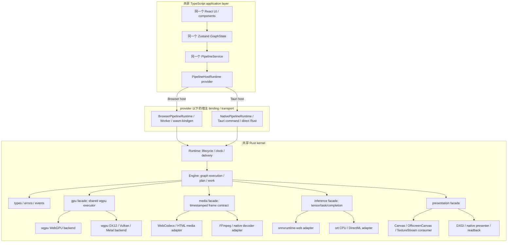
Browser 与 Tauri 不存在两套 React UI。`App`、components、Zustand 和 `PipelineService` 都是同一套 TypeScript application layer；分叉点是 `PipelineService.createRuntime()` 的 provider selection：

```text
shared React/TS UI -> PipelineService -> PipelineHostRuntime provider
                                           ├-> BrowserPipelineRuntime
                                           └-> NativePipelineRuntime
```

只有 provider 以下的 Worker/wasm-bindgen 与 Tauri command/direct Rust transport 不同。

图中约定：这里是**逐层依赖/同步调用图**，实线不表示数据返回。依赖方向严格为：

```text
Runtime -> Engine -> facade -> platform implementation
```

因此，`Runtime` 依赖 `Engine` 是正确的；`Engine` 依赖 GPU、media、inference、presentation facade 也合理，因为这些 facade 是 Engine 执行计划落地时使用的抽象端口。`Engine` 不直接持有 GPU、codec 或 ORT session，只依赖 facade contract。

平台实现到 Runtime 的返回是另一条**实际数据流**，不属于上面的依赖图：

```text
platform backend -. completion / frame / output .-> facade -. stamped result .-> Runtime
```

backend 通过 facade/host trait 被注册或注入，不反向依赖 `Runtime`。虚线只应出现在数据流图中，表示 completion queue、callback 或 event 的返回方向。

该图表达的不是“所有平台实现都相同”，而是**共享模块 facade 相同，模块内部选择 backend**：

```text
shared React/TS UI -> PipelineHostRuntime provider
  Browser branch -> BrowserPipelineRuntime / Worker / wasm-bindgen
                 -> shared Rust Runtime -> Engine
                    -> gpu facade -> wgpu WebGPU
                    -> media facade -> WebCodecs/HTML media
                    -> inference facade -> ORT-Web

  Tauri branch   -> NativePipelineRuntime / Tauri direct Rust
                 -> shared Rust Runtime -> Engine
                    -> gpu facade -> wgpu native backend
                    -> media facade -> FFmpeg/native decoder
                    -> inference facade -> ort/DirectML
```

`wgpu` 是最适合首先合并的模块：当前 Cargo 已启用 `wgpu` 的 `webgpu` 和 native backend features，GPU resource、render target、pipeline、command encoding 的核心可以收敛到同一 Rust implementation。不能强行共用的是 surface/presenter、Web `GPUExternalTexture`、DXGI interop 和具体 window object。

`media` 和 `inference` 也应提供共享 Rust facade，但不应把平台 SDK 假装成同一实现：

- `media` 共享 timestamp、frame selection、pause/resume/seek、resource generation 和 frame ownership；`media::web` 与 `media::native` 分别桥接 WebCodecs/HTML media 和 FFmpeg。
- `inference` 共享 model descriptor、tensor shape/dtype、task contract、async completion、revision/generation 检查以及 preprocess/postprocess；`inference::web` 调用 `onnxruntime-web`，`inference::native` 调用 `ort`/DirectML。
- Browser 的 `GPUExternalTexture`、WebCodecs `VideoFrame`、WebView2 `MediaStream` 和 Native 的 D3D12 surface、DXGI handle 仍然是 backend object，不进入 shared schema。

因此，目标不是把 `ort-web`、`ort`、WebCodecs、FFmpeg 变成一个二进制实现，而是让它们都位于同一 Rust module facade 之后。上层只看到统一的 runtime/graph/resource/output contract。

#### 当前实现：共享基础模块，但 Runtime 和 host orchestration 仍不对称

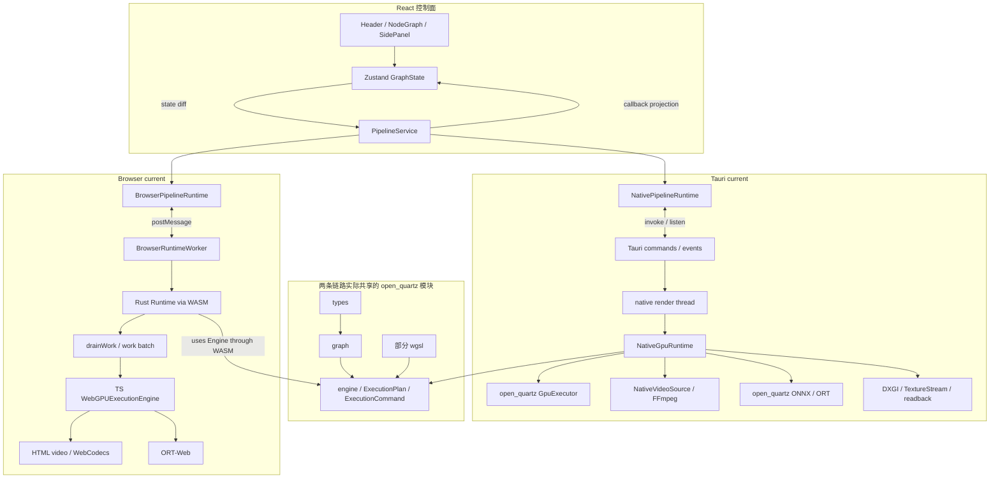

当前实现的真实结论：

- `types`、`graph`、`engine` 和部分 `wgsl` 已由 Browser/WASM 与 Native 共同使用；
- Browser 使用 Rust `Runtime` 生成 work batch，再由 TypeScript host 执行；
- Native 尚未使用 `open_quartz::runtime::Runtime`，而是由 `NativeGpuRuntime` 自己编排 clock、Engine、GpuExecutor、video、ONNX 和 presenter；
- 所以当前是“共享 Rust 基础模块 + 两套上层 orchestration”，不是完整对称的共享 Runtime。

| Rust 模块/语义 | Browser/WASM | Tauri/native | 结论 |
|---|---|---|---|
| `types`、`graph`、`engine`、部分 `wgsl` | 通过 WASM 使用 | 直接链接使用 | 已共享 |
| `ffi`/binding | `wasm-bindgen` | Tauri command/direct Rust | transport 不同，语义应相同 |
| `runtime::Runtime` | Browser Worker 生产使用 | Native 尚未使用 | 当前最大分叉 |
| `gpu` | TypeScript WebGPU backend | Rust `GpuExecutor` | 宿主实现分叉；Browser 仍重复部分 policy |
| `media` | DOM/WebCodecs/HTML video | `NativeVideoSource`/FFmpeg | 合理的宿主分叉 |
| `onnx` | ORT-Web + TS task glue | Rust ORT/DirectML | 推理执行分叉；任务语义应共享 |
| `output/presentation` | Rust 类型存在，callback 仍占主导 | native event + presenter | 尚未统一 delivery |

后续收敛目标：

```text
Browser Worker -> wasm-bindgen -> Rust Runtime/Engine -> Browser host backend
Tauri thread   -> direct Rust  -> Rust Runtime/Engine -> Native host backend
```

两边不能共享的只应是 DOM/WebGPU/wgpu/FFmpeg/ORT session、GPU handle、window handle 和 transport；graph semantics、clock、generation、output contract 不应继续留在宿主层。

### 1.2 控制面与数据面

| 平面 | 数据 | 频率 | 所有者 |
|---|---|---:|---|
| UI intent | play/pause/stop、graph edit、selection | 低频 | React + Zustand |
| Runtime control | set graph、resource reconcile、capture | 低频/按编辑 | `PipelineService` + host adapter |
| Frame work | clock tick、dirty commands、GPU submission | 每帧 | Browser Worker 或 native render thread |
| Runtime event | frame metadata、output metadata、error | 合并/限频 | runtime → adapter → Store |
| Pixel stream | GPU texture、TextureStream、preview readback | 高频或按需 | host GPU/runtime；Store 只保存 UI 投影 |
| Persistent project | nodes、edges、资源 descriptor/path | 保存时 | Zustand/project serializer |

### 1.3 宿主选择不变量

`PipelineService.createRuntime()` 只选择一次：

```text
checkIsTauri() == false -> BrowserPipelineRuntime
checkIsTauri() == true  -> NativePipelineRuntime
```

同一会话不得同时启动两套生产 runtime，也不得把 Browser runtime 当作 Native 的隐式 fallback。平台 fallback 只能发生在宿主内部，例如 Native presentation 从 TextureStream 降级为 bounded RGBA readback。


---

## 2. TypeScript 模块依赖

### 2.1 当前依赖图

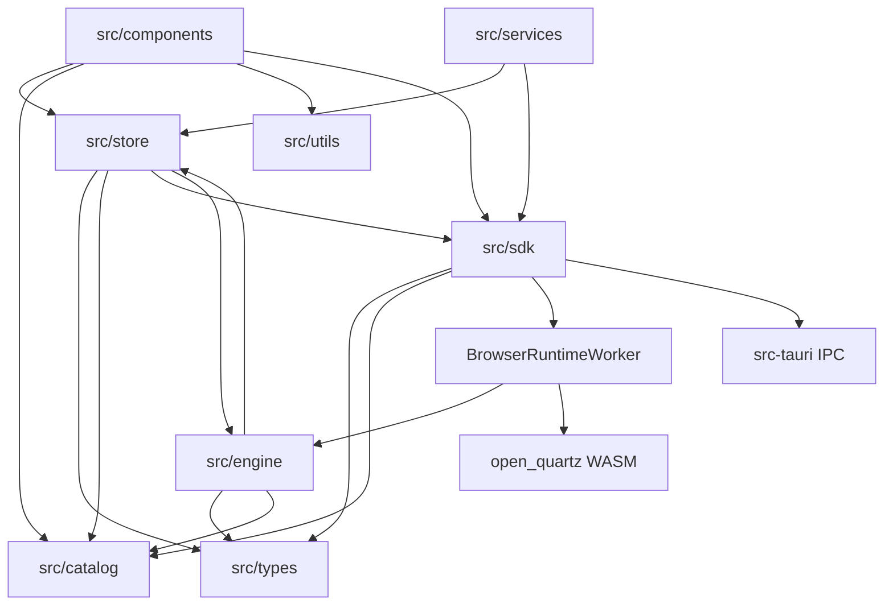

这张图同时暴露三个现状：

1. 正常主干是 `components → store → PipelineService → sdk adapter`。
2. Browser Worker 仍依赖 `src/engine` 的 TypeScript GPU/ONNX 实现。
3. `store → engine` 和 `engine → store` 形成概念环：`graphSlice/helpers` 创建 ONNX session/model manager，而 `executionEngine.ts` 又读取 store helper。ES module 不一定形成直接运行时循环，但分层已经不纯。

### 2.2 目录责任

| 目录 | 当前责任 | 禁止新增的责任 |
|---|---|---|
| `src/components` | 展示、用户输入、节点编辑、项目菜单 | graph 调度、GPU/decoder/session 所有权 |
| `src/store` | project/UI state、播放意图、预览和错误投影 | frame clock、runtime lifecycle、GPU handle |
| `src/services` | 监听 Store、串行化 runtime 操作、将 callback 投影回 Store | host-specific GPU/ONNX 算法 |
| `src/sdk` | host adapter、WASM binding、Worker/Tauri transport、协议类型 | 第二份 graph semantics |
| `src/engine` | **当前** Browser Worker 的 WebGPU、媒体、ORT-Web adapter；包含尚未迁出的执行逻辑 | 继续扩展 topology、dirty、clock、generation 等 canonical policy |
| `src/catalog` | UI catalog 与创建节点所需 descriptor | runtime resource/session ownership |
| `src/types` | TypeScript project/node/port schema | 平台对象和运行时资源 |
| `src/utils` | project I/O、Tauri detection、preview helpers | runtime orchestration |

### 2.3 当前生产类与遗留类

| 类 | 状态 | 生产入口 | 说明 |
|---|---|---|---|
| `PipelineService` | 当前 | `App`、`ScreenSaverApp` | 唯一 Store↔runtime bridge |
| `BrowserPipelineRuntime` | 当前 | `PipelineService` | main-thread Worker proxy |
| `BrowserRuntimeWorker` | 当前 | `BrowserPipelineRuntime` | Browser clock/work/GPU host |
| `WasmRuntimeContract` | 当前 | Browser Worker | Rust `RuntimeBinding` 的 typed projection |
| `Compositor` | 当前 | Browser Worker | 包装 TS WebGPU execution engine |
| `WebGPUExecutionEngine` | 当前 | `Compositor` | Browser GPU plan/resource/ONNX execution |
| `NativePipelineRuntime` | 当前 | `PipelineService` | Tauri command/event adapter + TS resource reconcile |
| `RealtimeHost` | 遗留 | 无生产引用 | 旧 main-thread rAF host，仅测试仍直接覆盖 |
| `WasmEngineContract` | 部分 | tests/contract usage | 低层 `Engine` binding；生产 Browser 使用 `WasmRuntimeContract` |

`RealtimeHost` 不应再出现在“当前 Browser 拓扑”中。后续应删除或明确移入 legacy test fixture，避免文档和测试继续暗示它是生产入口。

---

## 3. 核心对象关系

### 3.1 跨语言类图

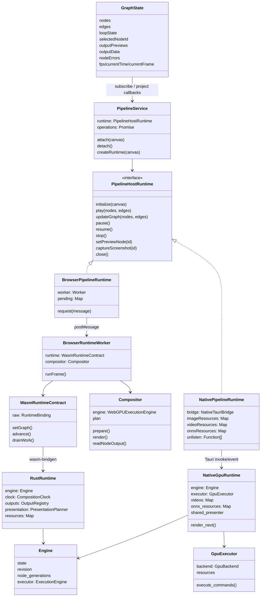

### 3.2 所有权表

| 对象 | Browser owner | Native owner | 是否进入 Store/项目文件 |
|---|---|---|---:|
| Graph metadata | Worker Rust Runtime + TS GPU plan | `NativeGpuRuntime::Engine` | 只保存可序列化 snapshot |
| Composition clock | Rust `Runtime::CompositionClock` | `NativeGpuRuntime` 的 `Instant/frame` | 仅投影 time/frame |
| GPU device/queue | `WebGPUBackend` | `GpuBackend` | 否 |
| GPU target/texture | `WebGPUExecutionEngine` | `GpuExecutor` | 否 |
| Video decoder | Browser engine/DOM/Web APIs | `NativeVideoSource` | 只保存 source descriptor/path |
| ONNX session | browser inference layer | `NativeOnnxResource` | 只保存 model descriptor/path |
| Output subscription registry | Rust Runtime 存在，生产未完整使用 | 未接入 Native | 否 |
| Preview image | Worker readback → data URL | bounded binary readback | Store 保存最近 UI 投影 |
| Renderer stream | Browser canvas projection | WebView2 TextureStream `MediaStream` | Store 只保存 live UI reference，不序列化 |

需要注意：Native composition clock 尚未使用 `runtime::CompositionClock`；这是共享 runtime 尚未完成的直接证据。

---

## 4. Store 监听与双向数据流

### 4.1 上层意图如何下沉

`App` 只创建一次 `PipelineService`。`PipelineService.attach()` 调用 `useGraphStore.subscribe((state, previous) => ...)`，以状态转换驱动 runtime：

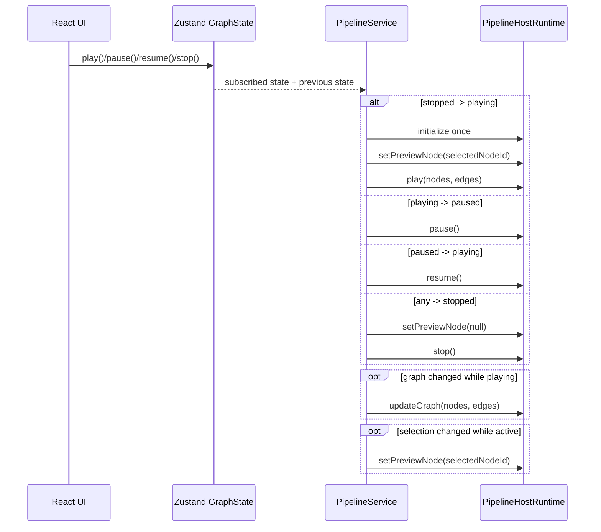

`PipelineService.operations` 把异步 control 操作串行化，防止 play/update/stop 交错。`generation` 防止 attach/detach 期间过期 runtime 初始化重新挂回服务。

### 4.2 下层状态如何上浮

当前上浮不是 UI 轮询 runtime object，而是 listener/callback 链：

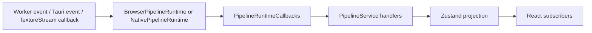

主要投影：

| 下层信号 | `PipelineService` 处理 | Store 字段 |
|---|---|---|
| frame/time/fps | 最多约 10 Hz 写 UI frame state | `fps/currentTime/currentFrame` |
| preview/output image | 忽略 stopped 后迟到结果 | `outputPreviews[nodeId]` |
| typed output data | 直接投影 | `outputData[nodeId]` |
| output size | 更新输入或输出 resolved size | node `resolvedWidth/resolvedHeight` |
| ONNX backend | 更新可观察 backend | node `onnxBackend/onnxNativeBackend` |
| node/runtime error | 归属 node 或 runtime | `nodeErrors` |
| renderer presented | 500 ms 窗口计算显示 FPS | `rendererFps` |
| TextureStream cadence | 合并 graph/present/display/drop 指标 | `rendererCadence` |

规则：Store 保存 UI 可观察结果，不接管结果资源的所有权。完整 texture、decoder frame、ORT tensor 和 per-frame command 都不能进入 Store。

### 4.3 监听模型的边界

当前监听模型有两层：

1. **应用监听**：Store state diff → runtime command。
2. **runtime 监听**：Worker/Tauri/VideoFrame callback → Store projection。

这使 UI 与底层解耦，但也带来两个必须守护的条件：

- 每个 listener 必须在 `detach()/close()` 中释放；Native 使用 `unlisten[]`，Browser 终止 Worker。
- 所有异步结果必须能识别过期状态。Native ONNX 已使用 graph revision + node generation；preview 通过当前 `previewNodeId` 再检查；通用 callback schema 尚未全部携带 stamp。

---

## 5. JavaScript ↔ Rust 接口

### 5.1 Browser：postMessage + wasm-bindgen

Browser 有两个串联边界：

```text
React main thread
  BrowserPipelineRuntime
    ⇅ structured-clone postMessage
Dedicated Worker
  BrowserRuntimeWorker
    ⇅ typed TS wrapper / JSON payload
  WasmRuntimeContract
    ⇅ wasm-bindgen
Rust RuntimeBinding -> Runtime -> Engine
```

#### Main thread ↔ Worker

请求：

| request | payload | 返回 |
|---|---|---|
| `initialize` | transferred `OffscreenCanvas` | ack |
| `play` | nodes + edges | ack |
| `update-graph` | nodes + edges | ack |
| `pause/resume/stop/close` | 无大 payload | ack |
| `set-preview` | node ID/null | ack |
| `capture` | node ID | data URL/null |

事件：`frame`、`output`、`output-size`、`output-data`、`node-error`、`backend`。

#### Worker ↔ Rust/WASM

生产 Worker 当前使用：

```text
Runtime.setGraph
Runtime.play
Runtime.advance
Runtime.drainWork
Runtime.pause/resume/stop/dispose
```

`RuntimeBinding` 还暴露 resource、output subscription、presentation、completion、delivery 和 event 方法，但 Browser Worker 尚未把这些通用 API 全部接入生产消息流。

### 5.2 Native：Tauri commands + Tauri events + TextureStream

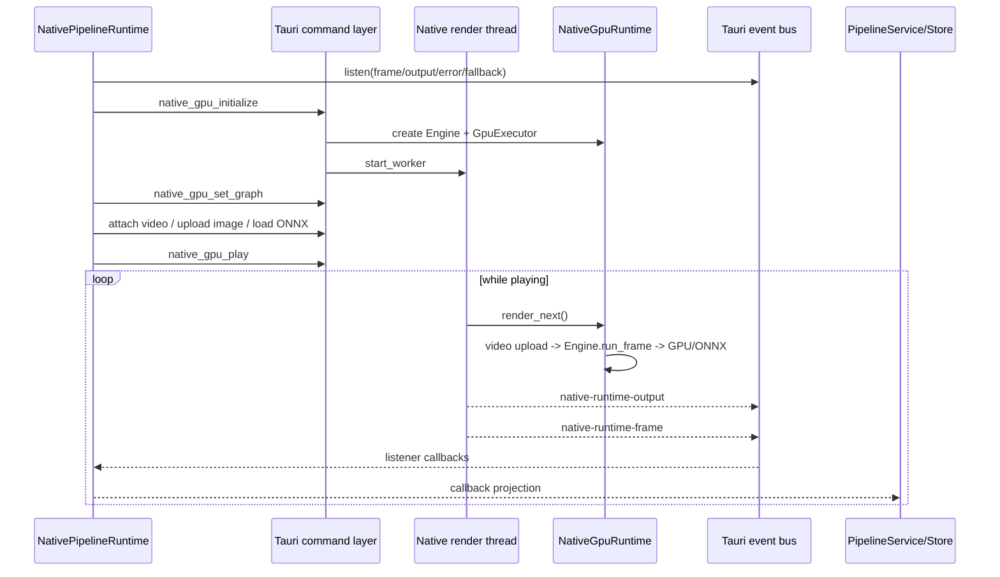

#### Control/query command families

| 类别 | 主要命令 | 传输 |
|---|---|---|
| lifecycle | `native_gpu_initialize/play/pause/resume/stop/close` | 小 JSON/空 payload |
| graph | `native_gpu_set_graph` | 去除资源 bytes 的 graph JSON |
| image | `native_gpu_upload_image/remove_texture` | raw RGBA body + headers |
| video | `attach/detach/video_metrics/video_devices` | descriptor/metadata |
| ONNX | `capabilities/load_model/unload_model` | model ID/path/options |
| output | `read_output/read_preview` | binary width+height+RGBA response |
| presentation | `set/take/release_shared_texture` | handles/lease metadata |
| diagnostics | `render_once/drain_events/set_mouse` | 小 payload |

#### Push events

| event | payload | 目的 |
|---|---|---|
| `native-runtime-frame` | frame/revision/output node/size | frame heartbeat 与 presentation trigger |
| `native-runtime-output` | ONNX output metadata/data/backend | typed output projection |
| `native-runtime-error` | string | runtime failure |
| `native-runtime-presentation-fallback` | string | 关闭 TextureStream 并启动 readback fallback |

#### Pixel presentation 是独立通道

Windows 主显示路径不是 Tauri JSON event：

```text
GpuOutputHandle
  -> DxgiSharedTextureExporter (leased slot)
  -> main-thread WebView2 present_shared_frame
  -> chrome.webview.getTextureStream("open-quartz-renderer")
  -> MediaStream + HTMLVideoElement
  -> Renderer DOM slot
```

不支持或失败时：

```text
native-runtime-frame event
  -> native_gpu_read_preview(max 960)
  -> binary RGBA
  -> temporary canvas/ImageData
  -> Renderer mirror canvas
```

显式 SAVE/screenshot 使用 `native_gpu_read_output`，不受 preview 尺寸限制。

### 5.3 接口不一致清单

| 语义 | Browser | Native | 结论 |
|---|---|---|---|
| canonical `Runtime` | 生产使用 | 未使用 | **不一致** |
| lifecycle/clock | Rust `Runtime` | Tauri `NativeGpuRuntime` | **重复** |
| graph engine | Rust `Engine` | Rust `Engine` | 共享 |
| work execution | TS `WebGPUExecutionEngine` | Rust `GpuExecutor` | host-specific，但 Browser 仍含 policy |
| resource reconcile | TS browser engine | `NativePipelineRuntime` + `NativeGpuRuntime` | **分散** |
| output subscription | Rust API 存在，Worker 未完整接入 | 未接入 | **部分** |
| state delivery | Worker custom events | Tauri custom events | **两个 schema** |
| presentation | canvas/readback | TextureStream/readback | 合理的平台差异 |

目标不是消灭 transport 差异，而是让 transport 机械投影同一组 runtime command/event schema。

---

## 6. 逐帧执行数据流

### 6.1 Browser frame

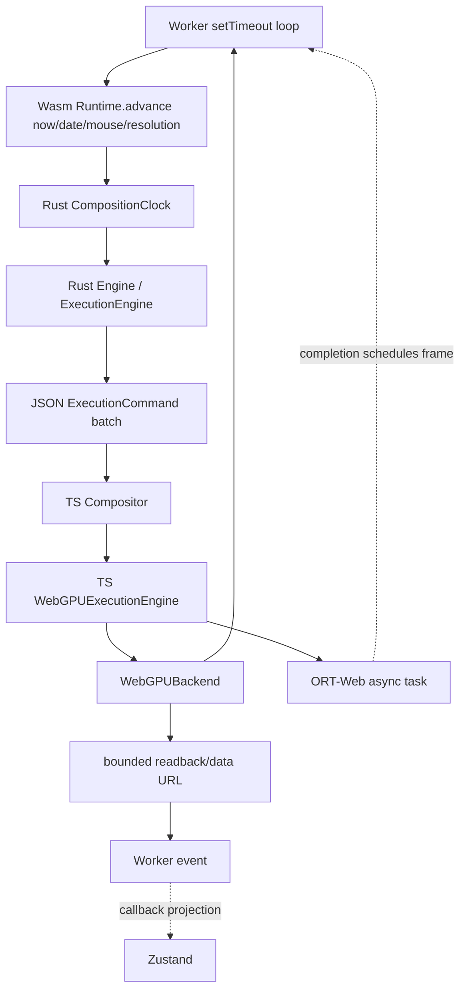

当前关键切分：Rust 决定 clock 和 dirty command batch；TypeScript `WebGPUExecutionEngine.prepare()` 仍建立自己的 plan/resources，并执行 shader、Math/ONNX 相关 host work。因此 Browser 不是纯 backend executor。

### 6.2 Native frame

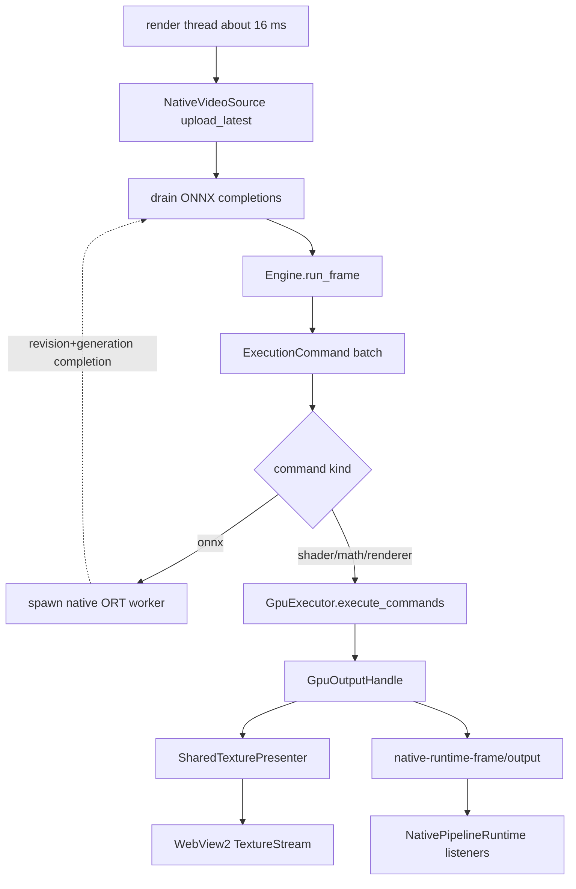

Native ONNX 当前需要 `GpuExecutor.read_output_rgba()`，在线程中执行 ORT，再 `upload_rgba()` 回 GPU；capability 明确为 tensor `cpu-copy`，不得描述成 shared wgpu/DirectML zero-copy。

### 6.3 Graph、资源和结果三条数据链

| 链 | 内容 | 生命周期 |
|---|---|---|
| Graph chain | node/edge/port/params | revision 管理；可持久化 |
| Resource chain | image/video/model descriptor → live object | node generation + host ownership；不可持久化对象 |
| Result chain | scalar/json/ROI/texture/presentation | output generation/stamp；Store 仅持 UI projection |

任何优化都必须说明自己改变的是哪条链。把 resource bytes 塞回 graph、把 GPU handle 写进 Store、或用 frame heartbeat 代替 typed output contract，都属于边界回退。

---

## 7. Rust 分仓与依赖关系

### 7.1 实际 package 边界

Rust 不是一个 Cargo workspace 内的多个业务 crate；当前是三个独立 package/宿主边界：

| package | 路径 | 责任 |
|---|---|---|
| `open_quartz` | `crates/open_quartz` | 可复用 Rust SDK、WASM binding、graph/engine/GPU/ONNX primitives |
| `app` | `src-tauri` | Tauri shell、native runtime 组合、FFmpeg、WebView2、screen saver export |
| `open-quartz-screensaver-stub` | `crates/open-quartz-screensaver-stub` | 轻量 `.scr` launcher/config host |

依赖方向：

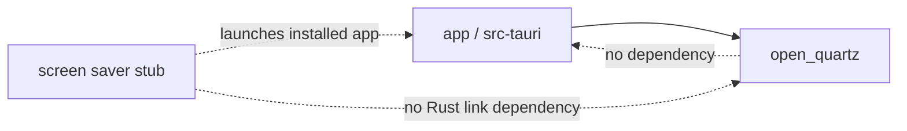

这里的“分仓”主要指 `open_quartz` crate 内模块分层，而不是 Cargo crate 间的强制编译边界。模块可见性较宽，靠文档约束不足以阻止逆向依赖。

### 7.2 `open_quartz` 当前模块图

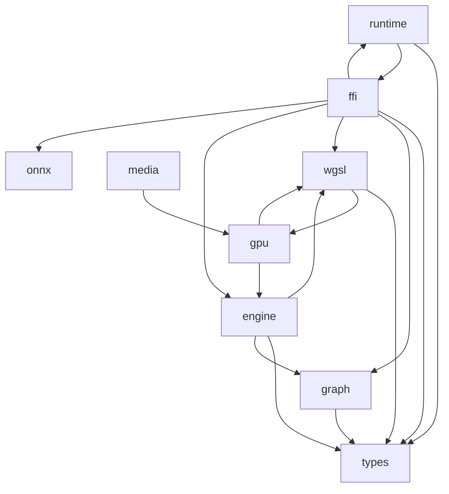

上图是源码 `use crate::...` 的实际方向，不是目标图。两个明显环：

- `runtime ↔ ffi`：`Runtime` 使用 `ffi::Engine/SdkError/EngineState`，而 `ffi::RuntimeBinding` 又包装 `runtime::Runtime`。
- `wgsl ↔ gpu`：GPU executor 使用 WGSL binding descriptor，而 WGSL compiler 又从 GPU 模块读取 fullscreen vertex 常量。

Rust 编译器允许同 crate 模块环，但这种方向会阻碍未来拆 crate 和稳定 SDK kernel。

### 7.3 目标模块图

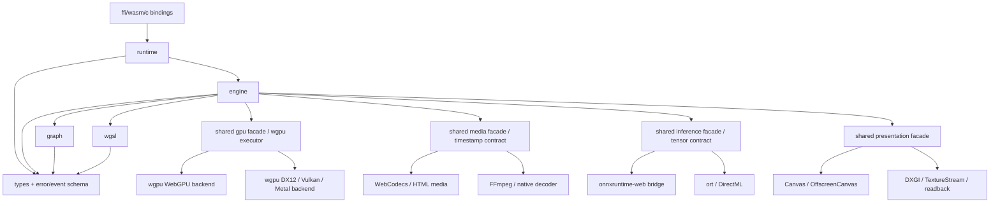

这张图中的 `gpu`、`media`、`inference`、`presentation` 是共享 Rust module facade；Web/native 只在 facade 内选择 backend。`wgpu` 的 WebGPU、DX12、Vulkan、Metal backend 属于同一个 GPU 抽象，不应在高层拆成两套 GPU executor。

目标规则：

1. schema/error/event 不依赖 binding。
2. `Runtime -> Engine -> facade -> platform implementation` 是唯一的逐层依赖/调用方向；backend completion 只作为独立数据流返回。
3. `gpu` 共享 resource/target/pipeline/command encoding；surface、`GPUExternalTexture`、DXGI interop 和 window object 留在 backend。
4. `media` 共享 timestamp、frame selection、pause/resume/seek、generation 和 frame ownership；WebCodecs/HTML media 与 FFmpeg 是内部 backend。
5. `inference` 共享 model descriptor、tensor contract、task、preprocess/postprocess 和 async completion；`onnxruntime-web` 与 `ort`/DirectML 是内部 backend。
6. `ffi` 只依赖 runtime，不得被 runtime 反向依赖。
7. Tauri 不拥有第二套 scheduler、resource reconciliation、output 或 presentation policy。


### 7.4 Rust 核心对象所有权

| 对象 | 当前定义 | 当前 owner |
|---|---|---|
| `ExecutionEngine` | `open_quartz::engine` | `ffi::Engine` 内部 |
| `Engine` | `open_quartz::ffi` | Browser `Runtime` 或 Native `NativeGpuRuntime` |
| `Runtime` | `open_quartz::runtime` | Browser WASM production；Native 未使用 |
| `GpuExecutor` | `open_quartz::gpu` | `src-tauri::NativeGpuRuntime` |
| `OnnxSession` | `open_quartz::onnx` | `src-tauri::NativeOnnxResource` |
| `NativeVideoSource` | `src-tauri::native_video` | `src-tauri::NativeGpuRuntime` |
| `SharedTexturePresenter` | `open_quartz::gpu` | `src-tauri::NativeGpuRuntime` |
| `TextureStream` bridge | `src-tauri::webview_texture_stream` | Tauri main thread/WebView2 |

`Engine` 位于 `ffi` 而承担核心状态，是当前命名和依赖反转的根源之一。目标应把核心 `Engine`/errors/events 移到 kernel 层，binding 只做导出。

---

## 8. 优化后的边界审计

### 8.1 审计结论

性能优化没有破坏 GPU object 的基本所有权，但多次在 Tauri facade 和 TypeScript adapter 中加入 orchestration，使“薄宿主 + 厚 Rust Runtime”的原目标没有成立。现状是：**数据路径优化成功，控制路径分层部分漂移。**

### 8.2 逐项审计

| 边界 | 原意 | 当前证据 | 状态 | 处理 |
|---|---|---|---|---|
| UI ↔ runtime | component 不直接驱动 runtime | App 只创建 `PipelineService`；常规 graph/play 经 Store 监听 | 保持 | 继续守护；screen saver 专用 invoke 可留在专用 UI |
| Store ↔ runtime | Store 只保存 intent/projection | GPU/decoder/ORT 未进入 Store；但 Store helper 持 model/session manager | 部分漂移 | 将 model/session lifecycle 移出 Store |
| Service ↔ adapter | `PipelineService` 是唯一通用桥 | Browser/Native 都实现 `PipelineHostRuntime` | 保持 | 扩展接口时先定义 canonical command/event |
| Browser main ↔ Worker | 主线程不做逐帧执行 | runtime/Compositor 在 Worker；main 只收事件和绘制投影 | 保持 | 避免把 GPU work 搬回主线程 |
| Rust Runtime ↔ host | 两端共用一个 runtime policy | Browser 使用 `Runtime`；Native 直接使用 `Engine` + 自有 clock/scheduler | **破坏** | Native 先切到 `Runtime`，再删除 facade policy |
| Engine ↔ GPU | Engine 生成 command，GPU executor 只执行 | Native `GpuExecutor` 注释和实现符合；Browser executor 仍自行 prepare/policy | 部分 | Browser backend 收敛为 command executor |
| Graph ↔ resource | graph 只传 metadata | Native strip payload 后独立同步 image/video/ONNX | 保持 | 将 sync policy 从 TS adapter 下沉 runtime |
| Runtime ↔ FFI | binding 依赖 core | `runtime` 反向依赖 `ffi::Engine/SdkError` | **破坏** | 把 Engine/error/event 移出 ffi |
| WGSL ↔ GPU | compiler 不依赖 backend | WGSL compiler 依赖 GPU fullscreen shader 常量 | **破坏** | 常量移入 WGSL/shared shader module |
| Media ↔ GPU | media 定义 frame contract | `media` 直接依赖 `GpuOutputHandle` | 部分 | importer 输出 opaque resource handle/trait |
| Output observation | 所有 output 使用 subscription/delivery | Rust registry 已实现；生产仍用 custom frame/output callbacks | **未切换** | 用统一 delivery batch 替代 host 特例 |
| Presentation | graph output 与显示 transport 分离 | Native presenter/mailbox 已分离；选择仍围绕单 `output_node_id` | 部分 | 接入 `PresentationPlanner/Set` 与多订阅 |
| Native video optimization | decoder surface 不经 CPU | Windows D3D12VA→wgpu YUV import；camera/non-Windows fallback 明确 | 保持 | 不把平台实现提升为 core 依赖 |
| TextureStream optimization | 高频 pixels 不走 IPC | shared texture + WebView2 stream；event 只发 metadata | 保持 | transport 留在 host 层 |
| ONNX async | completion 必须防 stale | Native 检查 revision + generation | 保持 | 改用通用 `AsyncCompletionEnvelope` |
| Legacy host | 单一 Browser production host | `RealtimeHost` 无生产引用但测试仍依赖 | 漂移/债务 | 删除或隔离 legacy tests |

### 8.3 结构风险在目标架构下的状态与防回退措施

新架构图本身不会自动消除风险。A、B 在目标结构完整落地后应被删除；C、D 仍需要协议和编译边界才能消除。迁移期间四项风险都仍然存在。

| 风险 | 当前 | 目标架构落地后 | 是否会复发 |
|---|---|---|---|
| A. Native 第二个 Runtime | 存在 | 应消除 | host adapter 重新拥有 clock/scheduler/resource policy 时会复发 |
| B. Browser 第二份 execution semantics | 存在 | 应消除 | Web adapter 重新解析 graph、topology、dirty/feedback 时会复发 |
| C. output contract 未统一 | 存在 | 仅靠 facade 设计不能消除 | 新增 host-specific callback/event 时会复发 |
| D. 同 crate 模块环 | 存在 | 逻辑图不能消除 | 没有编译边界时随时会复发 |

#### A. Native runtime 是第二个 runtime

当前 `src-tauri/src/native_runtime.rs` 同时拥有 clock、worker、graph/resource reconciliation、video/ONNX lifecycle、output selection 和 presentation policy，超出薄 adapter 边界。

目标结构通过以下不变量消除：

```text
Tauri host -------┐
Screen saver host ├-> 同一个 open_quartz::Runtime
Other native host ┘
```

- Runtime 是唯一 lifecycle、clock、scheduler、revision/generation、resource reconciliation、subscription 和 presentation policy owner。
- Tauri、screen saver、未来 native UI 只负责构造 platform backend、注册 opaque handle、转发 command/event 和提供 window/surface。
- host crate 不得定义第二个 `*Runtime` policy object；只能定义 `*Host`、`*Backend`、`*Binding`。
- conformance tests 对所有 host 运行同一 lifecycle/graph/output contract。

#### B. Browser 仍有第二份 execution semantics

当前 Rust `Runtime.advance()` 生成 `ExecutionCommand`，但 TypeScript `WebGPUExecutionEngine.prepare()` 仍处理 topology、plan、resource 和 ONNX policy。

目标结构通过以下不变量消除：

- Rust `Engine` 是 topology、dirty、feedback、Math、generation 和 work ordering 的唯一来源。
- Browser 使用共享 Rust `gpu` facade/`wgpu` executor；Web adapter 只实现 `GPUExternalTexture`、WebCodecs、ORT-Web 和 DOM presenter 等平台对象桥接。
- Browser backend 的输入必须是 typed work/resource descriptor，不能接收完整 Zustand Store，也不能导入 `src/store`、node catalog 或自行拓扑排序。
- 同一 graph 的 Browser/Native work contract test 必须比较 node order、port binding、target descriptor、generation 和 completion stamp。

#### C. 通用 output contract 尚未成为生产观察边界

`OutputKey/OutputState/OutputSubscription/OutputDeliveryBatch` 已存在，但生产仍依赖 `onFrame/onOutput/onOutputSize/onOutputData` 和 `native-runtime-*` 特例。

避免方式：

- Runtime 只发布 `OutputDeliveryBatch`、structured event 和 presentation delivery。
- Worker message、Tauri event、C/WASM callback 只是同一 delivery schema 的 transport 编码，不能新增宿主专属 output semantics。
- `PipelineService` callback 只能由 delivery projection 生成；新增 output 类型不能新增 callback 字段或 Tauri event name。
- frame heartbeat 只承载 cadence/health，不承载 output value、backend result 或 presentation ownership。

#### D. 同 crate 模块环隐藏分层错误

当前 `runtime ↔ ffi`、`wgsl ↔ gpu` 在单 crate 内可编译，架构图无法阻止逆向依赖。

避免方式：

1. 先把 `Engine`、error/event/schema 和共享 shader source 移出 `ffi`/concrete GPU module。
2. 让 dependency 单向为 `binding -> Runtime -> Engine -> facade contract -> platform implementation`。
3. 收紧 Rust module visibility，禁止通过 crate root 重新导出绕过层次。
4. 增加 dependency policy CI；最终拆成 kernel/host-api/platform/binding crates，用 Cargo 编译边界阻止逆向依赖。

#### E. 新 facade 设计的额外风险：平台类型泄漏

即使 A–D 消除，`web_sys::VideoFrame`、`GPUExternalTexture`、FFmpeg frame、ORT session、D3D12 resource 或 HWND 仍可能泄漏进共享 schema，使 facade 名义共享、实际继续分叉。

避免方式：

- shared facade 只暴露 descriptor、capability、opaque resource handle、stamp 和 completion envelope。
- `media::web/native`、`inference::web/native`、`gpu` platform backend 在模块内部隔离具体类型和 `cfg`。
- Runtime/Engine 不匹配平台类型、不包含 `cfg(target_arch/target_os)` policy 分支；平台差异通过 capability 和 backend registration 表达。
- Tauri host 与 screen saver host 必须复用同一个 native backend implementation，不能复制 FFmpeg/ORT/wgpu orchestration。

---

## 9. 必须守护的架构规则

### 9.1 允许依赖

```text
components -> store/actions
PipelineService -> PipelineHostRuntime
host adapter -> canonical Runtime binding + platform transport
binding -> Rust Runtime
Rust Runtime -> engine/schema/host traits
platform implementation -> host traits + platform APIs
```

### 9.2 禁止依赖

- component 直接调用 graph/native GPU command；screen saver export/config 等独立 shell capability除外。
- Store 保存 GPU texture、decoder frame、ORT session/tensor 或 per-frame command。
- `runtime` 依赖 `ffi`、Tauri、DOM 或具体 WebView event name。
- WGSL parser/compiler 依赖具体 GPU backend。
- Tauri shell 重建 composition clock、subscription registry、generation 或 presentation policy。
- Browser TS engine 重建 Rust 已定义的 topology/dirty/feedback semantics。
- 高频 pixel/frame 数据通过 JSON event 往返。
- 将目标接口写成“当前已实现”。

### 9.3 Change review 必答题

每个 runtime/性能 PR 必须回答：

1. 新状态由谁拥有？
2. 它属于 graph、resource 还是 result chain？
3. Browser 和 Native 是否产生第二套同义 policy？
4. 跨 JS/Rust 的是 command、event、stream 还是 bytes？频率和大小是多少？
5. listener/worker/session 在 stop/close/revision change 时如何释放或失效？
6. 是否改变 revision、generation、frame/content stamp？
7. fallback 是否通过 capability 显式可观察？
8. 是否新增逆向模块依赖？

---

## 10. 收敛顺序

### Phase 1：修正 Rust 内部依赖方向

1. 把 `Engine`、`EngineState`、`EngineEvent`、`SdkError` 从 `ffi` 移到 core schema/engine 层。
2. 让 `ffi` 单向包装 `runtime`。
3. 把 fullscreen WGSL 常量移出 `gpu`。
4. 把 media contract 对 concrete GPU handle 的依赖改为 host trait/opaque resource。

验收：目标模块图无 `runtime → ffi`、`wgsl → gpu`、`media → concrete gpu`。

### Phase 2：Native 使用 canonical Runtime

1. `NativeGpuRuntime` 内部从 `Engine` 切到 `Runtime`。
2. composition clock、lifecycle、revision/generation、async completion、output/presentation policy 由 Runtime 负责。
3. Tauri 保留 wgpu/FFmpeg/ORT/WebView2 host implementation 和 command/event transport。

验收：Browser/Native 对同一 control surface 有一一对应的方法和状态转换。

### Phase 3：统一 output delivery

1. UI 选择、Renderer、Math、ONNX 都注册 `OutputSubscription`。
2. custom output callbacks 改为 `OutputDeliveryBatch` 的投影。
3. frame heartbeat 只报告 cadence，不携带 output semantics。
4. preview/capture/native-present 成为 transport policy，不是节点特例。

验收：新增 output type 不需要新增 Tauri event name 或 `PipelineRuntimeCallbacks` 字段。

### Phase 4：Browser backend 变薄

1. Rust Runtime 生成完整 per-port work/resource reconciliation contract。
2. 将 Rust `gpu` facade 与 `GpuExecutor` 收敛到同一 `wgpu` implementation；WASM 选择 `wgpu` WebGPU backend，native 选择 DX12/Vulkan/Metal backend。
3. 将 `media`、`inference` facade 的 backend 分支收回 Rust module 内：WebCodecs/HTML media 与 ORT-Web 走 wasm adapter；FFmpeg 与 `ort`/DirectML 走 native adapter。
4. Browser TS 只持有无法由 Rust/WASM 表达的 Web 对象（例如 `GPUExternalTexture`、`VideoFrame`、DOM presenter），不再持有第二份 graph/execution policy。

验收：同一 graph 的 Browser/Native work batch contract 可比较，TS engine 不再依赖 Store。

### Phase 5：用编译边界固化分仓

只有在前四步完成后再考虑拆 crate：

```text
open_quartz_schema
open_quartz_kernel
open_quartz_host_api
open_quartz_native_gpu
open_quartz_bindings
```

不要先机械拆 crate；当前环依赖未清除时拆分只会制造 facade 和 re-export。

### 专项 TODO：自包含 Windows Screen Saver Host

**当前实现（必须替换）**：

```text
exported .scr launcher
  -> manifest.application_path
  -> 启动已安装的 OpenQuartz Tauri app
  -> ScreenSaverApp / PipelineService / NativePipelineRuntime
```

当前 `open-quartz-screensaver-stub` 只是 Win32 launcher/config host，没有链接 `open_quartz`；导出包依赖原安装路径，移动或卸载 OpenQuartz 后不能独立运行。这是过渡实现，不是目标架构。

**目标实现**：

```text
Windows Screen Saver Control
  -> self-contained .scr native host
  -> shared Rust Runtime
  -> Engine
  -> gpu/media/inference/presentation facades
  -> native platform implementations
  -> screen saver HWND / preview parent HWND
```

`.scr` 直接读取内嵌 graph/package、初始化共享 Rust kernel 和 native backend、创建输出窗口并运行；不得启动 Tauri、WebView、React、`PipelineService` 或已安装的 OpenQuartz。

#### 前置条件

- [ ] 完成 Phase 1：解除 `runtime ↔ ffi`、`wgsl ↔ gpu` 等逆向依赖。
- [ ] 完成 Phase 2：Native 使用 canonical `Runtime`，不再由 Tauri `NativeGpuRuntime` 持有第二套 scheduler/policy。
- [ ] 将可复用 native backend 从 `src-tauri` 下沉到共享 Rust module/crate：wgpu executor、native media、native inference、native presenter、resource bootstrap。
- [ ] 定义不依赖 Tauri/WebView 的 native window/surface presenter contract。

#### Host 与 package

- [ ] 将 `open-quartz-screensaver-stub` 从 launcher 改为真正的 native runtime host，直接依赖共享 Rust Runtime/native backend。
- [ ] 从 manifest 删除 `application_path`，升级 screen saver package schema/version，并提供旧 package 的明确拒绝信息。
- [ ] `/s`：直接创建全屏 Win32 host window，按当前显示器物理像素运行选定 Renderer。
- [ ] `/p <HWND>`：直接把 native child window 嵌入 Windows Screen Saver Control Panel 的 preview parent。
- [ ] `/c [HWND]`：保留纯 Win32 配置流程和 per-export settings，不启动 renderer/Tauri。
- [ ] package 内嵌 graph manifest、Renderer 选择和导出默认值；媒体和模型采用显式 resource descriptor，不写入 UI/Tauri state。
- [ ] package 可移动、可复制，运行不依赖 OpenQuartz 安装目录、注册表安装记录或用户机器上的 `app.exe`。

#### 能力与体积

- [ ] 定义最小 capability profile：shader、image、math、feedback、renderer，只携带 native host + Rust kernel + wgpu 路径。
- [ ] 定义 video profile：明确 FFmpeg/native codec 的静态链接、sidecar 或 package payload 策略。
- [ ] 定义 ONNX profile：明确 ORT/DirectML runtime、模型文件和 provider fallback 的 package 策略。
- [ ] 导出器按 graph 实际节点计算 capability/resource closure，不为未使用的 video/ONNX 能力打包 runtime。
- [ ] 删除“完整自包含 `.scr` 固定约 264 KB”的假设；分别记录 host、kernel、video runtime、inference runtime 和资源 payload 体积。

#### 生命周期与数据正确性

- [ ] screen saver host 直接拥有 Runtime、Engine、GPU device、decoder/session 和 presenter 生命周期。
- [ ] graph revision、node generation、async completion、output delivery 与桌面 Native host 使用同一 contract。
- [ ] `/s`、`/p` 退出时释放 window/surface、GPU、video、ORT worker、presenter lease 和 resource handle。
- [ ] native backend capability/fallback 必须可观察；缺失 video/ONNX runtime 时在启动前给出结构化错误，不能静默降级为不运行。
- [ ] 配置中重新选择的媒体路径只改变 resource descriptor，不改变 graph semantics。

#### 验收

- [ ] 在未安装 OpenQuartz、PATH 中没有 `app.exe` 的干净 Windows 环境运行导出的 `.scr`。
- [ ] 移动 `.scr` 后 `/s`、`/p`、`/c` 仍可工作。
- [ ] shader/image graph 在 `/s` 和 `/p <HWND>` 下按目标物理分辨率输出。
- [ ] video graph 验证 decode、loop、pause/exit 和资源释放。
- [ ] ONNX graph 验证模型加载、provider capability、stale completion 拒绝和下游 GPU continuation。
- [ ] 自动测试确认 manifest 不再含 `applicationPath`，stub 不再 `Command::new(app.exe)`，screen saver host 直接构造共享 Runtime。
- [ ] 删除 Tauri `ScreenSaverApp` renderer 启动路径、`application_binary()` 和旧 launcher 兼容代码，不保留双实现。

---

## 11. 性能与正确性不变量

### 11.1 高频路径

Browser：

```text
Worker timer -> Rust Runtime.advance -> work batch -> WebGPU submit
```

Native：

```text
render thread -> video upload -> Engine/Runtime -> GpuExecutor -> presenter
```

两条路径都禁止每帧从 UI 发 command。

### 11.2 Copy budget

| 路径 | 当前 copy 特征 |
|---|---|
| Browser shader | GPU texture/render pass |
| Browser preview | 显式 bounded GPU readback → data URL |
| Native Windows file video | D3D12VA YUV surface import；无 CPU decoded RGBA 主路径 |
| Native ONNX | GPU readback RGBA → CPU/DirectML ORT → GPU upload |
| Native Renderer TextureStream | GPU shared texture bridge；无 CPU pixel IPC |
| Native fallback preview | bounded RGBA binary readback |
| Native screenshot | 显式 full-resolution RGBA readback |

### 11.3 生命周期

- graph revision 改变时，旧 async completion 不得发布。
- node generation 改变时，旧 resource/result 不得复用。
- position-only edit 不应重建 GPU/feedback resource。
- STOP/close 必须停止 worker/listener/video/session/presenter lease。
- TextureStream fallback 不得启动第二个 graph runtime。

---

## 12. 架构验证与源码索引

### 12.1 验证方法

文档更新后至少执行：

1. Mermaid fence 成对、图类型可解析；
2. 文档中的路径、类名、command/event 名可在源码定位；
3. TypeScript diagnostics 无新增问题；
4. 若只改文档，不需要重复运行 GPU/模型/发布测试。

长期应增加两类自动检查：

- dependency policy：禁止 `runtime -> ffi` 等逆向边；
- protocol parity：Rust public surface、WASM binding、Worker protocol、Tauri adapter 的方法/事件映射一致。

### 12.2 关键源码入口

| 主题 | 源码 |
|---|---|
| App/service 挂载 | `src/App.tsx` |
| Store 监听桥 | `src/services/PipelineService.ts` |
| Host facade | `src/sdk/PipelineRuntime.ts` |
| Browser main-thread adapter | `src/sdk/BrowserPipelineRuntime.ts` |
| Browser Worker | `src/sdk/BrowserRuntimeWorker.ts` |
| Worker protocol | `src/sdk/browserWorkerProtocol.ts` |
| WASM binding projection | `src/sdk/WasmSdkClient.ts` |
| Browser compositor/GPU | `src/engine/compositor.ts`、`src/engine/executionEngine.ts` |
| Native TS adapter/listeners | `src/sdk/NativePipelineRuntime.ts` |
| Tauri command registration | `src-tauri/src/lib.rs` |
| Native runtime/worker/events | `src-tauri/src/native_runtime.rs` |
| Native video | `src-tauri/src/native_video.rs` |
| WebView2 TextureStream | `src-tauri/src/webview_texture_stream.rs` |
| Rust public modules | `crates/open_quartz/src/lib.rs` |
| Runtime policy | `crates/open_quartz/src/runtime` |
| Engine/plan/commands | `crates/open_quartz/src/engine` |
| Native GPU/presenter | `crates/open_quartz/src/gpu` |
| ONNX | `crates/open_quartz/src/onnx` |
| Binding | `crates/open_quartz/src/ffi` |

### 12.3 当前基线总结

- **已成立**：单一 `PipelineService` 桥、Store listener 驱动、Browser Worker、共享 Rust graph/engine、Native GPU ownership、异步 ONNX stale protection、GPU TextureStream 主显示路径。
- **部分成立**：Rust Runtime、output subscription、presentation planner、media host contract。
- **尚未成立**：Browser/Native 统一 Runtime、统一 delivery schema、薄 Tauri adapter、纯 host-only Browser engine、无环 Rust module dependency。

这份结论是后续重构的起点。任何优化若改变上述状态，必须同时更新本文件的总图、依赖图、接口表和边界审计。
