# Open Quartz 软件架构设计

> 架构基线：v0.19.0b（2026-08-19）
>
> 本文只描述当前源码中可验证的结构，并单独标出目标边界和已发现的边界漂移。
> `当前`、`遗留`、`目标`不能混写；性能结果不等同于分层正确性。

## 0. 阅读指南

本文优先回答五个问题：

1. TypeScript、WASM、Tauri 和 Rust 各自负责什么，依赖方向是什么？
2. Rust domain model 如何投影为 TypeScript/Java 可直接消费的浅层 SDK 对象？
3. UI 如何通过 SDK 和监听把意图送入 runtime，又如何监听下层状态和数据？
4. Browser 与 Native 两条执行路径在哪里共用 Rust，在哪里仍然分叉？
5. 长期优化后，原有模块切分哪些仍成立，哪些已经漂移？

建议阅读顺序：

- 第 1–3 节：系统总图、模块依赖、对象关系；
- 第 4–6 节：状态监听、JS↔Rust 接口和逐帧数据流；
- 第 7–8 节：Rust 分仓、所有权和优化后的边界审计；
- 第 9–12 节：约束、演进顺序、验证方法和源码索引。

状态标记：

| 标记 | 含义 |
|---|---|
| **当前** | 生产路径已经使用 |
| **部分** | 类型或基础设施存在，但生产路径未完整接入 |
| **遗留** | 源码仍存在，但生产入口不再使用 |
| **目标** | 应收敛到的边界，不代表已实现 |

### 0.1 当前状态摘要

截至本基线，Rust/WASM 执行内核和 TypeScript 生产入口已经完成一次切换：Rust public object API、Rust wgpu Browser execution、React adapter 和 Tauri/native Player 路径均已接入；旧 `PipelineRuntime`、TS `Compositor/WebGPUExecutionEngine`、`RealtimeHost` 已删除。但“TypeScript 除 GUI/平台能力外保持极薄”尚未完成：TS 仍持有本地 Project/Graph 模型、Store graph mutation、Project I/O、screen saver transform、ORT task policy、resource reconciliation 和多份 catalog/codec 规则。

仍需明确区分三类状态：

| 项目 | 状态 | 说明 |
|---|---|---|
| Rust/TypeScript public object graph | **部分** | public 类名和生产入口已建立，但 TS `Project/Graph/Node` 仍是本地 React Flow-backed 模型，并非 Rust object 的真实薄 proxy |
| Browser execution ownership | **当前/部分** | topology、clock、dirty、feedback、Math 和 shader/GPU execution 位于 Rust/WASM；ORT task/pre/postprocess、output subscription projection、video/resource host policy 仍有较厚 TS 实现 |
| Native execution ownership | **当前/部分** | lifecycle/clock/graph/output 进入共享 Rust Runtime/Player；Tauri host 仍组合 native resource、ONNX worker和 presentation transport |
| Java SDK/JNI | **部分** | Java object facade、environment contracts、Rust aggregate handle/C ABI 和 conformance tests 已存在；完整 JNI method 覆盖、真实动态库加载及 Android/Desktop surface 集成仍未完成 |
| Rust 编译边界 | **部分** | schema 与 JNI bindings 已拆 crate；public SDK、host API、execution 仍主要共处 `open_quartz`，部分 internal 模块以 `#[doc(hidden)] pub` 供 native host 使用 |
| Web 性能 | **已知问题，暂缓修复** | 功能链路可运行，但当前 Web 链路存在性能问题；本轮只记录，不在架构文档更新中修改实现 |
| TypeScript 薄层目标 | **未完成** | 已消除第二套 graph/GPU engine，但 domain/editor/resource/inference 业务仍散落在 `store`、`engine`、`catalog`、`utils`、`screensaver.ts` 和厚 host adapter |

Web 性能问题必须作为独立工作项重新测量，不能再使用“已达到 copy budget”描述当前状态。源码中可验证的高成本路径包括：Renderer preview 最多约 15 Hz 执行 GPU readback → `ImageData` → PNG blob → base64；ORT-Web 输入执行 GPU readback，输出再上传；DOM video 每帧 `createImageBitmap` 后 transferable postMessage；Worker 使用约 60 Hz `setTimeout` 调度。它们是待 profile 的候选热点，不等同于已经确认的唯一根因。

---

## 1. 系统总览

### 1.1 系统总览：Rust SDK 与语言 SDK 对称目标

这一节先画**目标架构**，再画**当前实现**。目标架构区分三个不同概念：

1. `open_quartz` 是完整的 Rust SDK。Native 业务、Tauri、Screen Saver 或其他 Rust host 可以直接使用 Rust SDK 的 domain/runtime/GPU/media/inference/presentation 接口开发，不需要经过 TypeScript。
2. TypeScript SDK 是给 Web/React 等 JavaScript 应用使用的浅层 domain facade；Worker、wasm-bindgen、Tauri IPC 是它内部的 transport/binding 实现，不是另一个业务层。
3. Java SDK 是独立的语言 SDK，通过 JNI 进入 Rust SDK；它不复用 TypeScript SDK 的 transport，也不依赖 Worker、wasm-bindgen 或 Tauri IPC。

#### 目标架构：Rust SDK、TypeScript SDK、Java SDK 与宿主

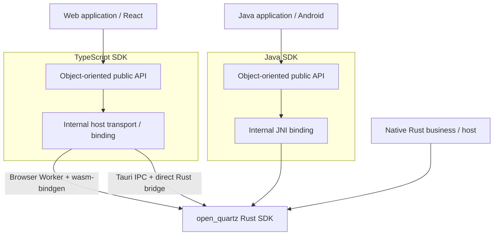

上图只表达大的软件栈关系。TypeScript transport/binding 明确属于 TypeScript SDK 内部，JNI binding 明确属于 Java SDK 内部；二者不是位于语言 SDK 与 Rust SDK 之间的独立产品层。

TypeScript SDK 内部的目标链路为：

```text
React / Web UI -> React adapter -> TypeScript SDK
                                      ├-> Browser Worker -> wasm-bindgen -> Rust SDK
                                      └-> Tauri IPC -> direct Rust bridge -> Rust SDK
```

Java SDK 的目标链路为：

```text
Java UI / application -> Java SDK -> JNI -> Rust SDK
```

Native Rust 业务的目标链路为：

```text
Native Rust business / host -> open_quartz Rust SDK
```

Rust SDK 内部仍按以下方向组织：

```text
Rust SDK Runtime -> Engine -> GPU/media/inference/presentation contracts -> platform implementations
```

`open_quartz` 本身是可被 Native 业务直接消费的完整、面向对象的 Rust SDK。它的 public API 只暴露用户能够直接理解和使用的领域对象：Project、Graph、Node、Port、Player、Resource、Output。Runtime、Engine、ExecutionPlan、ExecutionEngine、Compositor、GpuExecutor 等是 Rust SDK 内部实现，不属于用户接口，也不出现在 TypeScript/Java public proxy 中。

#### 目标 SDK 的对象 API

```text
Rust SDK public object API:
  OpenQuartz / Project / Graph / Node / Port / Player / Resource / Output

TypeScript SDK public proxy API:
  OpenQuartzClient / Project / Graph / Node / Port / Player / Resource / Output
  internal: Browser Worker / wasm-bindgen / Tauri IPC / environment injection

Java SDK public proxy API:
  OpenQuartzClient / Project / Graph / Node / Port / Player / Resource / Output
  internal: JNI binding / environment injection
```

TypeScript SDK 和 Java SDK 的 public 类图应基本对应 Rust SDK public object graph；允许使用符合语言习惯的命名、Promise/Future、iterator/stream 和 error mapping，但不能引入 Rust public API 中不存在的业务层。尤其不能把 `PipelineRuntime`、`ExecutionEngine`、`Compositor` 或 binding object 包装成用户需要理解的 public 类。

TypeScript SDK 和 Java SDK 内部可以使用浅 proxy、object cache、request/response、transaction encoding、event dispatch、thread handoff 和序列化。这些属于各 SDK internal implementation，不反向塑造 Rust SDK public object API。

目标总依赖为：

```text
Web application -> TypeScript SDK public proxy
                -> TypeScript SDK internal transport/environment
                -> Rust SDK public objects

Java application -> Java SDK public proxy
                 -> Java SDK internal JNI/environment
                 -> Rust SDK public objects

Native Rust business -> Rust SDK public objects
```

Rust SDK 内部统一执行：

```text
Player -> internal Runtime -> internal Engine/Execution/GPU/media/inference/presentation
```

WASM Browser 路径中，Rust wgpu 已直接创建并拥有 WebGPU device/queue/pipeline/target 与 OffscreenCanvas surface；TypeScript SDK internal 只提供 Rust/WASM 无法独立取得的平台能力：DOM video/camera frame acquisition、transferable `ImageBitmap`、ORT-Web、Worker wakeup、resource resolution 和 DOM/UI projection。Java/JNI 与 Native host 使用同类细粒度 environment contracts，但具体平台实现不同。Environment/provider 是 SDK internal/advanced host integration，不进入普通 Project/Graph/Player 业务接口。

Browser 与 Tauri 不存在两套 TypeScript public API；它们只是同一个 TypeScript SDK internal 的两种 host implementation。Java SDK 通过自己的 JNI internal 调用 Rust SDK；Native Rust host 直接使用 Rust SDK。

#### 当前实现：public Player 已切换，平台 transport 仍分叉

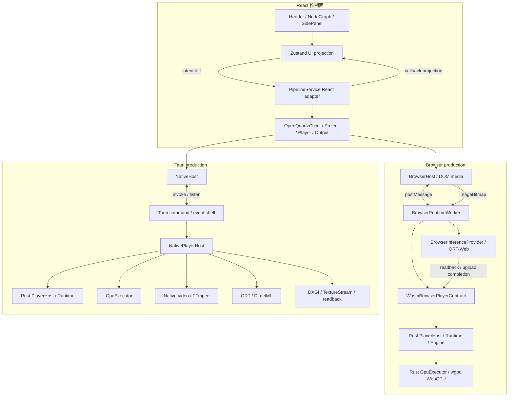

当前结论：

- Browser 不再生成或执行 TypeScript graph plan；Rust `Runtime/Engine/GpuExecutor` 持有 topology、clock、dirty、feedback、generation 和 shader GPU execution。
- Browser 的合理平台差异仍位于 TypeScript internal：DOM video/camera acquisition、`ImageBitmap` transfer、ORT-Web session、Worker timer 和 preview/capture 编码。
- Native 已使用共享 Rust Runtime/Player 语义；Tauri command/event、FFmpeg/ORT worker、DXGI/TextureStream 仍是 native host integration，不进入 public SDK。
- Browser 与 Tauri 对 UI 暴露同一个 TypeScript `Player`；host selection 位于 `OpenQuartzClient` internal，Component 和 Store 不处理 Worker/Tauri wire protocol。
- Java facade 与 JNI bindings crate 已建立，但真实 Java↔native 动态库端到端仍是未完成集成项。

| 语义/模块 | Browser/WASM | Tauri/native | 当前结论 |
|---|---|---|---|
| public object API | TypeScript proxy → Rust object/binding | TypeScript proxy → Tauri/Rust Player | public surface 已统一 |
| lifecycle/clock/graph policy | Rust Runtime/Engine | Rust Runtime/Engine | 已共享 |
| GPU execution | Rust wgpu WebGPU | Rust wgpu native backend | policy 已共享，surface/interop 平台化 |
| media | DOM decoder → transferable `ImageBitmap` | FFmpeg/native decoder | 合理平台分叉 |
| inference | ORT-Web provider，completion 回 Rust | Rust ORT/DirectML worker | provider 分叉；stamp/generation contract 共享 |
| output/presentation | Rust output registry + Worker projection/readback | Rust output registry + Tauri event/TextureStream | contract 共享，transport 分叉 |
| performance | **存在已知问题** | 当前未在本次文档更新中发现同类阻塞 | Web 后续单独 profile/优化 |

两边不得共享的仍应只包括 DOM/Web APIs、FFmpeg/ORT session、GPU/window handle 和 transport；graph semantics、clock、generation、output contract 必须保持 Rust 唯一来源。

### 1.2 控制面与数据面

| 平面 | 数据 | 频率 | 所有者 |
|---|---|---:|---|
| UI intent | play/pause/stop、graph edit、selection | 低频 | React + Zustand |
| Runtime control | set graph、resource reconcile、capture | 低频/按编辑 | TypeScript `Player` + internal host |
| Frame work | clock tick、dirty、GPU submission | 每帧 | Rust Runtime/Engine/GpuExecutor；Browser Worker 或 native render thread 触发 |
| Runtime event | frame metadata、output metadata、error | 合并/限频 | Rust delivery → internal host → React adapter → Store |
| Pixel stream | GPU texture、TextureStream、preview/capture readback | 高频或按需 | Rust/platform host；Store 只保存 UI 投影 |
| Persistent project | nodes、edges、资源 descriptor/path | 保存时 | TypeScript `Project/Graph` + I/O boundary |

### 1.3 宿主选择不变量

`OpenQuartzClient.player()` 在内部只选择一次 host：

```text
checkIsTauri() == false -> BrowserHost
checkIsTauri() == true  -> NativeHost
```

`PipelineService` 只消费 public `Project/Player/Output`，不直接选择 Worker/Tauri transport。同一会话不得同时启动两套生产 host，也不得把 Browser host 当作 Native 的隐式 fallback。平台 fallback 只能发生在 host internal，例如 Native presentation 从 TextureStream 降级为 bounded RGBA readback。


---

## 2. TypeScript 模块依赖

### 2.1 当前依赖图

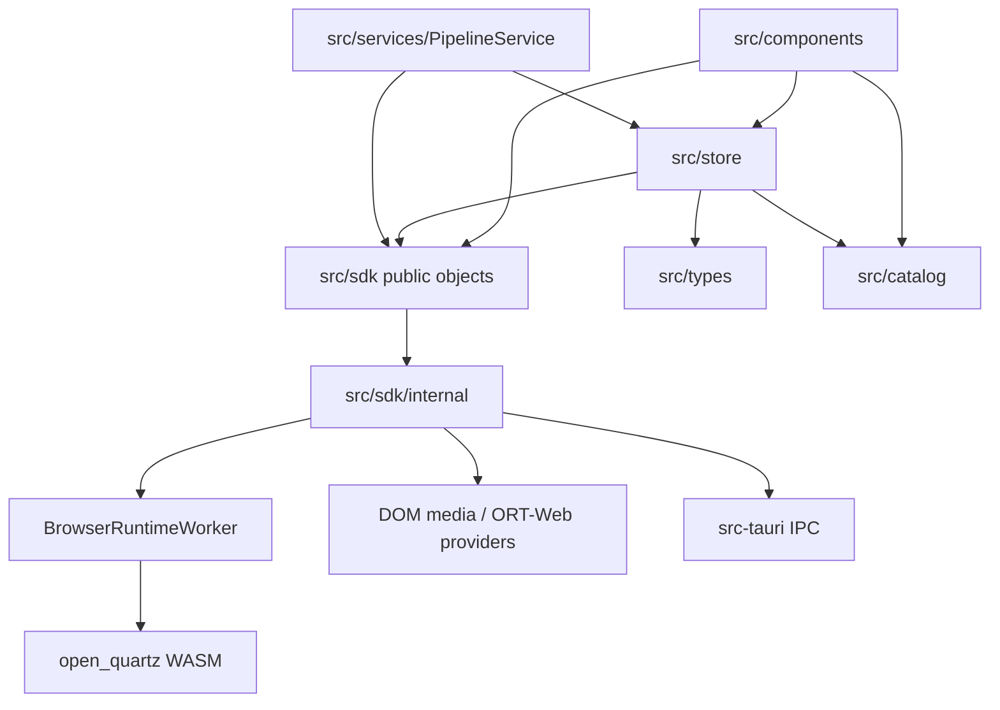

当前主干是 `components/store → PipelineService → TypeScript public objects → internal host → Rust`。旧 `src/engine/compositor.ts`、`executionEngine.ts`、`realtimeHost.ts` 和 `WebGPUBackend.ts` 已删除；Store 不再持有 model manager、ORT session、`MediaStream` 或 capture closure。`src/engine` 仅保留编辑器 shader 校验和 ONNX provider 所需的算法/ORT 封装，不拥有 graph topology 或逐帧 execution policy。

### 2.2 目录责任

| 目录 | 当前责任 | 边界 |
|---|---|---|
| `src/components` | 展示、用户输入、节点编辑、项目菜单 | 依赖 Store projection、public SDK 和 framework-neutral editor helpers；不依赖 SDK internal/transport |
| `src/store` | UI projection之外，仍含Graph mutation/node factory/connection rule/model准备 | 目标仅保存layout/selection/dialog/intent/result projection |
| `src/services` | React/Zustand adapter、presentation挂载、metrics与Player事件投影 | 拆小但保留framework职责；不定义跨平台业务policy |
| `src/sdk/OpenQuartzClient.ts`、`index.ts` | public facade；当前本地持有React Flow-backed Project/Graph snapshot | 改为Rust aggregate薄proxy；public export只含object/value/error |
| `src/sdk/internal` | Worker/Tauri/DOM transport，同时含ORT task和resource reconcile policy | 只保留不可替代platform capability和marshalling |
| `src/sdk/BrowserRuntimeWorker.ts` | frame wakeup、provider completion、output projection，同时扫描Graph建subscription/mapping | 只做timer/mailbox/provider/transport；observation intent来自Rust |
| `src/engine` | WGSL遗留materialization、ORT-Web inference与ONNX pre/postprocess、少量仅测试遗留 | 删除跨平台重复算法；只保留必要platform adapter或移入SDK internal |
| `src/catalog` | UI metadata与Math/ONNX执行descriptor、URL/defaults、legacy registry混合 | UI只保留label/category/icon/control；执行descriptor归Rust |
| `src/types` | project/domain/runtime/editor projection混合大DTO | 拆Rust domain schema、provider DTO和纯GUI projection |

### 2.3 当前生产类与已删除迁移类

| 类/模块 | 当前状态 |
|---|---|
| `OpenQuartzClient/Project/Graph/Node/Port/Player/Resource/Output` | public TypeScript SDK；生产使用 |
| `PipelineService` | React adapter；只调用 public objects |
| `BrowserHost` | main-thread internal transport 与 DOM media owner |
| `BrowserRuntimeWorker` | internal Worker host；调用 Rust `BrowserPlayer` |
| `NativeHost` | internal Tauri transport、event/TextureStream adapter |
| `WasmBrowserPlayerContract` | wasm-bindgen internal wrapper |
| `PipelineRuntime`、`BrowserPipelineRuntime`、`NativePipelineRuntime` | 已删除 |
| `Compositor`、`WebGPUExecutionEngine`、`WebGPUBackend`、`RealtimeHost` | 已删除；禁止回引 |
| `RuntimeBinding`、`WasmRuntimeContract`、`WasmEngineContract` | 已删除迁移接口 |

旧 public runtime surface 已清除，但 public object 仍未成为 Rust object 的真实 proxy；后续重点是继续把 domain/editor/resource/inference 规则下沉，而不是再增加 public runtime facade。

### 2.4 TypeScript 薄层专项审计

本次审计对 `src/sdk`、`engine`、`store`、`catalog`、`utils`、`services` 和 `screensaver.ts` 的非 GUI TypeScript 做了静态盘点，快照约 7,789 行。结论是：**执行内核下沉已经完成，但薄 TS SDK 只完成一半。**

| 区域 | 当前偏差 | 目标 |
|---|---|---|
| TypeScript public objects | `Graph` 自持 React Flow nodes/edges/revision；`Project` 用 TS serializer；`OpenQuartzClient` 不调用现有 Rust `OpenQuartz/Project` bindings | public object 是 Rust aggregate 的 async proxy/cache；public SDK 不导入 `@xyflow/react` |
| Zustand Store | `graphSlice/helpers` 持 connection type rule、node factory、ID counter、shader port更新、ONNX准备、Math/Renderer创建和 graph load/clear | Store 只保存 layout/selection/dialog/intent/output projection；Graph mutation 调 SDK command |
| Browser inference | TS 决定 task dispatch、tile/codec、pre/postprocess、threshold、overlay和 completion outputs | Rust 决定 task/tensor/pre/postprocess/output contract；TS 只调用 ORT-Web并回传 raw tensor/opaque result |
| Native host | 扫描完整 `ShaderNodeData` 并自行 reconcile image/video/ONNX resource | Rust Player产生 typed provider intent；TS只执行 Tauri/platform capability |
| Browser Worker | 扫描 graph 建 output subscription、renderer source和backend projection | Rust Output/Subscription 提供观察意图；Worker只做 timer、mailbox、provider和 transport |
| Project I/O | TS重复 project version、normalize、template strip/restore | Rust `Project::from_file/to_file` 唯一负责 domain serialization；TS只做 picker/download和React projection |
| Screen saver | TS重复 upstream traversal、resample node注入和edge rewiring | Rust SDK 提供 export/prepare transform；TS只做对话框、路径选择和host调用 |
| Catalog | Math执行公式、ONNX task/IO/defaults/URL与legacy registry混合在UI catalog | Rust拥有执行descriptor；TS catalog仅保留label/category/control presentation；删除第二registry |
| WGSL | `wgslCompiler.ts` 仍保留无人使用的pipeline/materialization代码 | 删除遗留，仅保留GUI编辑器需要的Rust validate调用和可选浏览器device diagnostics |
| 遗留代码 | TS topo sort、旧WebGL types、重复overlay和仅测试使用的Math compute仍存在 | 删除或替换为Rust contract/conformance test |

允许永久留在 TypeScript 的非 GUI 代码仅限平台边界：DOM media/camera、`ImageBitmap`/Worker、ORT-Web session调用、Tauri invoke/listen、WebView2 TextureStream、file picker/Blob download、React projection和必要的marshalling。判断标准不是文件是否位于 `src/sdk`，而是它是否只执行平台能力，且不定义跨平台业务语义。

目标依赖进一步收敛为：

```text
React components/store projection
  -> framework adapter
  -> thin TypeScript public proxy
  -> platform transport/provider
  -> Rust SDK objects and execution policy
```

以下依赖最终应为零：public SDK → React Flow；Store → execution/provider；Host → catalog/完整 Graph 业务字段；TypeScript → graph topology/Math公式/ONNX pre-postprocess/screen saver graph transform。

---

## 3. 核心对象关系

### 3.1 跨语言 public proxy 类图（目标）

跨语言类图只描述用户可见对象。TypeScript/Java SDK 作为 Rust SDK public object 的 proxy，类图应基本对应；PipelineService、PipelineRuntime、Worker、JNI、Runtime、Engine、Execution、Compositor、GpuExecutor 都不属于这张 public 类图。

```mermaid
classDiagram
    namespace RustSDK {
        class RustOpenQuartz[OpenQuartz]
        class RustProject[Project]
        class RustGraph[Graph]
        class RustNode[Node]
        class RustPort[Port]
        class RustPlayer[Player]
        class RustResource[Resource]
        class RustOutput[Output]
    }

    namespace TypeScriptSDK {
        class TsOpenQuartz[OpenQuartzClient]
        class TsProject[Project]
        class TsGraph[Graph]
        class TsNode[Node]
        class TsPort[Port]
        class TsPlayer[Player]
        class TsResource[Resource]
        class TsOutput[Output]
    }

    namespace JavaSDK {
        class JavaOpenQuartz[OpenQuartzClient]
        class JavaProject[Project]
        class JavaGraph[Graph]
        class JavaNode[Node]
        class JavaPort[Port]
        class JavaPlayer[Player]
        class JavaResource[Resource]
        class JavaOutput[Output]
    }

    RustOpenQuartz --> RustProject
    RustOpenQuartz --> RustPlayer
    RustProject *-- RustGraph
    RustProject *-- RustResource
    RustGraph *-- RustNode
    RustNode *-- RustPort
    RustPlayer --> RustOutput

    TsOpenQuartz --> TsProject
    TsOpenQuartz --> TsPlayer
    TsProject *-- TsGraph
    TsProject *-- TsResource
    TsGraph *-- TsNode
    TsNode *-- TsPort
    TsPlayer --> TsOutput

    JavaOpenQuartz --> JavaProject
    JavaOpenQuartz --> JavaPlayer
    JavaProject *-- JavaGraph
    JavaProject *-- JavaResource
    JavaGraph *-- JavaNode
    JavaNode *-- JavaPort
    JavaPlayer --> JavaOutput

    TsOpenQuartz ..> RustOpenQuartz : proxy
    TsProject ..> RustProject : proxy
    TsGraph ..> RustGraph : proxy
    TsNode ..> RustNode : proxy
    TsPort ..> RustPort : proxy
    TsPlayer ..> RustPlayer : proxy
    TsResource ..> RustResource : proxy
    TsOutput ..> RustOutput : proxy

    JavaOpenQuartz ..> RustOpenQuartz : proxy
    JavaProject ..> RustProject : proxy
    JavaGraph ..> RustGraph : proxy
    JavaNode ..> RustNode : proxy
    JavaPort ..> RustPort : proxy
    JavaPlayer ..> RustPlayer : proxy
    JavaResource ..> RustResource : proxy
    JavaOutput ..> RustOutput : proxy
```

proxy 对应的是对象 identity、方法行为、lifecycle、error 和 observable result，不要求三种语言共享相同的内存布局或通信 DTO。TypeScript/Java internal 可以批量调用和缓存，但不得增加另一个 public runtime/business abstraction。

### 3.2 当前内部实现所有权（非 public SDK）

| 对象 | Browser owner | Native owner | 是否进入 Store/项目文件 |
|---|---|---|---:|
| Graph metadata | Rust Runtime/Engine；TS `Graph` 保存编辑 projection | Rust Runtime/Engine | 仅可序列化 snapshot |
| Composition clock | Rust `CompositionClock` | Rust `CompositionClock`；host 提供 monotonic `now_ns` | Store 仅投影 time/frame |
| GPU device/queue/target | Rust `BrowserGpuEnvironment/GpuExecutor` | Rust `GpuBackend/GpuExecutor` | 否 |
| Video decoder | `BrowserHost` 的 DOM `HTMLVideoElement` | native video/FFmpeg | 项目仅保存 source descriptor/path |
| Video frame transport | transferable `ImageBitmap`，单节点最多一个 in-flight | native frame/surface | 否 |
| ONNX session | `BrowserInferenceProvider`/ORT-Web | native ORT/DirectML resource | 项目仅保存 model descriptor/path |
| Output registry | Rust Runtime | Rust Runtime | 否 |
| Preview/capture bytes | Worker 按 output readback 并编码 data URL | bounded readback 或 TextureStream | Store 仅保存最近 preview URL/metadata |
| Renderer stream | Browser canvas/surface | WebView2 TextureStream，live video 留在 adapter | Store 只保存 `rendererStreamActive` boolean |

Native 与 Browser 已共享 composition policy；仍允许 host 持有平台 resource、provider session、surface 和 transport。Web 当前性能问题集中在这些平台数据路径，不能以重新引入 TS execution policy 作为优化手段。

### 3.3 Rust SDK public object graph（目标）

Rust SDK public API 的判断标准是“用户是否需要直接理解和操作这个对象”。若一个对象只用于调度、编译、计划、GPU 提交、transport 或 binding，它应留在 internal，即使源码中由一个大型 class/struct 实现。

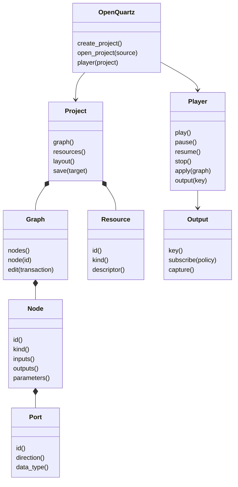

#### 3.3.1 Public、host integration 与 internal 分类

| 类别 | 对象 | 是否跨语言 proxy | 说明 |
|---|---|---:|---|
| 稳定用户接口 | `OpenQuartz`、`Project`、`Graph`、`Node`、`Port`、`Player`、`Resource`、`Output` | 是 | 用户直接创建、编辑、运行和观察 composition 所需对象 |
| Scoped public helper | `GraphEdit`、`NodeMut`、`PlayerBuilder`、`Subscription`、typed value/ID/error | 按语言习惯映射 | 服务 public object method，不形成新的业务层 |
| Host integration API | `EnvironmentBuilder`、`GpuProvider`、`MediaProvider`、`InferenceProvider`、`PresentationProvider` | 仅 SDK internal/高级 host 使用 | 为 Rust internal execution 注入平台功能；不是普通用户业务接口 |
| Rust internal | `Runtime`、`Engine`、`ExecutionEngine`、`ExecutionPlan`、`ExecutionCommand`、`Compositor`、`GpuExecutor`、clock、registry | 否 | 统一沉到 Rust；不出现在 TS/Java public 类图 |
| Language internal | Worker/Tauri transport、wasm-bindgen binding、JNI handle table、proxy cache、DTO | 否 | 分别属于 TypeScript SDK 与 Java SDK internal |

`PipelineHostRuntime`、`BrowserPipelineRuntime`、`NativePipelineRuntime`、`WasmRuntimeContract` 已作为迁移期 adapter 删除；当前 internal 使用 `BrowserHost`、`NativeHost`、`WasmBrowserPlayerContract`，且均不进入 public SDK export。

`Player` 取代 public `PipelineRuntime`/`RuntimeSession`。当前所谓 Session 的用户行为只有装载 Graph、播放控制、输入和 Output observation，与 Player 高度重合；同时保留 Player 和 Session 只会制造两个生命周期对象。内部仍保留 `Runtime`/execution session，未来若出现协作编辑、远程连接或认证上下文，应另建语义明确的 `WorkspaceSession`/`ConnectionSession`，不能重新把 execution runtime 暴露为 Session。

#### 3.3.2 Rust public API 形状

下面代码只表达用户价值和 ownership，不冻结最终命名：

```rust
let environment = Environment::native_defaults()?;
let sdk = OpenQuartz::new(environment);
let mut project = sdk.open_project(project_source)?;

let change = project.graph_mut().edit(|edit| {
    edit.update_node(NodeId::new("blur-1"), |node| {
        node.set_parameter("radius", Value::Float(12.0))
    })?;
    edit.connect(
        PortKey::new("blur-1", "output"),
        PortKey::new("renderer-1", "input"),
    )?;
    Ok(())
})?;

let mut player = sdk.player(project.graph())
    .with_resources(project.resources())
    .build()?;

let subscription = player
    .output(OutputKey::new("renderer-1", "output"))?
    .subscribe(OutputPolicy::latest(), output_consumer)?;

player.play()?;
player.apply(project.graph(), &change)?;
player.pause()?;
player.resume()?;
player.stop()?;
drop(subscription);
```

Rust public method 使用 typed Rust value、newtype ID、enum、trait、iterator/future、`Result<T, SdkError>` 和 ownership/lifetime。以下内容不得出现在 Rust business object method 中：

- JSON string 作为常规 graph/node/player 参数或返回值；
- Worker/Tauri request ID、event name、callback payload；
- JNI handle、Java class name、wasm-bindgen type；
- React Flow node、DOM object、WebView event；
- `ExecutionPlan`、`ExecutionCommand`、GPU bind group 或其他 internal execution descriptor。

#### 3.3.3 Graph aggregate、GraphEdit 与 Project/Player ownership

Graph 是 public aggregate root。推荐的 Rust 形状是 closure-scoped transaction，而不是暴露可长期保存的 command list：

```rust
pub fn edit(
    &mut self,
    operation: impl FnOnce(&mut GraphEdit<'_>) -> Result<(), GraphError>,
) -> Result<GraphChange, GraphError>;
```

首版保持单一返回值：transaction 自定义业务值可以由调用者在 closure 外保存；public API 只返回后续 `Player::apply` 和 undo/redo 真正需要的 `GraphChange`。若未来出现明确场景，再增加 `edit_with_result<R>`，不要先让基本 API 泛型化。

`GraphEdit` 至少提供 `add_node`、`remove_node`、`update_node`、`connect`、`disconnect`。推荐 `update_node(id, closure)`，而不是让 `NodeMut` 长期占用 `&mut GraphEdit`：这样后续 `connect` 不会被 Rust mutable borrow 卡住，Node mutation 仍保持对象式 API。

```rust
graph.edit(|edit| {
    edit.update_node(blur_id, |node| {
        node.set_parameter("radius", Value::Float(12.0))?;
        node.rename("Background Blur")?;
        Ok(())
    })?;
    edit.connect(blur_output, renderer_input)?;
    Ok(())
})?;
```

原子性规则：closure 返回 `Ok` 后统一验证并 commit；返回 `Err` 或 unwind 时原 Graph 不变。第一版推荐对纯 metadata Graph 建立 draft/clone 后提交，优先保证正确性；live GPU/decoder/ORT resource 不属于 Graph，因此不会被复制。若大图 profiling 证明 clone 成本显著，再把内部实现替换为 operation journal/copy-on-write，不改变 public API。

transaction 内同步完成，不允许持有 `GraphEdit` 跨 `await`。文件读取、模型下载和 decoder 创建应先在 transaction 外完成；transaction 内只写入 resource descriptor/reference。一次 transaction 统一维护 identity、type compatibility、edge uniqueness、cycle/feedback rule、resource invalidation 和 execution invalidation，并返回 Rust domain `GraphChange`，但不公开 wire patch。

```text
Project
  ├-> Graph               executable node/edge/port semantics
  ├-> GraphLayout         position / expanded / groups / notes
  ├-> ResourceCatalog     public resource descriptors/references
  └-> ProjectMetadata

Player
  ├-> private applied/compiled Graph state
  ├-> private live resources
  ├-> private Runtime/Engine/Execution
  └-> public Output objects
```

- position-only layout edit 不调用 `Player::apply`，不增加 execution revision，也不重建 GPU/feedback resource。
- Project 不拥有 decoder、GPU texture、ORT session 或 presenter。
- Player 构建时复制/编译 Graph state，不长期借用 Project/Graph；Project 可继续编辑并创建多个 Player。
- Player 更新使用 `player.apply(project.graph(), change)`；`GraphChange` 允许 Rust internal 做增量更新，如何跨 Worker/JNI 同步由 language SDK internal 决定。
- Output subscription 是 owned handle，不长期借用 Player 到阻止后续 mutable method；Player 关闭时 subscription 统一失效。

`Resource` 保留为 public object，但仅表示用户实际消费的 project resource：导入/替换图片、选择视频、选择 camera、绑定 ONNX model、查看 descriptor/状态。当前产品 UI 已经直接提供这些行为，因此完全隐藏 Resource 会迫使 NodeData 再次承载 path/data URL/model status。

public `Resource` 不等于 live runtime handle。建议拆成：

```text
Project Resource (public)
  id / kind / source descriptor / metadata / replace source / bind to node

Player live resource (internal)
  decoder / GPU texture / ORT session / generation / platform handle
```

如果后续确认用户只通过 Input/ONNX Node 操作资源，也可以让 `Node.resource()` 返回 Resource 而不提供顶层 catalog UI；但 Resource 类型本身仍有用户价值。GPU texture、decoder frame、ORT session、DXGI/DOM handle 永远不成为 public Resource。

#### 3.3.4 Execution environment：最小功能注入，不是业务接口

评估结论：WASM 需要部分 host integration，但不应把整个 GPU/execution engine 注入 TypeScript。

| 能力 | Rust/WASM 能否直接负责 | 目标处理 |
|---|---|---|
| WebGPU instance/adapter/device/queue/pipeline | 可以。当前 `wgpu` 已启用 `webgpu`；wgpu 27 可在 Worker 读取 `WorkerNavigator.gpu` | 由 Rust wgpu 创建和拥有，不注入 TS `WebGPUExecutionEngine` |
| Canvas/OffscreenCanvas surface | 可以由 wgpu 创建；wgpu 27 支持 `SurfaceTarget::Canvas/OffscreenCanvas` | TypeScript binding 在构建 Environment 时只传入 canvas target；Rust 管理 surface/render |
| ImageBitmap/VideoFrame 上传 | wgpu Web API支持 external image copy，但 DOM decoder/camera acquisition 受浏览器线程和对象生命周期限制 | TS internal 拥有 DOM source/frame acquisition；通过细粒度 `FrameSource`/opaque frame adapter 提供给 Rust |
| ORT-Web | 当前是 JavaScript library，Rust SDK 不能直接创建当前 ORT-Web session | 必须注入 `InferenceProvider`，除非未来替换为 Rust/WASM inference implementation |
| DOM/WebView presentation | DOM slot、HTMLVideoElement、TextureStream 属于 host | 注入 `PresentationTarget/Presenter` 或传 surface target；presentation policy 仍由 Rust internal 决定 |
| wakeup/timer | Browser event loop 属于 host | host 只实现 `FrameScheduler/Waker`；clock、deadline、play/pause policy 归 Rust Player/internal Runtime |
| file picker、camera permission、URL/blob resolution | 浏览器/Java UI 平台能力 | 由 language SDK internal resource resolver 提供，不进入普通 Project/Graph API |

因此 Environment 不应先定义一个包罗万象的 `GpuProvider`。推荐优先让 Rust wgpu 自己拥有 GPU；只对不可移入 Rust/WASM 的能力定义细粒度 host ports：

```rust
pub struct EnvironmentBuilder { /* advanced host integration */ }
pub trait FrameSource { /* acquire/release timestamped external frames */ }
pub trait InferenceProvider { /* model/task/completion */ }
pub trait PresentationTarget { /* surface/stream target */ }
pub trait FrameScheduler { /* wake at Rust-provided deadline */ }
pub trait ResourceResolver { /* host file/blob/device resolution */ }
```

这些 trait 的准确签名仍需在实现前做 spike，但边界已确定：Rust `Player`/internal execution 请求能力，host 提供实现；host 不接收 Graph 后自行执行。TypeScript/Java UI 不直接调用 provider，Project/Graph/Node/Player public API 不出现 provider 类型。

```text
Native Rust host -> Environment::native_defaults() + optional presenter target
TypeScript SDK internal -> EnvironmentBuilder + browser-only host ports
Java SDK internal -> EnvironmentBuilder + Java/JNI platform ports
```

`EnvironmentBuilder` 和 host ports 是 advanced host integration API。普通 composition 用户只使用 `OpenQuartz/Project/Graph/Player`；host integration 不得演变成第二套 PipelineRuntime。

#### 3.3.5 Rust internal execution 边界

目标内部关系：

```text
Player public facade
  -> Runtime internal
     -> Engine / Execution internal
        -> injected GPU/media/inference/presentation providers
```

- `Runtime` 负责 lifecycle、clock、generation、resource/output policy。
- `Engine/Execution` 负责 graph evaluation、plan、dirty/feedback、work ordering。
- GPU/media/inference/presentation 实现负责平台能力。
- `Compositor` 不作为独立 public 概念；其职责并入 Rust execution/presentation internal。
- Browser 不再保留第二个 TS `WebGPUExecutionEngine` policy object；TS 只保留注入 Rust 所需的平台 adapter。

#### 3.3.6 Threading、async、errors 与生命周期

- mutation 通过 `&mut self`、scoped edit 或内部同步明确串行化，不依赖隐藏 global singleton。
- 只有真正允许跨线程的对象实现 `Send/Sync`；GPU/window/DOM/platform handle 不伪装成通用线程安全对象。
- 异步加载和推理通过 Rust future/task/completion object 表达；internal Runtime 负责 stale generation 和 cancellation。
- public error 使用结构化 `SdkError`/error enum；不以 JSON string 作为 Rust API 错误。
- Output observation 使用 owned subscription；具体 callback/channel/stream adapter按语言和 thread affinity 提供。
- `Drop` 负责兜底清理，public `close/stop` 提供可观察、可返回错误的显式释放路径。

#### 3.3.7 待批阅的 public API 决策

| 决策 | 结论 | 原因 |
|---|---|---|
| SDK 根对象 | 保留 `OpenQuartz` | project/player factory、capability discovery；避免 global singleton |
| Player vs Session | public 只保留 `Player`；Session/Runtime 留 internal | 当前 Session 行为与 Player 基本重合；Player 对 play/pause/output 更直观 |
| Graph mutation | `Graph::edit` + closure-scoped `GraphEdit` + `GraphChange` | 原子维护 graph invariants；支持 Player 增量 apply；不暴露 wire command |
| Node mutation | `GraphEdit::update_node(id, closure)` | 避免 `NodeMut` 长借用阻止同 transaction 继续修改 graph |
| Node 多态 | `NodeKind`/typed descriptor + `Node` view | 当前类型集合相对封闭；避免过早 `Box<dyn Node>` |
| Player 与 Project | Player 拥有 applied state，显式 `apply(Graph, GraphChange)` | Project 可继续编辑；支持多个 player/offline/screen saver |
| Resource | public descriptor/object；live resource internal | 用户确实导入/替换/绑定 image/video/model，但不应接触 decoder/GPU/ORT handle |
| WASM GPU | Rust wgpu 直接拥有；只传 canvas/surface target | wgpu WebGPU/OffscreenCanvas 已支持，不需要注入第二个 TS GPU engine |
| WASM host integration | 只注入 frame source、ORT-Web、presentation、scheduler、resolver 等不可下沉能力 | 保持 Rust execution 唯一，同时满足浏览器平台约束 |
| Output | public `Output` + owned `Subscription` | 用户确实需要观察结果；internal registry/delivery 不暴露 |
| Thread model | Player 默认 single owner；按 environment capability决定 `Send` | 保留平台 thread affinity，避免虚假 `Sync` |

### 3.4 TypeScript/Java SDK 是 Rust public object 的薄 proxy（目标）

| Rust public object | TypeScript proxy | Java proxy |
|---|---|---|
| `OpenQuartz` | `OpenQuartzClient` | `OpenQuartzClient` |
| `Project` | `Project` | `Project` |
| `Graph` | `Graph` | `Graph` |
| `Node` | `Node` | `Node` |
| `Port` | `Port` | `Port` |
| `Player` | `Player` | `Player` |
| `Resource` | `Resource` | `Resource` |
| `Output` / `Subscription` | `Output` / `Subscription` | `Output` / `Subscription` |
| `SdkError` | typed error | typed exception/result |

TypeScript/Java public proxy 可以调整语言命名和 async 形状，但不能增加 `PipelineRuntime`、`ExecutionEngine`、`Compositor` 等 Rust public graph 中不存在的业务对象。

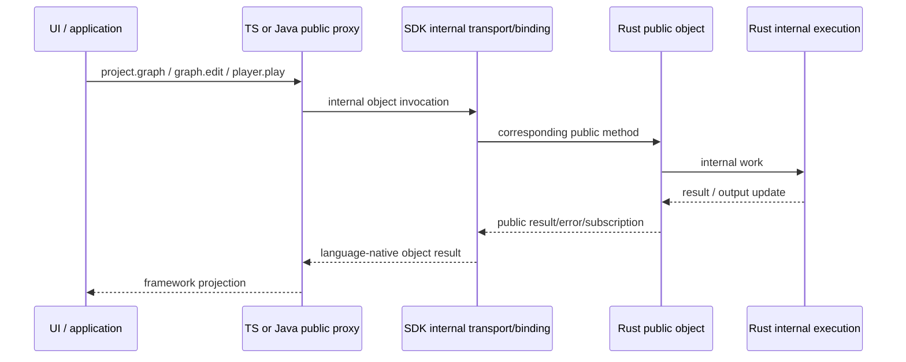

TypeScript SDK internal 拥有 Browser Worker、Tauri transport、wasm-bindgen、proxy cache 和 Browser capability adapters。Java SDK internal 拥有 JNI binding、handle table、marshalling、thread handoff 和 Java platform adapters。Native Rust application 直接使用 Rust public object，不经过 proxy。

---

## 4. Store 监听与双向数据流

### 4.1 上层意图如何下沉

`App` 只创建一次 `PipelineService`。Service 将 Zustand state transition 投影为 public `Player` 操作：

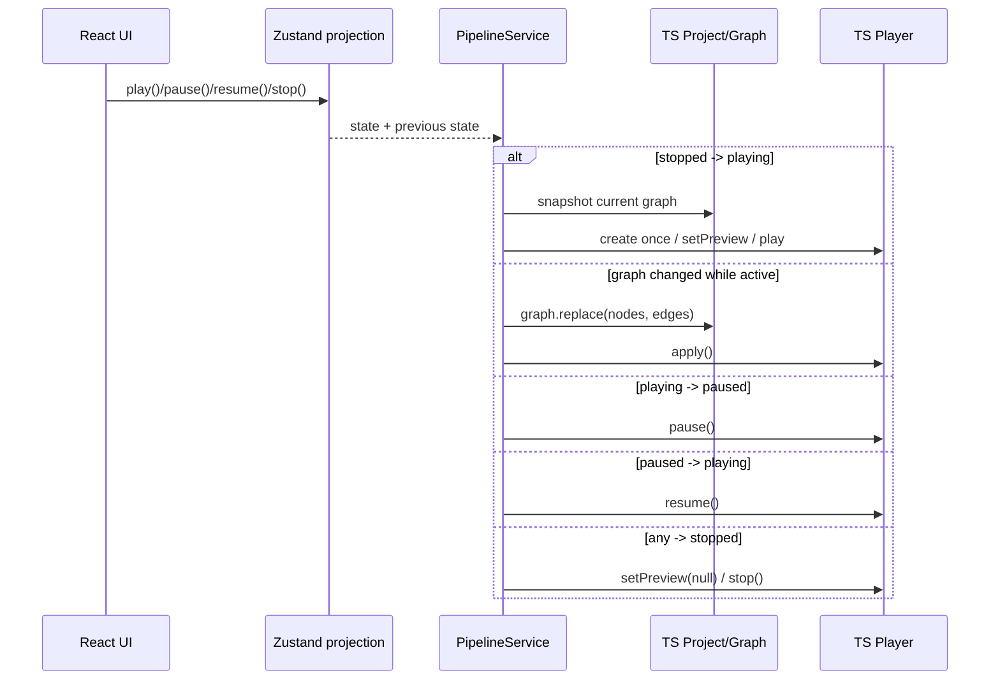

`PipelineService.operations` 串行化 async control，`generation` 拒绝 attach/detach 期间过期 Player 初始化。Host selection、Worker request 和 Tauri command 都在 TypeScript SDK internal。

### 4.2 下层状态如何上浮

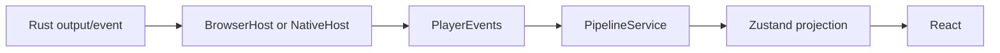

| 下层信号 | Adapter 处理 | Store projection |
|---|---|---|
| frame/time/fps | 最多约 10 Hz 更新 UI | `fps/currentTime/currentFrame` |
| preview/output image | stopped 后忽略迟到结果 | `outputPreviews[nodeId]` |
| typed output data | 直接投影 | `outputData[nodeId]` |
| output size | 更新 resolved size | node `resolvedWidth/resolvedHeight` |
| ONNX backend | 更新可观察 provider | node `onnxBackend/onnxNativeBackend` |
| node/runtime error | 归属 node 或 runtime | `nodeErrors` |
| renderer presentation/cadence | 窗口统计 | `rendererFps/rendererCadence` |
| TextureStream existence | adapter 持 live video，Store 只记状态 | `rendererStreamActive` |

Capture closure、Player、`MediaStream`、model manager、ORT session、texture 和 per-frame command 均不进入 Store。

### 4.3 监听模型的边界

1. **应用监听**：Store state diff → public Project/Player intent。
2. **runtime 监听**：Worker/Tauri/VideoFrame callback → `PlayerEvents` → Store projection。

每个 listener 必须在 `detach()/close()` 释放；Native 使用 `unlisten[]`，Browser 终止 Worker。Async inference completion 携带 graph revision、node generation 和 input/content stamp；preview/capture 仍需用当前 selection/subscription/lifecycle 拒绝迟到结果。

---

## 5. Language SDK ↔ Rust SDK 接口

### 5.1 Browser：public Player + internal Worker/wasm-bindgen

```text
React main thread
  OpenQuartzClient / Player
    -> BrowserHost (DOM media + Worker transport)
      ⇅ structured-clone postMessage
Dedicated Worker
  BrowserRuntimeWorker
    -> WasmBrowserPlayerContract
      ⇅ wasm-bindgen
Rust BrowserPlayerBinding -> PlayerHost -> Runtime/Engine/GpuExecutor
```

Main thread 请求仍包括 `initialize/play/update-graph/pause/resume/stop/set-preview/capture/close`；custom ONNX model 通过 transferable `ArrayBuffer` 注册。视频不是 RPC payload：`BrowserHost` 通过 `requestVideoFrameCallback`/timer 创建 `ImageBitmap`，每节点最多一个 in-flight frame，并使用 transferable postMessage。

Worker 每帧调用 Rust `BrowserPlayer.frame()`；Rust 返回 clock 和需要 host inference 的 task。Shader/feedback/renderer GPU work由 Rust wgpu 执行。ORT-Web provider 只处理 Rust 发出的 inference task，并用 graph revision、node generation、input/content stamp 提交 completion。

当前 Browser 边界仍有性能成本：

- renderer preview 最多约 15 Hz 执行完整 GPU readback、PNG 编码和 base64；
- ORT-Web 输入使用 `readOutputRgba()`，结果使用 `uploadRgba()`；
- video 使用 `createImageBitmap` + Worker transfer；
- Worker 以 `setTimeout` 驱动约 60 Hz frame loop。

这些路径已标为已知性能问题，暂不在本轮修复。后续必须先做 frame-time、readback、encode、postMessage 和 GC 分项 profile，再决定降频、订阅化、opaque GPU/tensor interop 或调度调整。

### 5.2 Native：public Player + Tauri internal host

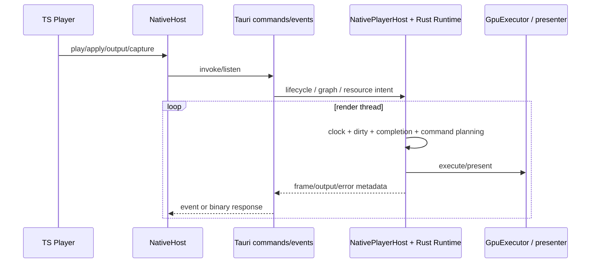

主要 command family 仍是 lifecycle、graph、image/video/ONNX resource、output readback、shared texture lease 和 diagnostics。Windows presentation 主路径为 DXGI shared texture → WebView2 TextureStream → adapter-owned `HTMLVideoElement`；失败时使用 bounded binary RGBA readback。高频 pixels 不经过 JSON event。

`NativeHost` 是 SDK internal transport，不是 public runtime。Tauri `NativePlayerHost` 仍负责 platform provider composition，但 lifecycle/clock/revision/generation/dirty/output policy 使用共享 Rust Runtime/Player 语义。

### 5.3 Java SDK：public facade 与 JNI 当前完成度

Java public source已包含 `OpenQuartzClient/Project/Graph/Node/Port/Player/Resource/Output`、`AutoCloseable` lifecycle、`CompletionStage` output/capture 形状、typed error mapping 和 `JavaEnvironment` provider contracts。`open_quartz_bindings` 提供 aggregate handle table 与 lifecycle C ABI；proxy、error 和 environment contract tests 使用可替换 `InternalBridge/JniBridge` 验证。

当前仍是**部分完成**：

- Rust C ABI 只覆盖 client/project/player 创建释放和 player lifecycle 子集；
- `NativeBridge` 声明的 graph/node/output/capture 方法尚未全部由 Rust 导出；
- 尚未运行真实 `System.loadLibrary("open_quartz_jni")` 端到端测试；
- Android Surface/Desktop presenter、direct buffer、callback thread 和完整 subscription 尚未接平台 host。

因此 Java object graph 和 internal boundary 已建立，但不能描述为可发布的完整 Java/JNI SDK。

### 5.4 当前接口一致性

| 语义 | Browser | Native | Java | 结论 |
|---|---|---|---|---|
| public object graph | TS proxy | TS proxy | Java proxy source | 形状一致 |
| lifecycle/clock/graph policy | Rust Runtime/Engine | Rust Runtime/Engine | JNI lifecycle 子集 | Browser/Native 共享；Java partial |
| GPU execution | Rust wgpu WebGPU | Rust wgpu native | provider contract only | 平台 backend 分叉 |
| inference | ORT-Web provider | ORT/DirectML | provider contract only | completion contract共享，平台实现不同 |
| output registry | Rust Runtime | Rust Runtime | facade/bridge shape | Java native method覆盖不完整 |
| state transport | Worker events | Tauri events | JNI future/publisher target | transport 可不同，public semantics 不应分叉 |
| presentation | OffscreenCanvas/readback | TextureStream/readback | Surface/presenter 待接 | 合理平台差异 |

UI 不消费统一 wire DTO；Browser/Tauri/JNI internal 分别投影相同 public object semantics。

---

## 6. 逐帧执行数据流

### 6.1 Browser frame

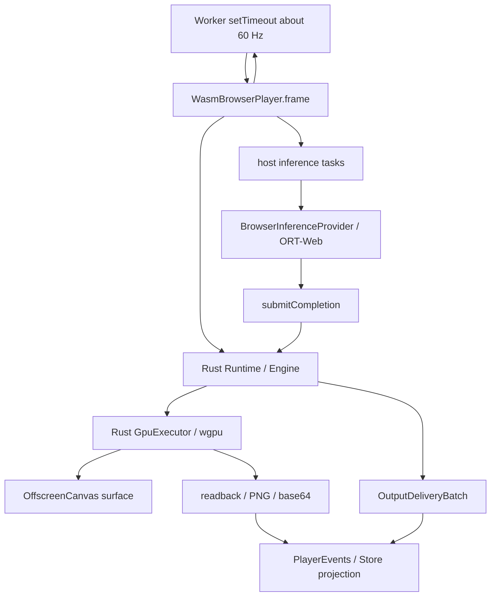

Rust 是 topology、clock、dirty、feedback、generation 和 GPU work 的唯一 owner。TypeScript Worker 只调度 frame、上传 external frame、运行 ORT-Web provider、drain delivery、编码 preview/capture。

#### 已知 Web 性能问题（暂缓）

功能 smoke、capture 和回归测试通过，不代表性能 gate 通过。当前已确认存在 Web 链路性能问题，但尚无 profile 证据将其归因于单一环节。本版本保留现状，不做快速 special case。后续优化需至少记录：Rust frame/GPU submit、GPU readback、PNG/blob/base64、ORT preprocess/inference/upload、`createImageBitmap`、postMessage、Worker scheduling 和 JS GC 的独立耗时与帧率影响。

### 6.2 Native frame

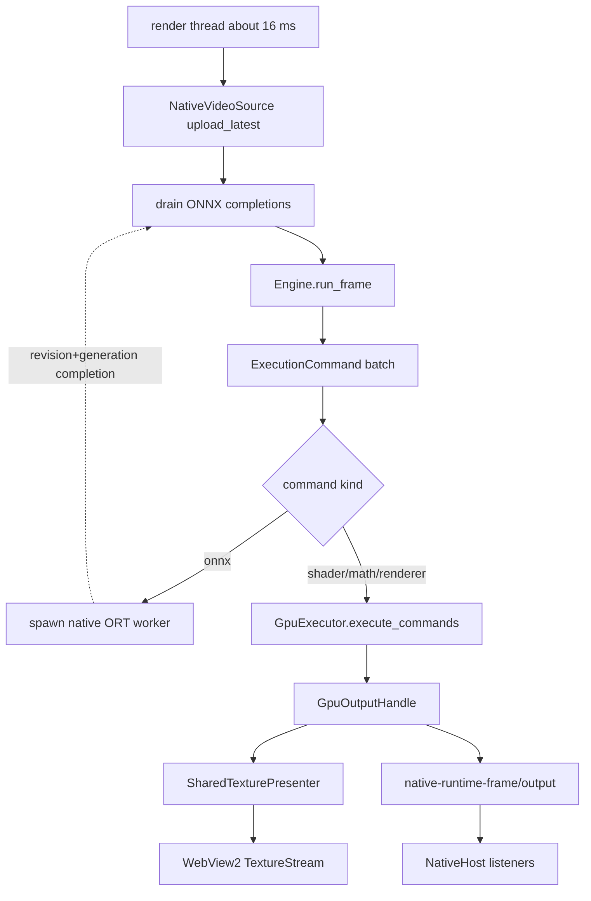

Native ONNX 当前需要 `GpuExecutor.read_output_rgba()`，在线程中执行 ORT，再 `upload_rgba()` 回 GPU；capability 明确为 tensor `cpu-copy`，不得描述成 shared wgpu/DirectML zero-copy。

### 6.3 Graph、资源和结果三条数据链

| 链 | 内容 | 生命周期 |
|---|---|---|
| Graph chain | node/edge/port/params | revision 管理；可持久化 |
| Resource chain | image/video/model descriptor → live object | node generation + host ownership；不可持久化对象 |
| Result chain | scalar/json/ROI/texture/presentation | output generation/stamp；Store 仅持 UI projection |

任何优化都必须说明自己改变的是哪条链。把 resource bytes 塞回 graph、把 GPU handle 写进 Store、或用 frame heartbeat 代替 typed output contract，都属于边界回退。

---

## 7. Rust 分仓与依赖关系

### 7.1 实际 Cargo workspace 边界

根 `Cargo.toml` 当前统一管理五个成员：

| package | 路径 | 当前责任 |
|---|---|---|
| `open_quartz_schema` | `crates/open_quartz_schema` | public IDs、types、Project/Graph schema、`SdkError`；不依赖 execution/binding |
| `open_quartz` | `crates/open_quartz` | Rust public objects以及 internal Runtime/Engine/GPU/media/ONNX/WASM implementation |
| `open_quartz_bindings` | `crates/open_quartz_bindings` | JNI aggregate handle table 与 C ABI；依赖 `open_quartz` |
| `app` | `src-tauri` | Tauri shell、native provider composition、events/commands、WebView2、screen saver export |
| `open-quartz-screensaver-stub` | `crates/open-quartz-screensaver-stub` | 自包含 Win32 `.scr` host |

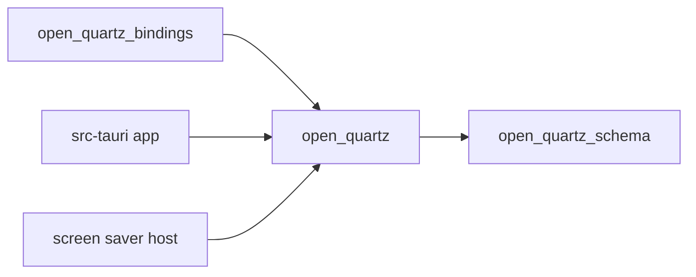

### 7.2 当前完成与剩余编译边界

已完成：

- schema/error/type 已从 core 拆到 `open_quartz_schema`；
- JNI handle/C ABI 已从 core 拆到 `open_quartz_bindings`；
- workspace 包含 Tauri 和 screen saver，`cargo metadata`/`cargo test --workspace` 可从根执行；
- TypeScript public export parity 与 dependency boundary 有 CI。

仍未完成：

- 计划中的独立 `open_quartz_sdk`、`open_quartz_host_api`、`open_quartz_execution` 尚未拆出；
- native host 仍需要访问 core 中 `#[doc(hidden)] pub` 的 `engine/gpu/host/media/runtime/onnx/wgsl` 模块；这只是文档隐藏，不是 compiler-private；
- WASM object binding 仍在 `open_quartz::ffi`，尚未整体迁入 bindings crate；
- `open_quartz` 仍同时包含 public object facade 与 execution implementation。

### 7.3 当前依赖规则

1. `open_quartz_schema` 不得依赖 core、bindings 或 platform crate。
2. `open_quartz_bindings -> open_quartz -> open_quartz_schema` 单向依赖。
3. Runtime/Engine 不依赖 language binding、Tauri、DOM 或 JNI DTO。
4. Tauri/screen saver 可依赖 hidden host integration，但不得通过 crate root重新导出 internal execution type给应用用户。
5. 下一步若继续拆 crate，应优先建立 `sdk/host_api/execution` 的编译边界，而不是复制现有模块。

### 7.4 Rust 核心对象所有权

| 对象 | 当前定义 | 当前 owner |
|---|---|---|
| public IDs/Graph/ProjectFile/error | `open_quartz_schema` | public value layer |
| `OpenQuartz/Project/Player/Resource/Output` | `open_quartz::sdk`，crate root re-export | Rust SDK user |
| `Runtime/Engine/ExecutionPlan` | `open_quartz` hidden modules | Rust Player/host integration |
| Browser wgpu environment | `open_quartz::wasm_environment` | Worker Rust BrowserPlayer |
| `GpuExecutor/GpuBackend` | `open_quartz::gpu` hidden module | Browser/native Player host |
| ORT-Web session | TypeScript SDK internal provider | Browser Worker |
| Native ORT/video/presenter | core primitives + Tauri/native host | NativePlayerHost |
| JNI aggregate handles/C ABI | `open_quartz_bindings` | Java SDK internal |

Binding 只能投影 public/domain/runtime methods；不得反向塑造 Rust public business API。

---

## 8. 优化后的边界审计

### 8.1 审计结论

控制路径重构已消除了第二套 TypeScript graph/GPU engine，但“public proxy + platform adapter”仍偏厚，不能把 public 类名一致等同于薄 SDK 完成。

剩余问题分为四类：

1. **TypeScript 业务下沉**：TS local Project/Graph、Store mutation、Project I/O、screen saver transform、ORT task policy、resource reconcile和遗留算法仍需迁入Rust SDK。
2. **Web 数据路径性能**：功能正确但存在已知问题；本轮暂缓，迁移时保留基线，后续单独profile。
3. **Java/JNI 完整度**：Java facade 和 lifecycle C ABI 已有，但native method与平台集成不完整。
4. **Rust 编译边界**：schema、bindings已拆；public SDK、host API、execution尚未完全拆crate。

### 8.2 逐项审计

| 边界 | 当前证据 | 状态 | 后续 |
|---|---|---|---|
| UI ↔ SDK | Component 经 Store/Service 调 public objects，但 catalog和部分editor helper仍直连 | **部分** | GUI只消费Rust-backed proxy和UI metadata |
| Store ↔ SDK | 无live object，但`graphSlice/helpers`仍实现Graph invariant、node factory、model准备和shader port mutation | **未完成** | mutation迁入SDK；Store仅保留UI projection/intent |
| Public proxy ↔ Rust | TS `Project/Graph/Node`自持React Flow snapshot和revision，未使用现有Rust object binding | **未完成** | public SDK禁止`@xyflow/react`并代理Rust aggregate |
| Service ↔ SDK | lifecycle经public Player；仍包含较多presentation/metrics projection | **部分** | 拆为小型framework adapter，不增加业务policy |
| Browser main ↔ Worker | DOM media/transport合理；Worker仍扫描Graph建立output subscription和renderer mapping | **部分** | observation intent由Rust Output/Subscription提供 |
| Browser execution/inference | shader/GPU在Rust；ORT task/pre-postprocess/output mapping仍在TS | **部分** | TS只运行ORT-Web，Rust拥有task/tensor/result语义 |
| Native execution/resource | Runtime语义共享；`NativeHost`仍扫描完整Graph reconcile image/video/ONNX | **部分** | Rust产生typed provider intent，host只执行平台调用 |
| Runtime ↔ binding | legacy `RuntimeBinding` 已删除；JNI ABI 独立 crate | **保持** | WASM binding 后续可迁 bindings crate |
| Schema boundary | `open_quartz_schema` 无 execution/binding dependency | **保持** | CI 守护 |
| Rust public visibility | internal root re-export 已移除；部分 host modules `#[doc(hidden)] pub` | **部分** | 继续拆 `sdk/host_api/execution` |
| Output observation | Rust registry + public Output；host events 为 projection | **保持/部分** | presentation/multi-output仍可完善 |
| Java/JNI | facade、tests、handle table、lifecycle ABI存在 | **部分** | 补全 graph/node/output ABI和真实加载测试 |
| Web copy budget | shader GPU-only；preview/ORT/video 仍有显著 host cost | **未通过** | 暂缓修复，先建立 profile 基线 |
| Project/screen saver/catalog | TS重复version/normalize/graph transform/Math formula/ONNX registry | **未完成** | 迁Rust并删除重复来源 |
| TS遗留算法 | topo sort、旧WebGL types、shader pipeline materialization、重复overlay仍存在 | **债务** | 先做无调用清理并以Rust contract test替代 |

### 8.3 防回退规则

- Rust `Engine` 继续作为 topology、dirty、feedback、Math、generation 和 work ordering 的唯一来源。
- TypeScript provider 可持 DOM/ORT/session/transport，不得接收完整 Store 后自行 plan graph。
- `OutputDeliveryBatch`、stamp 和 generation 是 async/output consistency source；Worker/Tauri/JNI 只是 transport projection。
- `open_quartz_schema` 不依赖 core/bindings/platform；`open_quartz_bindings -> open_quartz -> open_quartz_schema` 保持单向。
- Web 性能优化不得用重新引入 `Compositor/WebGPUExecutionEngine`、把 live object 放入 Store或让 UI 逐帧发 command 的方式实现。
- 平台类型如 `ImageBitmap`、ORT session、FFmpeg frame、D3D12 resource、HWND/Surface 必须留在 host/provider boundary。
- Public TypeScript SDK不得导入React Flow，也不得自行维护domain revision/invariant。
- Store只能保存GUI projection、layout、selection、intent和observable result；Graph command必须经过SDK。
- Provider/Host不得从catalog或完整Graph推导跨平台业务policy；Rust提供typed intent/request。
- 下沉任何行为前必须先建立回归，切换caller后才能删除TS实现和旧测试。

### 8.4 当前风险优先级

| 优先级 | 风险 | 当前决定 |
|---|---|---|
| P0 | TS public objects不是真实Rust proxy，Store仍持domain mutation | 下一阶段先完成Rust-backed object与Graph command cutover |
| P0 | Browser inference和NativeHost仍定义跨平台业务policy | 将task/resource intent下沉Rust，TS只保留平台执行 |
| P1 | Project I/O、screen saver、catalog和遗留算法重复 | 分小步迁移；每步先补Rust regression再删除TS实现 |
| P1 | Web frame/preview/inference/video性能不足 | 已记录并暂缓专项修复；迁移过程不得退化现有基线 |
| P1 | Java `NativeBridge` 与Rust C ABI覆盖不一致 | 补全后才能宣称Java SDK可用 |
| P2 | `open_quartz` public facade与execution共crate | 行为下沉稳定后继续拆compiler boundary |
| P2 | 多output/presentation完整度 | 在真实产品需求下推进 |

---

## 9. 必须守护的架构规则

### 9.1 允许依赖

```text
components -> framework adapter / Store projection
framework adapter -> TypeScript SDK public Project/Graph/Player/Output proxy
TypeScript SDK public proxy -> TypeScript SDK internal transport/environment
Java UI/application -> Java SDK public proxy -> Java SDK internal JNI/environment
Native Rust business -> Rust SDK public objects
TS/Java internal -> Rust SDK public methods + host integration providers
Rust Player -> internal Runtime/Engine/Execution -> provider traits
platform implementation -> injected provider traits + platform APIs
```

### 9.2 禁止依赖

- component 直接调用 native GPU command、Worker/Tauri transport、JNI internal 或 environment provider；screen saver host integration 除外。
- public TypeScript/Java SDK 暴露 `PipelineRuntime`、Runtime、Engine、ExecutionEngine、Compositor、binding、request ID、wire DTO 或具体 platform object。
- Rust SDK business API 按 Worker message、Tauri command、JNI DTO 或序列化格式组织。
- TypeScript Browser 层保留 topology、plan、dirty、feedback、shader compilation policy 或第二个 execution engine。
- environment provider 暴露为 Project/Graph/Node/Player 的业务方法，或由 UI 逐帧驱动。
- Node/Port proxy getter 通过同步 IPC/JNI 逐属性读取，或 proxy 长期持有无生命周期保护的 native pointer。
- Store 保存 SDK client/player/proxy object、GPU texture、decoder frame、ORT session/tensor 或 per-frame command。
- 将 SDK class instance/native handle 序列化进 Project JSON。
- `runtime` 依赖 `ffi`、Tauri、DOM 或具体 WebView event name。
- WGSL parser/compiler 依赖具体 GPU backend。
- Tauri shell 重建 composition clock、subscription registry、generation 或 presentation policy。
- 高频 pixel/frame 数据通过 JSON event 往返。

### 9.3 Change review 必答题

每个 runtime/性能 PR 必须回答：

1. 新状态由谁拥有？
2. 它属于 graph、resource 还是 result chain？
3. Browser 和 Native 是否产生第二套同义 policy？
4. 跨 JS/Rust 的是 command、event、stream 还是 bytes？频率和大小是多少？
5. listener/worker/session 在 stop/close/revision change 时如何释放或失效？
6. 是否改变 revision、generation、frame/content stamp？
7. fallback 是否通过 capability 显式可观察？
8. 是否新增逆向模块依赖？
9. 该能力属于 Rust SDK object API、TypeScript SDK public/internal、Java SDK public/JNI internal，还是 framework adapter？
10. 新对象的 ownership、identity、stale/dispose 和线程语义是什么；是否把 internal communication 泄漏成了 public API？

---

## 10. 新架构落地计划

### 10.1 当前完成度与真实阻塞

早期重构已完成Rust execution cutover，但薄TypeScript SDK仍是当前主阻塞。后续按以下顺序推进：

1. TypeScript public objects改为真实Rust aggregate proxy，移除React Flow/domain revision泄漏。
2. Store graph mutation、Project I/O、screen saver transform和catalog执行语义迁入Rust SDK。
3. Browser inference的task/pre-postprocess和host resource reconciliation迁入Rust typed intent。
4. 清除TS遗留算法后继续拆Rust public SDK/host API/execution编译边界。
5. Web性能问题保持已知且暂缓专项修复；每次迁移必须证明没有退化现有功能与可测性能基线。
6. Java完整JNI与平台环境仍需独立贯通。

### 10.2 阶段状态

| Phase | 当前状态 | 说明 |
|---|---|---|
| 0 API | **完成** | public object API 与 WASM capability 已建立 |
| 1 Domain | **完成/部分深化** | typed IDs、Project/Graph/GraphEdit 已有；NodeData 仍有 editor/runtime projection 可继续拆 |
| 2 Player/Native | **完成主路径** | Tauri/SCR 使用 Rust Player/Runtime；platform host composition仍存在 |
| 3 WASM | **功能完成，性能未通过** | Rust wgpu Browser execution已生产使用；Web 性能问题已记录并暂缓 |
| 4 TypeScript execution cutover | **完成** | React adapter、App/ScreenSaver cutover、legacy TS execution删除 |
| 5 Java/JNI | **部分** | public facade和tests完成；完整ABI、真实动态库与平台surface未完成 |
| 6 Boundaries | **部分** | schema/bindings crate与CI完成；sdk/host_api/execution尚未完全拆分 |
| 7 Thin TS convergence | **待执行** | Rust-backed proxy、Store command下沉、Project/screen saver/catalog/inference/resource policy下沉和TS遗留清理 |

以下Phase 0–6条目保留为历史实施规格；下一步以Phase 7路线为准。

### Phase 0：冻结 public object API，完成高风险 spike

**实现：**

1. 在 Rust 中先写 `OpenQuartz`、`Project`、`Graph`、`Node/Port view`、`PlayerBuilder/Player`、`Resource`、`Output/Subscription` 的 public signature、rustdoc、compile example 和最小可运行 in-memory behavior；不得提交 `unimplemented!()`、空方法或 JSON/wire facade 充当对象 API。
2. 明确 Runtime、Engine、ExecutionPlan、ExecutionCommand、GpuExecutor、registry 和 FFI 为 internal target；此阶段先建立模块边界和禁止新增 public re-export，不急于一次性收紧全部 visibility。
3. 冻结 `Graph::edit`、`GraphEdit::update_node`、`GraphChange`、Player ownership、Output subscription 和 Resource descriptor/live-resource 分层。
4. 做一个隔离 WASM spike，验证 Rust wgpu 在 Dedicated Worker 中完成 adapter/device、OffscreenCanvas surface、单 shader render 和 readback/capture。
5. 分别 spike `ImageBitmap/VideoFrame` frame delivery、ORT-Web provider round-trip、Rust deadline→host wakeup、DOM presentation target；记录哪些能力必须注入及其 thread/ownership/copy budget。

**验收 gate：**

- Native Rust 示例只出现 public object，不出现 Runtime/Engine/JSON/binding。
- public API review 表逐项确定用户价值、ownership、error、thread 和 close/drop 语义。
- WASM spike 证明 GPU 是否可由 Rust wgpu 直接拥有；provider signature 基于实测，不按现有 TS class 反推。
- 本阶段不改生产入口，不引入长期 feature flag。

### Phase 1：建立 Project/Graph/Resource domain model

**实现：**

1. 引入 typed `ProjectId/NodeId/PortId/ResourceId/OutputKey`，建立私有字段和受控 constructor/method，停止把 `Vec<ProjectNode>` public field 当 SDK API。
2. 将当前 `NodeData` 拆为 executable Node descriptor、`GraphLayout`、project `ResourceCatalog` 和 editor/runtime projection；position、expanded、download progress、resolved size 不进入 executable Graph。
3. 实现 closure-scoped `Graph::edit`。第一版以 metadata draft/clone 保证 rollback，commit 时统一校验 type、edge、cycle/feedback 和 resource reference，返回 `GraphChange`。
4. 建立 `.quartz.json` loader/serializer boundary。旧文件在 load 时一次性规范化为新 Project object；serializer 只从 Project object生成持久化格式。兼容转换不得进入 Graph/Player。
5. 将 screen saver graph slicing、project import/export、catalog node creation 改为调用 Project/Graph 方法，不直接修改 React Flow node data。

**验收 gate：**

- 现有 project fixtures 可 load→normalize→save→reload，graph semantics 和 resource references 不变。
- position-only/layout edit 不产生 executable `GraphChange`。
- GraphEdit 的失败、panic/unwind、cycle、类型不匹配、删除有引用 node 均保持原 Graph 不变。
- Rust domain module 不依赖 ffi、Tauri、DOM、React Flow 或 platform handle。

### Phase 2：实现 Player facade，先完成 Native clean cutover

**实现：**

1. 实现 `OpenQuartz::player(Graph)`、`PlayerBuilder`、`Player`；Player 内部组合现有 Runtime、Engine、GpuExecutor、resource/output registry，但这些类型不穿透 public API。
2. 实现 `Environment::native_defaults()` 和最小 host integration：native GPU/media/inference，以及由具体 host 提供的 presentation target。不要先建一个包罗万象的 backend trait。
3. 实现 public Resource descriptor/object、Player internal live resource reconciliation，以及 public `Output/Subscription/capture` facade。
4. 提取 Tauri 和 Screen Saver 共用的 native environment/Player implementation；Tauri 只保留 command/event/WebView2 shell，SCR 只保留 package、Win32 window/surface shell。
5. 迁移所有 Native/SCR caller 后，将 Runtime、Engine、GpuExecutor 的直接构造限制在 Rust SDK internal/test；删除 host 中重复的 clock、generation、resource/output policy。

**验收 gate：**

- 同一个 Native Rust example、Tauri host、SCR host 都通过 `OpenQuartz -> Project -> Player -> Output` 路径运行 shader、image、math、feedback、renderer、video 和 ONNX。
- Tauri/SCR 不直接构造 Runtime/Engine/GpuExecutor，不复制 video/ONNX scheduling policy。
- play/pause/resume/stop/apply/close 和 stale completion 在三个 Native consumer 上跑同一 conformance suite。
- screenshot、preview、presentation 都来自 public Output，frame heartbeat 不承载 output value。

### Phase 3：在隐藏 harness 中完成 Browser/WASM Rust execution

旧 Browser production path 在此阶段保持不变；新 Player path 只由测试/开发 harness 驱动。禁止在一个生产会话中同时运行旧 TS execution 与新 Rust execution，也禁止把旧路径做成 Player 的 runtime fallback。

**实现：**

1. 建立 wasm-bindgen internal object binding/handle table，只投影 Rust public object method；ExecutionPlan/command 不进入 TypeScript public API。
2. Rust wgpu 在 WASM 内拥有 device、queue、pipeline、target、feedback 和 shader execution；TypeScript 只传 OffscreenCanvas/surface target。
3. 实现细粒度 Browser host ports：DOM video/camera frame source、ORT-Web inference、frame scheduler/waker、resource resolver、DOM presentation。provider 不接收完整 Graph，不读取 Store/Catalog。
4. 将 Browser node matrix 逐项接入 Rust Player：shader/constant/math/feedback/image → video → ONNX → renderer/output/capture。
5. 建立同一 Project fixture 的 Native/WASM conformance：Graph behavior、output key/type、Player state transition、resource invalidation、frame/content stamp 和可比较像素结果。

**验收 gate：**

- Browser test harness 不导入 `src/engine/compositor.ts` 或 `executionEngine.ts`。
- shader/feedback/video/ONNX/renderer 的 browser smoke 全部通过 Rust Player。
- provider 只实现平台能力；topology、dirty、feedback、generation、output policy 只有 Rust 一份。
- **性能 gate 未通过**：普通 shader 保持 GPU-only、video 不经 JSON，但 renderer preview/ORT readback-upload/video transfer/Worker scheduling 仍存在已知性能问题；暂缓修复，待独立 profile。

### Phase 4：TypeScript SDK proxy、React adapter 与一次性生产切换

**实现：**

1. 建立 TypeScript `OpenQuartzClient/Project/Graph/Node/Port/Player/Resource/Output` proxy，与 Rust public object逐项对应；Worker/Tauri/wasm-bindgen、proxy cache 和 host selection 全部在 SDK internal。
2. 建立 React/Zustand adapter。React Flow node 由 Graph+Layout projection生成；Store 只保存 UI projection/selection/dialog，不保存 Player、MediaStream、capture closure、model manager 或 live resource。
3. 将 App、ScreenSaverApp、project menu、node editor、preview/capture 全部切换为 TypeScript public proxy。
4. 同一个 TypeScript Player 自动选择 Browser internal 或 Tauri internal；UI 不检测 Tauri、不调用 command name、不处理 Worker message。
5. 切换 gate 通过后，在同一阶段删除 `PipelineRuntime.ts`、public Browser/NativePipelineRuntime export、`RealtimeHost`、TS `Compositor/WebGPUExecutionEngine` policy、旧 Store ONNX/resource lifecycle 和相应 legacy tests。

**验收 gate：**

- `src/components`、`src/store` 不导入 `src/sdk/internal`、transport、binding、Tauri command 或 `src/engine` execution。
- TypeScript public export 只包含 Rust public object proxy、typed value/error 和 framework-neutral helpers。
- Browser 与 Tauri 使用同一 UI scenario 完成 open/edit/play/pause/apply/output/capture/close。
- production bundle 中不再存在第二个 TypeScript graph/execution policy；不存在旧 runtime fallback。

### Phase 5：Java SDK/JNI 投影

**实现：**

1. 在 Rust/TypeScript public API 稳定后，建立 Java `OpenQuartzClient/Project/Graph/Node/Port/Player/Resource/Output` proxy。
2. JNI internal 管理 aggregate-level handle、thread handoff、direct buffer/platform surface、subscription callback 和 error mapping；不为每个 Port 建长期 native pointer。
3. Android/Desktop host 通过 environment ports 注入 surface、resource resolver、scheduler 和需要的平台 inference/media 能力。
4. 复用 Phase 2/3 的 public object conformance fixture，不创建 Java 专属 graph/runtime policy。

**验收 gate：**

- Java public 类图与 Rust public object 对应，无 Runtime/Engine/Execution/Compositor/JNI handle 泄漏。
- Java close/AutoCloseable、callback thread、stale object 和 native handle release 有确定测试。
- 同一 Project fixture 在 Native Rust、TypeScript 和 Java 产生一致 Graph/Player/Output 行为。

### Phase 6：删除迁移边界并用编译边界固化

只有 Phase 4 clean cutover 完成后才拆 crate；否则只会固化临时 adapter。

```text
open_quartz_schema       public value/ID/error
open_quartz_sdk          Project/Graph/Player/Resource/Output public objects
open_quartz_host_api     advanced Environment/provider contracts
open_quartz_execution    internal Runtime/Engine/GPU execution
open_quartz_bindings     WASM/JNI/C bindings
```

**实现与验收：**

1. public SDK crate 不能依赖 bindings、Tauri、DOM、JNI DTO 或 platform shell；execution crate 不依赖 language binding。
2. dependency-policy CI 禁止 internal execution type从 public crate/root re-export。
3. public-proxy parity 检查 Rust/TypeScript/Java object/method/error；internal conformance 检查行为，不要求共享 wire DTO。
4. 删除所有迁移 adapter、临时 conversion helper、dev feature flag 和已无 caller 的 legacy test；Project file version conversion仅保留在持久化 loader boundary。

### 10.3 切换策略与提交纪律

1. **保持一条生产路径。** Phase 0–3 的新 Browser Player 只在 harness 中运行；Phase 4 一次切换生产入口并删除旧路径。
2. **不以 shim 冒充完成。** 临时 adapter 必须有明确删除 Phase，不能从 crate root 或 TypeScript public index 导出。
3. **每阶段可独立验证。** 一个阶段只有在自身 gate 全部通过后才开始依赖它的下一阶段；narrow unit test 不能代替 Native/Browser smoke。
4. **先行为、后拆 crate。** ownership、Player、provider 和 Browser execution 行为稳定前，不做机械目录/包拆分。
5. **Project migration 只在 I/O boundary。** runtime、Graph、Player 和 language proxy 只看新 domain object，不携带 legacy field fallback。

### 10.4 总体验收矩阵

| 维度 | 必须证明 |
|---|---|
| Public API | Native Rust 用户只使用 OpenQuartz/Project/Graph/Node/Port/Player/Resource/Output |
| Graph | atomic edit、rollback、type/cycle rule、layout 不触发 execution |
| Player | lifecycle、apply、multi-player、close/drop、stale async completion |
| Resource | descriptor 与 live object 分离；replace/remove/generation/close 正确 |
| Output | value/preview/capture/presentation 统一由 Output/Subscription 观察 |
| Environment | Rust execution 请求能力；host provider 不拥有 graph/execution policy |
| Browser/Native | 同一 fixture 的 graph behavior、output schema、stamp 和可比较像素一致 |
| Language SDK | TS/Java public proxy 对应 Rust public object，internal transport 可替换 |
| UI | framework 只依赖 public proxy，Store 无 live SDK/platform object |
| Cleanup | 无 PipelineRuntime、TS Compositor/WebGPUExecutionEngine policy、双 runtime 或 public wire DTO |
| Thin TS | public SDK不导入React Flow；Store无domain mutation；Host不扫描catalog/完整Graph；TS无跨平台算法重复 |
| Rust regression coverage | 除GUI和不可替代平台API外，所有可复用功能由Rust unit/contract tests直接防守 |

### 10.5 推荐 change-set 顺序

每个 change-set 都必须保持主分支可构建，并只在其 gate 具备足够证据时合入：

1. **API/spike change-set：** public signature review、WASM wgpu/frame/ORT/scheduler spike；spike 不进入 production path。
2. **Domain change-set：** typed IDs、Project/Graph/Layout/Resource、GraphEdit、project loader normalization。
3. **Player core change-set：** Player/Environment/Output facade 包装现有 Rust internal，实现 native defaults。
4. **Native host change-set：** Tauri 与 SCR 迁移到 Player，共享 native environment；删除 host direct Runtime/GpuExecutor orchestration。
5. **WASM execution change-sets：** Rust wgpu core、frame source、ORT-Web、presentation、scheduler，全部先落 hidden harness。
6. **TypeScript SDK change-set：** public proxy 和 internal object binding，不改 UI。
7. **Application cutover change-set：** React adapter/Store 切换，同时删除 PipelineRuntime、RealtimeHost、TS Compositor/WebGPUExecutionEngine policy 和旧 production tests。
8. **Java/JNI change-sets：** 在 Rust/TS public API 经生产验证后单独推进，不阻塞 Phase 6 dependency boundaries。
9. **Compile-boundary change-set：** 最后拆 crate、收紧 visibility、启用 dependency/proxy parity CI。

不得把第 5–7 项压成“先加一层 proxy、底下继续永久运行旧 TS engine”的假迁移。TypeScript proxy 可以先合入但不能成为 production 入口，直到 Rust/WASM Player 通过 Phase 3 gate。

### 10.6 Phase 7：薄 TypeScript convergence

Phase 7不做一次性重写。每个change-set只迁移一个可观察contract，先建立回归，再切caller，最后删除旧TS实现。

| 顺序 | Change-set | Rust目标 | TypeScript最终保留 | 必须回归 |
|---:|---|---|---|---|
| 1 | 无生产caller遗留清理 | 复用现有topo/Math/WGSL/ONNX contracts | 删除TS topo、旧WebGL types、Math `compute`、unused shader materialization、legacy ONNX registry/重复overlay | 先确认生产引用为零；Rust对应单测；`npm test`与`cargo test --workspace` |
| 2 | Rust-backed public objects | Rust `OpenQuartz/Project/Graph/Node/Port`绑定支持aggregate snapshot、edit、revision、serialize | async proxy、snapshot cache和error mapping；React Flow projection移到framework adapter | 同一fixture的create/open/edit/save/revision/rollback Rust+TS conformance；App open/edit/save smoke |
| 3 | Graph command与Store瘦身 | Rust node factory、connect/disconnect/type invariant、shader port更新、remove cascade、GraphChange | selection/layout/dialog/intent/undo UI projection | 每个Store action先转为Rust behavior test；connection boundary、cycle/type、undo/apply regression；NodeGraph UI test |
| 4 | Project I/O与screen saver | Rust version normalize、template resolution、upstream subgraph、resample transform、manifest graph | file picker、Blob download、dialog和path selection | load→normalize→save→reload；export graph像素/节点fixture；SCR package tests；TS菜单/对话框test |
| 5 | Catalog执行语义下沉 | Rust Math descriptor/formula、ONNX task/IO/defaults/integrity、shader template contract | label/category/icon/control metadata | Rust catalog snapshot/behavior tests；public proxy parity；菜单渲染tests；删除第二registry |
| 6 | Browser inference瘦身 | Rust task dispatch、tensor descriptor、tile/preprocess/postprocess、threshold、NMS/segmentation、output mapping和completion stamp | ORT-Web session lifecycle与raw tensor marshalling | Rust task unit tests覆盖每个model family/boundary；Native/Browser tensor conformance；stale completion；Browser ONNX smoke |
| 7 | Host resource intent | Rust Player输出resolve/attach/detach/load/unload/present typed intent和generation policy | DOM/Tauri/WebView2具体调用及opaque handle | image/video/model replace/remove/stop/close tests；Browser/Native同fixture；platform smoke |
| 8 | Schema与crate边界 | 拆 `open_quartz_sdk/host_api/execution`，移除UI/runtime projection字段 | GUI projection单独TS type | `cargo test --workspace`、compile-fail/dependency tests、TS diagnostics、project compatibility fixtures |
| 9 | Web性能专项 | 在正确边界上优化readback/encode/tensor/video/scheduler | 必要Web API与instrumentation | 优化前后同一benchmark；像素/输出/stamp回归；不得以关闭功能换指标 |

完成判据：

- `src/sdk` public surface不导入`@xyflow/react`，不自持domain invariant或独立revision。
- `src/store`不创建可执行node、不校验Graph连接、不下载/introspect模型。
- `BrowserHost/NativeHost`不导入执行catalog，不从完整Graph推导resource/task policy。
- TypeScript中不存在topology、Math执行公式、ONNX pre/postprocess、Project normalize或screen saver graph transform的第二实现。
- 除GUI和必须依赖DOM/Tauri/ORT-Web/WebView2的platform adapter外，功能变化应能由Rust tests直接定位失败。

### 10.7 每一步重构的回归协议

每个change-set必须按以下顺序执行，禁止“先删TS、最后补测试”：

1. **冻结行为**：列出要迁移的observable contract和edge cases。若行为目前只在TS，先保留/补characterization test；若Rust已有对应行为，先补Rust regression。
2. **Rust test先行**：为目标Rust API增加会在合理错误实现下失败的unit/contract test；覆盖success、boundary、invalid input、state transition、stale/dispose和serialization invariants。
3. **实现但不切生产**：完成Rust逻辑和binding/proxy，运行targeted Rust tests。
4. **跨语言conformance**：同一fixture同时经过Rust direct、WASM/TS proxy，必要时JNI；比较Graph/result/output key、revision/generation、stamp和可比较pixels/tensors。
5. **切一个caller**：一次只迁一个Store action、provider task或host intent；运行对应TS component/adapter regression和实际smoke。
6. **完整gate**：至少运行`cargo test --workspace`、`npm test`、`npm exec -- tsc -b`和public proxy/dependency checks；GPU/media/inference行为变更还要运行对应Browser或Native smoke。
7. **清理**：只有新路径通过完整gate后，才删除旧TS实现、legacy fixture和临时adapter；保留真正防守public behavior的tests。

每个PR必须记录“迁移前由哪个test防守、迁移后由哪个Rust test防守、还需要哪个platform smoke”。没有回归证据的代码搬运不算完成。

### 10.8 Rust 测试覆盖作为预期副产物

薄TS迁移完成后，一个重要副产物是：**几乎所有非GUI、非平台专属功能都可由Rust层unit/contract tests直接覆盖。** 这不是追求虚假的100%行覆盖，而是让业务功能的失败首先在Rust tests中出现，而不是依赖React/Worker/Tauri端到端测试才发现。

| 功能层 | 主要Rust测试 | 仍需语言/platform测试 |
|---|---|---|
| Project/Graph/Layout/GraphEdit | unit + property/invariant + serialization round-trip | React Flow projection与文件picker |
| node factory/catalog/Math/shader contract | table-driven/snapshot + parser/compiler behavior | 菜单、icon、编辑器interaction |
| Player lifecycle/resource/output | state transition、generation、subscription、stale/dispose | Worker/Tauri transport与surface |
| screen saver transform/package | graph fixture、manifest/package round-trip | Windows VM `/s`/`/p`/`/c` smoke |
| ONNX task/pre-postprocess | deterministic tensor/image fixtures、threshold/NMS/segmentation boundaries | ORT-Web/native provider availability与GPU interop |
| GPU execution | small deterministic texture/pixel fixtures | Browser/native adapter/device smoke |
| language proxy parity | Rust public contract fixture | TS/Java marshalling、close/error/thread behavior |

最终测试金字塔应为：大量快速Rust unit/contract tests；少量TS GUI与platform adapter tests；更少但真实的Browser/Tauri/Java/screen saver smoke。端到端测试验证集成，不能代替Rust对功能语义的直接覆盖。

### 专项状态：自包含 Windows Screen Saver Host

当前最小 capability profile 已切换为真正的 native host：

```text
Windows Screen Saver Control
  -> self-contained .scr
  -> Win32 /s or /p child window
  -> open_quartz::Runtime
  -> Engine -> GpuExecutor -> wgpu DX12
  -> direct DX12 wgpu Surface presentation
```

`.scr` 直接读取自身尾部的 version-3 manifest，初始化 `open_quartz` Rust SDK 和 GPU executor，并拥有窗口、Runtime、GPU device 与 presenter 生命周期；不启动 Tauri、WebView、React、`PipelineService` 或已安装的 OpenQuartz。

#### 已完成

- [x] 解除 `runtime -> ffi`、`wgsl -> gpu` 逆向依赖；Tauri Native 使用 canonical `Runtime`。
- [x] `open-quartz-screensaver-stub` 直接依赖 `open_quartz`，不依赖 `app` crate。
- [x] manifest 删除 `application_path`，magic/schema 升级到 version 3；旧包返回明确的版本错误。
- [x] `/s` 创建全屏 Win32 popup；`/p <HWND>` 创建并嵌入 native child window；`/c [HWND]` 保留纯 Win32 设置流程。
- [x] package 内嵌 graph manifest、Renderer ID、导出默认值和 exposed resource descriptors。
- [x] image override 只替换 resource path，不修改 graph topology/semantics。
- [x] shader、image、math、feedback、renderer、file-video、ONNX 共用同一 host；release host 实测 5,725,184 bytes（不含按图嵌入的资源）。
- [x] exporter 按实际 graph 收集 file video、FFmpeg、ONNX model、ORT 和 DirectML，写入带 offset/length/task 的资源闭包。
- [x] package/extraction 测试验证 version 3、自身前缀、资源 offset/length、runtime 环境路径和 manifest 回读。

#### Capability profile closure

- [x] Video profile：`NativeVideoSource` 已下沉到共享 crate；SCR package 内嵌文件视频和 FFmpeg，host 复用 loop/rate/pause/drop 生命周期。
- [x] ONNX profile：package 内嵌模型、ORT/DirectML；host 复用 Rust task preprocess/postprocess 与 DirectML→CPU fallback。
- [x] 导出器按 graph 实际节点选择资源，不需要的媒体/推理 payload 不进入 `.scr`。
- [x] native surface presenter：Renderer texture 通过 fullscreen blit render pass 直接进入 wgpu DX12 Surface，无逐帧 readback/GDI。
- [x] Camera profile 明确拒绝；导出时无法保存确定性的物理 camera source。

#### 验收状态

- [x] stub 无 `Command::new(app.exe)`、无 Tauri/app 依赖，直接构造共享 Runtime。
- [x] Rust/SCR tests 覆盖 graph plan、resource closure、runtime path extraction、mode parsing 和 package version 拒绝。
- [x] `/s`、`/p`、`/c` 均由 self-contained host 实现，退出路径显式销毁窗口并 drop media/session/GPU resources。
- [ ] 在未安装 OpenQuartz 的干净 Windows VM 手工验证移动后的 `.scr` `/s`、`/p`、`/c`。
- [ ] 用真实视频 graph 做 decode/loop/exit 长时间稳定性验证。
- [ ] 用真实 ONNX graph 做模型加载、provider fallback 与下游 GPU continuation 验证。

## 11. 性能与正确性不变量

### 11.1 高频路径

Browser：

```text
Worker timer -> WasmBrowserPlayer.frame -> Rust Runtime/Engine/GpuExecutor -> wgpu surface
                         ├-> OutputDeliveryBatch -> PlayerEvents
                         ├-> preview/capture readback -> PNG/base64
                         └-> ORT-Web task -> readback/inference/upload/completion
```

Native：

```text
render thread -> video/completion -> Rust Runtime/Engine -> GpuExecutor -> presenter
```

两条路径都禁止 UI 每帧发 command。Browser 的 timer/provider/readback 是 SDK internal host capability，不拥有 graph execution policy。

### 11.2 当前 copy 特征与性能状态

| 路径 | 当前 copy/同步特征 | 性能状态 |
|---|---|---|
| Browser shader | Rust wgpu texture/render pass，正常帧不做 CPU pixel copy | 需 profile frame/submit，但结构为 GPU-only |
| Browser renderer preview | 最多约 15 Hz：GPU readback → `Uint8Array/ImageData` → PNG blob → base64 → postMessage | **已知性能候选热点** |
| Browser capture | 显式 full output readback + PNG/base64 | 用户触发；可接受性待测 |
| Browser video | DOM decode → `createImageBitmap` → transferable postMessage → external texture copy | **已知性能候选热点** |
| Browser ONNX | GPU readback RGBA → ORT-Web → RGBA upload | **已知性能候选热点** |
| Native Windows file video | D3D12VA YUV surface import；无 CPU decoded RGBA 主路径 | 保持 |
| Native ONNX | GPU readback RGBA → CPU/DirectML ORT → GPU upload | 明确 cpu-copy tensor path |
| Native Renderer TextureStream | GPU shared texture bridge；无 CPU pixel IPC | 保持 |
| Native fallback preview | bounded RGBA binary readback | fallback only |
| Native screenshot | 显式 full-resolution RGBA readback | 用户触发 |

**决策：Web 性能问题先标记、暂不修复。** 下一轮必须先建立可重复的 Browser benchmark/profile，再决定方案；不得在没有数据时通过降低正确性、特殊 casing 或恢复 TS execution engine“优化”。

### 11.3 生命周期

- graph revision 改变时，旧 async completion 不得发布。
- node generation 改变时，旧 resource/result 不得复用。
- position-only edit 不应重建 GPU/feedback resource。
- STOP/close 必须停止 worker/listener/video/session/presenter lease。
- TextureStream fallback 不得启动第二个 graph runtime。

---

## 12. 架构验证与源码索引

### 12.1 验证方法

仅文档更新至少执行：

1. Mermaid fence成对、图类型可解析；
2. 文档中的路径、类名、command/event名可在源码定位；
3. `npm exec -- tsc -b`无新增diagnostic；
4. 不重复运行与文档无关的GPU/模型/发布测试。

任何代码重构则必须遵守10.7回归协议。默认完整gate：

```text
cargo test --workspace
npm test
npm exec -- tsc -b
npm run check:public-proxy
```

按变更路径追加smoke：Browser GPU/ORT/video、Tauri/native、Java JNI或screen saver。Targeted test可用于开发循环，但不能替代change-set完成时的完整gate。

自动边界检查应持续扩展：

- Rust public boundary：禁止public object引用binding、Tauri、DOM、JNI/wasm DTO或internal execution type；
- TypeScript thin boundary：public SDK禁止React Flow，Store禁止provider/execution，Host禁止catalog/完整Graph policy；
- public proxy parity：Rust/TypeScript/Java对象、方法、error与observable behavior对应；
- internal conformance：WASM、Worker、Tauri、JNI对同一fixture行为一致，不要求共享wire DTO；
- duplicate policy detection：禁止TS topo、Math公式、ONNX pre/postprocess、Project normalize和screen saver transform重新出现。

测试迁移原则：TS-only业务每迁出一项，Rust层必须增加等价或更强的regression；删除TS test前确认其contract已由Rust test和必要platform test共同覆盖。目标结果是Rust unit/contract tests几乎覆盖全部非GUI功能，而TS tests集中于GUI与不可替代platform integration。

### 12.2 关键源码入口

| 主题 | 源码 |
|---|---|
| App/framework adapter | `src/App.tsx`、`src/services/PipelineService.ts` |
| TypeScript public object API | `src/sdk/OpenQuartzClient.ts`、`src/sdk/index.ts` |
| Browser main-thread internal host | `src/sdk/internal/BrowserHost.ts` |
| Browser Worker | `src/sdk/BrowserRuntimeWorker.ts` |
| Worker protocol | `src/sdk/browserWorkerProtocol.ts` |
| WASM internal wrapper | `src/sdk/WasmSdkClient.ts` |
| Browser ORT provider/resource | `src/sdk/internal/BrowserInferenceProvider.ts`、`src/sdk/internal/OnnxResourceRegistry.ts` |
| Native TypeScript internal host | `src/sdk/internal/NativeHost.ts` |
| Java public/internal SDK | `java/sdk/src/main/java/com/sanitor/openquartz` |
| Java/Rust JNI binding | `crates/open_quartz_bindings` |
| Tauri command registration | `src-tauri/src/lib.rs` |
| Native host/render/events | `src-tauri/src/native_runtime.rs` |
| Native video | `src-tauri/src/native_video.rs`、`crates/open_quartz/src/native_video.rs` |
| WebView2 TextureStream | `src-tauri/src/webview_texture_stream.rs` |
| Rust schema crate | `crates/open_quartz_schema` |
| Rust public object/core crate | `crates/open_quartz/src/lib.rs`、`crates/open_quartz/src/sdk.rs` |
| Runtime/Engine/GPU/ONNX | `crates/open_quartz/src/runtime`、`crates/open_quartz/src/engine`、`crates/open_quartz/src/gpu`、`crates/open_quartz/src/onnx` |
| Browser Rust wgpu environment | `crates/open_quartz/src/wasm_environment.rs`、`crates/open_quartz/src/ffi/browser_player.rs` |
| Boundary/parity CI | `.github/workflows/dependency-boundaries.yml`、`scripts/check-public-proxy-parity.mjs` |

### 12.3 当前基线总结

- **已成立**：Rust public object API；Rust/WASM wgpu Browser execution；共享Rust lifecycle/clock/graph execution policy；旧TS graph/GPU engine删除；schema/bindings crate与boundary/parity CI。
- **部分成立**：TypeScript public facade和生产cutover，但尚非真实Rust-backed薄proxy；Store/host/provider仍持部分domain/resource/inference policy；Java facade/JNI lifecycle；Rust host API/execution编译边界。
- **已知问题、暂缓**：Web生产链路性能。候选热点为preview readback/PNG/base64、ORT readback-upload、video `ImageBitmap` transfer、Worker timer/GC；迁移每一步不得退化现有基线。
- **下一主线**：执行Phase 7，按回归先行方式迁Rust-backed proxy、Store Graph command、Project/screen saver/catalog、ONNX task与resource intent；预期副产物是Rust tests直接覆盖几乎所有非GUI功能。
- **尚未完成**：完整Java JNI/platform integration；独立`open_quartz_sdk/open_quartz_host_api/open_quartz_execution`边界；干净Windows VM的screen saver手工与长稳验证。

后续任何性能或边界优化若改变上述状态，必须同时更新总图、逐帧数据流、copy 特征、阶段状态和源码索引。
