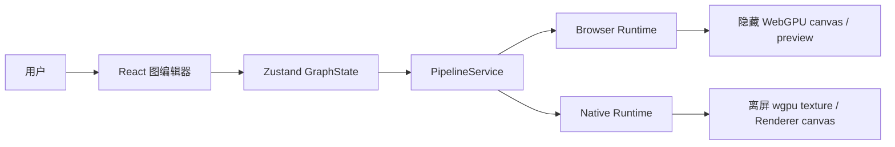

# Open Quartz 架构设计

> 面向实时异构视频管线的图编辑器与双宿主运行时
>
> 文档状态：架构基线（2026-07-30）
>
> 本文描述**当前真实实现、目标边界和迁移缺口**。`已实现`、`迁移中`、`目标`三种状态必须显式区分；目标设计不能被误读为已接入生产路径。

**阅读顺序**：0–3 给出系统结论、上下文和边界；4–7 定义数据、生命周期、执行和资源；8–11 分解两个宿主、SDK 与 ONNX；12–17 描述应用、运维和验证；18–19 记录迁移状态与架构治理规则。

---

## 0. 设计结论

Open Quartz 是一个以有向无环图（DAG）表达实时媒体处理逻辑的编辑器。一个图可以包含：

- WGSL shader：纹理、标量、向量和系统 uniform；
- image、framebuffer、video、system input；
- CPU math 节点；
- ONNX 推理节点；
- renderer terminal 节点；
- feedback/accumulator 跨帧状态。

系统由三个边界组成：

1. **编辑器边界**：React、React Flow、Zustand 只负责图编辑、项目管理、控制状态和结果展示。
2. **运行时边界**：`PipelineService` 把 Store 状态翻译成 runtime 生命周期、graph 更新、resource 操作和结果事件。
3. **宿主边界**：browser 与 Tauri 使用不同的时钟、媒体、GPU 和 ONNX 实现，但共享 graph、WGSL、计划、状态和错误语义。

`PipelineService` 根据宿主显式选择一个生产 runtime。浏览器路径为：

```text
React UI -> Zustand Store -> PipelineService
  -> BrowserPipelineRuntime -> RealtimeHost
  -> Compositor -> WebGPUExecutionEngine / browser ONNX
```

Tauri 路径不启动 browser GPU runtime：

```text
Tauri WebView UI -> Zustand Store -> PipelineService
  -> NativePipelineRuntime -> Tauri commands/events
  -> Rust render thread -> Engine / ExecutionPlan / GpuExecutor
  -> native wgpu surface + async native ORT
```

两个 adapter 实现同一 `PipelineHostRuntime` facade；选择发生一次，不存在双 runtime 或隐式 fallback。

这不是两个独立产品。目标是共享语义、分离宿主实现，而不是强迫两个宿主共享不可移植的 GPU 对象。

---

## 1. 目标、非目标与约束

### 1.1 目标

1. 让用户以图的方式组合 shader、媒体、数学运算和 AI 推理。
2. 让静态图只执行必要的 render pass，让动态图按宿主时钟连续执行。
3. 让 graph metadata、GPU resource、媒体解码器和 ONNX session 具有清晰的所有权。
4. 让 browser 和 Tauri 共享 graph contract、WGSL contract、执行计划和可观察事件。
5. 让高频 command/media/ONNX path 保持宿主本地；Windows Renderer 主路径通过 WebView2 TextureStream 做 GPU-only DOM 合成，selected preview/screenshot 才显式 readback。
6. 让 graph hot update 尽可能保留未变化的 pipeline、target、feedback 和媒体资源。
7. 让失败可定位到 node、revision、resource generation 或宿主 capability。

### 1.2 非目标

- 不把 Tauri WebView canvas 当作 native `wgpu::Surface`；Windows 使用 WebView2 TextureStream，其他不支持的平台回退 bounded preview readback。
- 不把 browser `GPUTexture`、Tauri `wgpu::Texture`、ONNX session 或 FFmpeg child process 序列化到项目文件。
- 不把 native wgpu device 与 DirectML device interop 描述成已完成的零拷贝能力；当前 capability 明确为不共享。
- 不为未来 3D patch、分布式渲染或多进程图执行提前设计协议。Three.js 依赖存在，但不是当前 2D pipeline 的执行核心。
- 不在 browser 与 native 之间共享宿主对象；只共享可序列化的 graph、plan、输入和事件语义。

### 1.3 硬约束

| 约束 | 规则 |
|---|---|
| 高频路径 | browser 使用 `requestAnimationFrame`；native 使用 Rust render thread；两者都不发送每帧 JSON command |
| 大资源 | image 使用 raw RGBA upload；video 使用宿主 decoder；model 使用 model ID/path；禁止把 bytes 放入 graph snapshot |
| GPU 所有权 | 一个 runtime 独占自己的 GPU object；Store 不应保存 native GPU object |
| Graph | 节点 ID 稳定；edge handle 决定端口连接；拓扑和 node data 变化才触发 plan rebuild |
| Feedback | shader 声明 `previousFrame` 才启用 ping-pong；位置变化不能清空反馈状态 |
| Output | native 每帧只 emit metadata；Windows 将三槽 DXGI export 经 D3D11On12、共享 keyed-mutex bridge、NV12 VideoProcessor 提交给 TextureStream；不支持时使用单 pending readback；screenshot 显式读取全分辨率 |
| 协议 | FFI/Tauri 错误必须保留结构化 code、message、nodeId/details |

---

## 2. 系统上下文

### 2.1 用户可见系统



编辑器的主窗口是控制面：节点、连线、参数、项目文件、播放状态和 preview 选择。运行时是数据面：graph 编译、GPU submission、媒体解码、推理和 output 资源。

### 2.2 两种宿主拓扑

#### Browser：Web 宿主路径

```text
Browser document
  ├── React UI
  │     ├── Header
  │     ├── NodeGraph
  │     └── SidePanel
  ├── Zustand GraphState
  ├── PipelineService
  ├── BrowserPipelineRuntime
  ├── RealtimeHost
  │     ├── Clock
  │     ├── MouseState
  │     ├── HTMLVideoElement / VideoSource
  │     └── Compositor
  │           └── WebGPUExecutionEngine
  └── browser ONNX session
        ├── onnxruntime-web WebGPU EP
        └── onnxruntime-web WASM fallback
```

browser runtime 在隐藏 canvas 上执行 WebGPU，renderer mirror/preview 由 `RealtimeHost` 转发到 UI。`Compositor.captureScreenshot()` 会通过 `readNodeOutput()` 读回 renderer 上游 target；当前 browser readback 统一限制到最长边 512，因此它是 preview/bounded screenshot，而不是保证原始分辨率的 full-output export。renderer 上游若是直接 image `TextureHandle` 而非 `RenderTarget`，当前 `readOutputs()` 也不会生成截图。

#### Tauri：native capability path

```text
Tauri main window / WebView
  ├── React UI
  ├── NativePipelineRuntime
  │     ├── graph metadata command
  │     ├── image raw-byte command
  │     ├── video resource command
  │     ├── bounded renderer preview / full screenshot command
  │     └── frame/output/error event listener
  └── Tauri command/event bridge
          │
          ▼
Rust native render thread
  ├── NativeGpuRuntime
  │     ├── Engine::new_native()
  │     ├── ExecutionPlan
  │     ├── GpuExecutor
  │     ├── native video sources / FFmpeg
  │     └── native ONNX resources / completion queue
  └── offscreen wgpu Device + Queue + textures
```

native GPU object 与 WebView 解耦；Rust 保持 texture、decoder frame 和 ONNX session ownership。adapter 根据 Node/SidePanel/fullscreen canvas 的实际显示尺寸 × DPR 请求预览，GPU 先缩放再传输；完整像素仅由 SAVE/screenshot 显式读取。

---

## 3. 分层架构与依赖规则

### 3.1 分层与 SDK-first 原则

Open Quartz 的长期产品边界是 **Rust runtime SDK**，不是 React/Tauri 应用。Web UI、Tauri shell 以及未来 Qt/Swift/AppKit/WinUI 等 native UI 都是 SDK client。可跨平台表达且不依赖具体窗口系统的责任必须优先落在 `open_quartz` crate；TS、Tauri command 和其他语言 binding 保持薄。

```text
┌──────────────────────────────────────────────────────────────┐
│ Replaceable UI clients                                      │
│ React/React Flow | Qt | Swift/AppKit | WinUI | other UI     │
├──────────────────────────────────────────────────────────────┤
│ Thin language/shell bindings                                │
│ WASM/TypeScript | C ABI/UniFFI-style bindings | Tauri IPC   │
├──────────────────────────────────────────────────────────────┤
│ Rust open_quartz Runtime SDK                                │
│ control/state machine | clock | graph/kernel | resources    │
│ output subscriptions | presentation planning | errors/events│
├──────────────────────────────────────────────────────────────┤
│ Host/platform traits and implementations                    │
│ GPU | media/input | inference | presenter | frame pacer     │
├──────────────────────────────────────────────────────────────┤
│ Platform APIs                                               │
│ WebGPU/WebCodecs/ORT-Web | wgpu/native decoder/ORT/surface  │
└──────────────────────────────────────────────────────────────┘
```

判断规则：一项逻辑若能由不含 React、DOM、Tauri、具体 window handle 或平台 GPU object 的 Rust 类型表达，就必须放入 Rust SDK。外层只负责 UI intent 转换、平台对象注册和渲染结果展示，不能重新实现 clock、scheduler、subscription、generation、resource reconciliation 或 presentation planning。

第二条硬原则：**Web app 与 Tauri app 必须调用同一个 Rust SDK 向上接口。** 只允许因 ABI/transport 产生机械 binding 差异，不允许形成 `WebRuntime API` 与 `NativeRuntime API` 两套 public surface。相同 capability 必须使用相同方法、descriptor、handle、state transition、error/event 和 subscription/delivery schema；平台差异通过 capability 与注册的 host backend 表达，不能通过分叉上层 API 表达。


### 3.2 目录职责

| 目录 | 责任 | 不应负责 |
|---|---|---|
| `src/components` | Web UI 展示、用户输入、节点编辑 | 定义 runtime 语义、直接创建 runtime、直接读 GPU texture |
| `src/store` | Web UI/project view state、选择、表单和 SDK delivery 的 UI 投影 | clock、output generation、resource/session ownership、执行状态机 |
| `src/services` | 将 Store intent 转成 SDK command，将 SDK event投影回 UI | graph scheduling、subscription policy、resource reconciliation |
| `src/engine` | 迁移期 browser platform glue；最终仅保留无法在 Rust/WASM 表达的 WebGPU/WebCodecs/ORT-Web 对象适配 | clock、topology、Math、dirty/feedback、generation、subscription registry、presentation planning |
| `src/sdk` | Rust SDK 的薄 WASM/TS/Tauri binding、handle registry 和类型投影 | 重新实现 Rust runtime policy 或业务 UI 状态 |
| `src/catalog` | 迁移期 Web UI catalog view；canonical node/model descriptors 最终来自 Rust SDK | 持有 GPU/session 生命周期或独立定义 execution semantics |
| `crates/open_quartz/src/types` | canonical graph/project/node/port/output/subscription/presentation schema | 宿主 UI 状态 |
| `crates/open_quartz/src/graph` | 拓扑、dirty set、graph plan 原语 | 具体 UI orchestration |
| `crates/open_quartz/src/wgsl` | WGSL parse、compile、validate | React/UI 状态 |
| `crates/open_quartz/src/engine` | runtime state machine、composition clock、typed frame、plan/dirty/feedback、per-port output、async generation | 具体 window toolkit |
| `crates/open_quartz/src/runtime`（目标） | resource reconciliation、subscription registry/delivery、presentation planning、host trait orchestration | React、Tauri command 或 DOM API |
| `crates/open_quartz/src/gpu` | native wgpu backend、targets、pipelines、upload/readback 与 platform interop traits | Tauri command registration |
| `crates/open_quartz/src/media`（目标） | timestamped input contract、native decoder ownership、frame selection | Web UI media controls |
| `crates/open_quartz/src/onnx` | inference contract、native ORT provider、tensor preprocess/postprocess、completion semantics | Tauri WebView events |
| `crates/open_quartz/src/ffi` | 稳定 C/WASM/language-neutral ABI、handles、typed errors/events | runtime policy 的第二份实现 |
| `src-tauri/src` | 薄 window/IPC/bootstrap、platform handle 接入和发行资源定位 | native render scheduler、clock、subscription/presentation policy、graph execution |

### 3.3 依赖方向

允许的方向：

```text
UI client       -> one canonical open_quartz Runtime API
Web app         -> WASM binding of the same Runtime API + Web host backend registry
Tauri app       -> Rust/C binding of the same Runtime API + native host backend registry
Other native UI -> Rust/C/Swift/Kotlin binding of the same Runtime API
bindings        -> mechanical ABI/transport projection only
Rust Runtime    -> Rust types / graph / wgsl / engine / runtime / gpu / media / onnx
platform backend-> Rust host traits + platform APIs
```

禁止的方向：

- `executionEngine.ts`、`RealtimeHost`、component、Store 或 Tauri shell 各自重新实现 Rust runtime state machine；
- component 直接调用 `invoke()` 或依赖内部 Rust module；
- Store 保存 `wgpu`/WebGPU pipeline、texture、surface、decoder frame、FFmpeg child 或 ONNX session；
- Rust runtime 依赖 React、Zustand、DOM、Tauri event name 或某个 native UI toolkit；
- Tauri command 成为只有 Tauri 客户端才能使用的业务能力入口；每个能力必须先有 SDK-level API；
- 为 Web 与 Tauri 暴露不同名称、参数、生命周期或事件模型的 Rust public runtime API；平台 capability 不能成为向上接口分叉的理由；
- runtime 用字符串匹配错误替代结构化错误码。

### 3.4 当前 facade 与目标 SDK 边界

`PipelineHostRuntime` 是当前 Web UI 的过渡 facade，不是长期产品 API。目标是 `open_quartz` 暴露 language-neutral、handle-based `Runtime` API，覆盖 lifecycle、graph/resources、clock、output subscription、capture、presentation descriptors、capabilities、errors/events。Tauri commands 和 WASM/TS 方法只是该 API 的机械投影；未来 native UI 可直接链接 Rust `rlib` 或通过稳定 C ABI/language binding 使用同一 runtime，无需复制 Tauri/Web 逻辑。

这里的“机械投影”要求 public surface 一一对应：例如 Web 和 Tauri 都调用同一语义的 `Runtime::set_graph`、`register_resource`、`play/pause/resume/stop`、`subscribe_output`、`update_presentation`、`drain_deliveries/events`。Web 不能多出一套 callback-driven runtime API，Tauri 也不能多出一套 command-driven业务 API；`postMessage`/WASM call 与 Tauri IPC/direct Rust call 只是 transport 实现。

宿主不可移植对象通过 opaque handle 或 host trait 注册：browser 使用 WebGPU/WebCodecs/ORT-Web adapter，native 使用 wgpu、hardware decoder、ORT 和 surface adapter。**对象实现留在宿主，所有权、生命周期、调度和 observable semantics 留在 Rust SDK。**


## 4. 核心数据模型

### 4.1 GraphState

Zustand `GraphState` 当前包含：

- `nodes: Node<ShaderNodeData>[]`；
- `edges: Edge[]`；
- `selectedNodeId`、`activeRendererId`；
- project name/path；
- output preview/data、node errors；
- `loopState`、fps、current time/frame；
- undo/redo history；
- screenshot callback。

`gpuDevice` 目前仍用于 browser edit-time shader validation；它不是 graph serialization 的一部分，也不是 native runtime 状态。长期目标是把 validation device 从 Store 移到 validation service，删除 UI state 对 GPU object 的依赖。

### 4.2 节点与端口

当前 `ShaderNodeData` 的主要节点类型：

```typescript
type NodeType =
  | 'shader'
  | 'input'
  | 'constant'
  | 'onnx'
  | 'renderer'
  | 'math';
```

端口 data type 分为：

- GPU/WGSL 类型：`float`、`int`、`uint`、`bool`、`vec*`、`mat*`、`sampler2D` 等；
- 逻辑类型：`roi`、`mesh`、`json`；
- `auto`：Math 节点用于宽类型连接。

输入 mode：

- `image`：image resource；
- `framebuffer`：指定尺寸/格式的 GPU target；
- `video`：browser HTML video 或 native FFmpeg source；
- `system`：time、delta、frame、mouse、resolution。

### 4.3 Graph semantics

- graph 是节点和 edge 的有向图；
- execution plan 对 graph 做拓扑排序；
- cycle 被记录为 `cycle`，不能假设循环图拥有完整拓扑序；
- input/constant/shader/onnx/renderer/math 对应不同执行命令；
- renderer 是优先输出节点；若没有 renderer，则使用没有 downstream edge 的 terminal node；
- 未连接的 builtin port 从 frame inputs 填充；已连接的 port 优先使用 upstream texture/value；
- `previousFrame` 是 feedback 声明，不是普通输入 port。

### 4.4 Graph snapshot 与 resource descriptor

graph snapshot 只应保存可持久化 metadata：

```text
node id/type/position
node data: shader template、ports、uniform values、resource key/path、尺寸/格式
edges: source/sourceHandle/target/targetHandle
```

不允许保存：

```text
GPUTexture / GPUBuffer / wgpu::Texture / wgpu::Buffer
HTMLVideoElement / FFmpeg Child / ORT Session
raw decoded pixels / output readback bytes
```

Native adapter 在 `setGraph` 前调用 `stripGraphResourcePayloads()`，把 image/video 大 payload 从 graph JSON 中移除；resource bytes 和 decoder descriptor 随后通过独立命令提交。browser 当前仍直接从 browser graph metadata 建立 HTML/WebGPU resource，未来应统一为相同的 resource descriptor API。

---

## 5. 生命周期与状态机

### 5.1 Application 生命周期

```text
App mount
  -> PipelineService.attach(canvas)
  -> subscribe GraphState
  -> user PLAY
  -> create runtime / initialize GPU
  -> setGraph + reconcile resources
  -> play / render
  -> graph hot update, preview selection, pause/resume
  -> STOP
  -> release video, GPU plan, callbacks, device references
  -> App unmount -> detach
```

`App.tsx` 当前只创建 `PipelineService`、挂载 hidden canvas、渲染 UI。服务必须在 unmount 时取消 Store subscription；runtime 必须在 stop/close 时停止 frame loop 和异步 resource listener。

### 5.2 Shared Engine state

Rust `Engine` 状态：

```text
empty -> ready -> running -> paused -> stopped -> disposed
```

主要操作：

- `setGraph`：解析 graph、建立 execution plan、增加 revision、更新 node generations；
- `markDirty`：标记节点及其 downstream；
- `runFrame`：接收 typed frame inputs，生成内部 execution commands；
- `pause/resume/stop`：只改变合法生命周期状态和执行策略；
- `drainEvents`：取出结构化 engine events；
- `dispose`：终止后续执行和旧 generation 的事件。

### 5.3 Graph revision 与 node generation

- `revision` 表示 graph snapshot 版本；
- `node generation` 表示 node resource/semantic contract 的版本；
- position-only graph update 不应增加需要重建 GPU resource 的 generation；
- shader code、ports、edges、尺寸、格式或 source descriptor 改变时，相关 node 及 downstream 变 dirty；
- 删除 node 必须释放其 texture、target、video source、session 和 pending async work。

### 5.4 Browser scheduling

`RealtimeHost` 根据图判断 static/dynamic：

- video、动态 system source、`iTime`/`iFrame`/`iMouse` 或 feedback 会使 pipeline dynamic；
- static pipeline 在资源加载完成后执行单帧，并在 async ONNX 完成时安排补帧；
- dynamic pipeline 使用 `requestAnimationFrame` 连续执行；
- `Clock` 提供 time、delta、frame、date；`MouseState` 提供 mouse；
- pause 会冻结 clock 和 video；resume 恢复；stop 取消 RAF、销毁 video 和 compositor。

### 5.5 Native scheduling

Tauri native render worker：

- Rust thread 约 16 ms tick；
- `playing=true` 时调用 `NativeGpuRuntime::render_next()`；
- video frames 在 render thread 内从 decoder slot 上传到 GPU；
- `Engine::run_frame` 生成命令；`GpuExecutor::execute_commands` 消费命令；
- 最终 texture 保持离屏，不创建独立 output window；
- Windows DX12 output 进入三槽 `DxgiSharedTextureExporter`，main thread 通过 D3D11On12 打开 resource/fence、复用每槽 bridge texture，D3D11 VideoProcessor 转为 WebView2 NV12 texture 后 `PresentTexture`；队列只保留 latest frame；
- 每个 render frame 仍发送 `native-runtime-frame` metadata；TextureStream 可用时 adapter 直接从隐藏 `HTMLVideoElement` 合成到 Renderer mirrors，否则使用单 pending RGBA readback；
- frame command、decoder frame 和完整分辨率像素不进入常规 Tauri event。

---

## 6. 图编译与执行

### 6.1 统一计划生成

Rust `build_execution_plan_with_options()` 执行：

```text
ProjectNode[] + Edge[]
  -> graph node/edge representation
  -> topological sort
  -> upstream port map
  -> connected builtin detection
  -> target size/format resolution
  -> WGSL compile
  -> WGSL validation
  -> feedback detection
  -> output node selection
  -> ExecutionPlan
```

`ExecutionPlan` 包含：

- `sorted_ids`；
- `NodeExecutionPlan[]`；
- upstream mapping；
- builtin ports；
- target dimensions/format；
- compiled shader and validation errors；
- feedback flag；
- output nodes；
- default size；
- cycle flag。

browser 保留独立的 `WebGPUExecutionEngine.prepare()` GPU 对象实现；Rust plan 用于 WASM contract 和 native runtime。两条路径通过 graph/command/result contract tests 守护语义一致性，browser GPU object 不进入 Rust。

### 6.2 Dirty execution

Rust `ExecutionEngine` 保持：

- `DirtySet`；
- feedback read/write index；
- first-frame clear 标记；
- math scalar cache；
- node list 和 execution plan。

每帧只取按拓扑序排列的 dirty nodes。动态节点自动 dirty；上游 resource upload 会显式 `mark_dirty`。shader、math、onnx、renderer 生成不同的 `ExecutionCommand`。

### 6.3 Shader execution

WGSL compile contract 负责：

1. 从用户 code 和 ports 建立 binding plan；
2. 注入 system uniforms、sampler、texture、feedback bindings；
3. 对 native video 输入选择普通 sampled texture；
4. 对 browser video 保留 `texture_external` 语义；
5. 去除冲突的用户声明；
6. 通过 `naga` 验证并返回 source mapping/diagnostics。

Rust parser 已由 `src/sdk/wgslParser.ts` 作为同步 production parser 使用：`main.tsx` 在 React mount 前调用 `initializeSdk()`，后续 `parseWgslShader()` 通过 `requireSdk()` 使用 WASM binding。

### 6.4 Feedback

feedback shader 通过引用 `previousFrame` 声明跨帧状态：

```text
frame N:
  feedback[read] -> shader -> feedback[write]
  swap(read, write)
```

首帧清空由 `feedbackClearColor`/plan 决定。position-only graph update 必须保留 feedback indices 和 GPU ping-pong texture；shader contract、尺寸、格式改变时才重建。

### 6.5 Math、input、ONNX、renderer

| 节点 | 计划阶段 | 执行阶段 |
|---|---|---|
| input | resource/constant descriptor | 标记 resource ready；不产生 shader command |
| math | 保留 upstream scalar mapping | CPU 计算，缓存 scalar output |
| shader/constant | compile、bindings、target、feedback | GPU render pass |
| ONNX | 计划 input/output contract | browser WebGPU/WASM；native async texture→tensor→ORT→texture，六类 task 与 cascade |
| renderer | 选择 output target | browser mirror/native surface present |

---

## 7. 资源架构

### 7.1 Resource registry

runtime 逻辑上维护以下资源集合：

```text
images[nodeId]    -> image texture + descriptor
videos[nodeId]    -> browser VideoSource 或 native NativeVideoSource
models[nodeId]    -> browser model/session 或 native ORT session
pipelines[key]    -> compiled pipeline/bind group layout
renderTargets[id] -> target + feedback ping-pong
outputs[nodeId]   -> readable output texture descriptor
```

Store 只保存 descriptor/key/path，不保存以上对象。

### 7.2 Image

Browser：

- `imageDataUrl` 通过 `Image.decode()` → `createImageBitmap()` → `copyExternalImageToTexture()` 上传；
- `WebGPUBackend.loadRawTexture()` 已存在，但当前 `WebGPUExecutionEngine.prepare()` 只注册 `imageDataUrl`，`rawDataUrl` 尚未接入 browser plan resource reconciliation；
- 已上传 image 以 `TextureHandle` 作为 texture source。

Native：

- TS adapter 校验 `width * height * 4`；
- 以 raw `Uint8Array` body 发送到 `native_gpu_upload_image`；
- node/width/height 通过 headers 发送；
- Rust 直接 `queue.write_texture` 或对应 backend upload；
- descriptor 未变化时不重复发送；
- 删除或切换 source 时调用 `native_gpu_remove_texture`。

### 7.3 Video

Browser：

- `VideoSource` 管理 HTMLVideoElement、camera stream 或 file URL；
- 每帧将 video element 传给 browser WebGPU path；
- `copyExternalImageToTexture`/external texture 是 browser 宿主行为。

Native：

- `NativeVideoSource` 通过 FFmpeg probe 输入尺寸和 fps；Windows x64 文件源优先使用 libav D3D12VA，camera 与非 Windows 保留 FFmpeg raw RGBA fallback；
- D3D12VA decoder thread 选择 `AV_PIX_FMT_D3D12`，等待 `AVD3D12VASyncContext` fence，并把独立保留的 P010 `ID3D12Resource` 放入 generation-tagged frame slot；
- native render worker 通过 `wgpu-hal::dx12::texture_from_raw` 导入 P010 surface，在 GPU 上转换为普通 sampled RGBA texture；不读取 decoded bytes；
- fallback decoder child 输出 raw RGBA，reader thread 写入 generation-tagged frame slot；
- render thread 调用 `upload_latest()`，只上传新 generation；
- pause 停 decoder，resume 重启 decoder，file source 保存 position；
- `NativeVideoDevice` 通过平台 backend discovery 返回 id/label。

必须满足：decoder frame 不通过 Tauri IPC 传输；同一个 frame 只允许一个 native upload owner；同 node 的 video descriptor 替换会丢弃旧 decoder并由后续 frame 更新/复用 texture；从 video 切换到非 video 时必须在同步 replacement image 前 detach source并移除旧 texture。

### 7.4 Render targets 与 output

每个 shader/renderer target descriptor 至少包含：

```text
width, height, texture format, filter/wrap, feedback flag
```

target 重建条件：

- 尺寸改变；
- format 改变；
- shader binding/output contract 改变；
- feedback layout 改变。

Native output/screenshot IPC payload 格式：

```text
u32 width little-endian
u32 height little-endian
width * height * 4 RGBA8 bytes
```

Native `read_output` 只接受 `rgba8unorm` output。Browser output readback 由 `Compositor.readNodeOutput()` → `WebGPUBackend.readTargetToDataURL()` 完成，当前最长边限制为 512；它用于 preview/bounded screenshot，不等于原始分辨率 export。

### 7.5 Resource reconciliation

每次 native graph update 的实际同步顺序：

```text
1. set graph metadata
2. reconcile video resources
     2.1 attach/update wanted descriptors
     2.2 detach stale descriptors
3. reconcile image resources
     3.1 upload/update wanted descriptors
     3.2 remove stale descriptors
4. changed resource nodes become dirty
5. render on next host tick
```

顺序不是实现细节：从 video 切换到 image 时，stale video detach 会移除 node texture，因此必须在 replacement image upload 前完成。反方向切换时，video descriptor 先建立，随后 image reconciliation 删除旧 image texture；首个 decoder frame再上传新的 video texture。

---

## 8. 浏览器运行时与逐帧数据流

### 8.1 宿主选择：先区分 Browser 与 Tauri

`App` 只创建隐藏 canvas，并把它交给 `PipelineService`：

```text
App.useEffect()
  -> new PipelineService()
  -> PipelineService.attach(hiddenCanvas)
  -> subscribe(Zustand GraphState)
```

用户点击 PLAY 后，`PipelineService.createRuntime()` 只选择一个宿主：

```text
checkIsTauri() == false                       checkIsTauri() == true
        │                                             │
        ▼                                             ▼
BrowserPipelineRuntime                         NativePipelineRuntime
        │                                             │
        ▼                                             ▼
RealtimeHost + browser rAF                    Tauri commands/events
                                                      │
                                                      ▼
                                               Rust render thread
```

因此：

- 本节的 rAF call graph 只描述 Browser runtime；
- Tauri app 当前使用 native runtime，不从 WebView 发起逐帧 rAF command；
- 两条路径共享 graph/node/task semantics 和 `PipelineHostRuntime` facade，但不共享 canvas、GPU texture、video decoder、ONNX session 或逐帧 buffer。

### 8.2 PLAY 到首帧的 Browser call graph

```text
Header PLAY
  -> GraphState.play()
  -> Zustand: loopState stopped -> playing
  -> PipelineService subscription
       -> clearOutputPreviews()
       -> clearNodeErrors()
       -> ensureRuntime(hiddenCanvas)
            -> BrowserPipelineRuntime.initialize(hiddenCanvas)
                 -> new RealtimeHost(hiddenCanvas, callbacks)
       -> runtime.setPreviewNode(selectedNodeId)
       -> BrowserPipelineRuntime.play(nodes, edges)
            -> RealtimeHost.play(nodes, edges)
                 -> isStaticPipeline(nodes)
                 -> Compositor.init(hiddenCanvas)
                      -> WebGPUExecutionEngine.init(hiddenCanvas)
                           -> WebGPUBackend.init()
                                -> navigator.gpu.requestAdapter()
                                -> adapter.requestDevice()
                                -> hiddenCanvas.getContext('webgpu')
                                -> GPUCanvasContext.configure(device, format)
                                -> build blit pipeline
                 -> Compositor.prepare(nodes, edges, callbacks)
                      -> WebGPUExecutionEngine.prepare(...)
                           -> backend.setSize(defaultW, defaultH)
                           -> topologicalSort(nodes, edges)
                           -> build nodeMap / binding maps
                           -> start async image texture loads
                           -> compile WGSL pipelines
                           -> allocate shader render targets
                           -> allocate feedback ping-pong targets
                           -> record renderer / ONNX upstream mappings
                 -> reconcileVideoSources(nodes)
                      -> VideoSource.init() for camera/file sources
                 -> Clock.start()
                 -> MouseState.attach(document.body)
                 -> state = playing
                 -> requestAnimationFrame(frame or one-shot tick)
```

静态图等待 `prepare()` 返回的 `pendingTextures` 完成后只请求一帧。动态 builtins、video 或 feedback 图进入连续 rAF。position-only 画布拖动不重建 execution plan。

### 8.3 Browser rAF 到 Renderer 上屏的完整 call graph

```text
requestAnimationFrame(now)
  -> RealtimeHost.tick(now)
       │
       ├─ [needsRecompile]
       │    -> Compositor.prepare(current nodes, edges)
       │    -> rebuild/reuse WebGPUExecutionPlan
       │
       ├─ Clock.tick(now)
       │    -> TimeState { time, delta, frame, date, fps }
       │
       ├─ collect ready HTMLVideoElement references
       │
       ├─ build FrameInputs
       │    { time, delta, frame, date, mouse, resolution, videoElements }
       │
       ├─ Compositor.render(FrameInputs)
       │    -> WebGPUExecutionEngine.runFrame(plan, inputs)
       │         │
       │         ├─ restore completed ONNX output cache
       │         ├─ upload current video frame fallback textures
       │         ├─ iterate plan.sortedIds in topological order
       │         │    ├─ math: CPU compute -> plan.mathValues
       │         │    ├─ input: texture/resource already registered
       │         │    ├─ ONNX: schedule async inference or reuse cache
       │         │    ├─ shader: build bind group -> render pass -> target
       │         │    ├─ feedback: read target A -> write B -> swap index
       │         │    └─ renderer: no pass here; only records upstream
       │         └─ GPUDevice.queue.submit(...) per pass/upload
       │
       ├─ RealtimeHost.renderToScreen()
       │    -> for every Renderer node
       │         -> Compositor.renderRendererToScreen(rendererNodeId)
       │              -> engine resolves renderer upstream texture
       │              -> WebGPUBackend.renderToScreen(texture/target)
       │                   -> blit render pass
       │                   -> target = GPUCanvasContext current texture
       │         -> hidden WebGPU canvas now contains this Renderer output
       │         -> query renderer-mirror-* canvases
       │         -> mirror.getContext('2d').drawImage(hiddenCanvas, ...)
       │              -> node preview / side panel / fullscreen mirror visible
       │
       ├─ [selected node preview]
       │    -> Compositor.readNodeOutput(selectedNodeId)
       │    -> GPU texture readback -> PNG data URL
       │    -> callback onOutput(nodeId, dataUrl)
       │    -> PipelineService -> GraphState.outputPreviews[nodeId]
       │
       └─ callback onFrame(TimeState)
            -> PipelineService.handleFrame()
            -> GraphState fps / currentTime / currentFrame
```

这里有两个不同的“显示”通道：

1. **Renderer 实时显示**：上游 GPU texture 先 blit 到隐藏 WebGPU canvas，再由浏览器 `drawImage` 合成到一个或多个 mirror canvas；代码没有显式 `copyTextureToBuffer`。
2. **SidePanel/缩略图/保存**：显式 GPU readback，形成 CPU RGBA、canvas 和 PNG data URL；它不属于主 Renderer 每帧纹理链。

多个 Renderer 顺序复用同一个隐藏 WebGPU canvas：每个 Renderer 先 blit 自己的上游，再立即复制到自己的 mirror，之后下一个 Renderer 可以覆盖隐藏 canvas。

### 8.4 Image source 数据路径

Browser image 在 graph/store 中保存的是可持久化 descriptor：`imageDataUrl`、尺寸、采样配置；真正的 GPU 对象只存在 runtime。

```text
imageDataUrl (Store / project metadata)
  -> WebGPUExecutionEngine.prepare()
  -> WebGPUBackend.loadImageTexture(nodeId, dataUrl)
       -> new Image(); img.decode()
       -> createImageBitmap(img)
       -> device.createTexture(rgba8unorm,
            TEXTURE_BINDING | COPY_DST | RENDER_ATTACHMENT)
       -> queue.copyExternalImageToTexture(bitmap -> GPUTexture)
       -> TextureHandle { texture, view, sampler, width, height }
       -> imageTextures[nodeId]
  -> plan.textureSources[nodeId] = { kind: 'image', handle }
  -> downstream shader bind group uses handle.view + handle.sampler
  -> shader render pass writes RenderTarget GPUTexture
  -> ... downstream nodes ...
  -> Renderer presentation
```

关键 ownership：

- Store 拥有 data URL/尺寸等 descriptor，不拥有 `GPUTexture`；
- `WebGPUBackend.imageTextures` 拥有 image `TextureHandle`；
- `WebGPUExecutionPlan.textureSources` 只索引当前 plan 可消费的 texture source；
- graph 重建可重建 plan mapping；runtime stop/close 统一 destroy GPU texture。

### 8.5 Video source 数据路径

#### 8.5.1 Media 建立

```text
video input node descriptor
  -> RealtimeHost.reconcileVideoSources()
  -> new VideoSource(config)
       -> camera: getUserMedia(MediaStream)
       -> file: HTMLVideoElement.src = videoUrl/file URL
       -> wait metadata/canplay
  -> videoSources[nodeId] = VideoSource
  -> videoElements[nodeId] = HTMLVideoElement
```

`VideoSource` 拥有 `HTMLVideoElement` 和可选 `MediaStream`。Store 只保存 source type、URL/path、device ID、loop 和 playback rate。

#### 8.5.2 每帧 GPU 路径

一个 ready video frame 同时支持两种消费方式：

```text
HTMLVideoElement current decoded frame
  │
  ├─ shader direct path
  │    -> device.importExternalTexture({ source: video })
  │    -> WGSL texture_external binding
  │    -> shader samples browser-owned decoded frame
  │
  └─ texture_2d / ONNX fallback path
       -> WebGPUBackend.uploadVideoFrame(nodeId, video)
       -> persistent rgba8unorm GPUTexture per node
       -> queue.copyExternalImageToTexture(video -> GPUTexture)
       -> plan.textureSources[nodeId] = TextureHandle
       -> normal texture_2d shader or ONNX input
```

`videoTextures[nodeId]` 在分辨率不变时逐帧复用，只有 metadata/分辨率变化才 destroy 并重建；每帧只更新其内容。`texture_external` 避免显式持久 texture copy，但 ONNX 和普通 `texture_2d` 输入仍需要 fallback texture。

### 8.6 Shader pass、RenderTarget 与 feedback buffer

计划阶段为每个普通 shader 分配 `RenderTarget`：

```text
RenderTarget
  texture: GPUTexture
  view: GPUTextureView
  sampler: GPUSampler
  width / height
  format: rgba8unorm or rgba16float
  usage: RENDER_ATTACHMENT | TEXTURE_BINDING | COPY_SRC | COPY_DST
```

普通 shader pass：

```text
upstream TextureHandle/RenderTarget views
  + upstream samplers
  + per-frame uniform GPUBuffer(s)
  -> GPUBindGroup
  -> fullscreen triangle render pass
  -> node RenderTarget.texture
  -> plan.textureSources[nodeId]
```

uniform buffer 当前按 frame 创建，`queue.submit` 后 destroy JS handle；GPU queue 保证已提交命令仍可完成。feedback 节点使用两个 RenderTarget：frame N 读 A 写 B，提交后交换 read index；首帧先 clear。

### 8.7 Browser ONNX 异步数据路径

ONNX 不阻塞 rAF。`runFrame()` 只设置 in-flight 并启动 Promise；后续 frame 使用上一份 `onnxOutputCache`。

```text
upstream TextureHandle / RenderTarget
  -> backend.readTargetToRgba()
       -> GPUTexture.copyTextureToBuffer
       -> staging GPUBuffer(COPY_DST | MAP_READ)
       -> queue.submit
       -> mapAsync(GPUMapMode.READ)
       -> strip 256-byte row padding
       -> CPU Uint8ClampedArray RGBA
  -> task preprocess
       -> Float32Array tensor (NCHW/NHWC, resize/letterbox/task normalization)
  -> onnxruntime-web session.run()
       -> WebGPU EP, failing that WASM EP
  -> task postprocess
       -> CPU RGBA and optional detections/segments
  -> backend.createTarget(result width, result height)
  -> queue.writeTexture(CPU RGBA -> output GPUTexture)
  -> onnxOutputCache[nodeId]
  -> plan.textureSources[nodeId]
  -> onOutputSize/onOutputData callbacks
  -> onOnnxComplete()
  -> RealtimeHost.scheduleRerender() for static graph
```

当前真实主路径仍包含 `GPU texture -> mapped CPU RGBA -> ORT tensor -> CPU RGBA -> GPU texture`。`WebGPUBackend.writeOrtBufferToTarget()` 已具备 ORT `GPUBuffer` 到 RGBA target 的 compute conversion，但 `runOnnxInference()` 当前 task path 尚未把它作为默认输出路径；禁止把现状描述成端到端 zero-copy。

动态图中：video/upstream dynamic source 每帧允许重新发起 inference，但同一 node 由 `onnxInFlight` 防止并发堆积。静态图中：结果缓存后由 completion callback 请求补帧，使 ONNX cascade 逐级收敛。

### 8.8 Preview、mirror、readback 与 callback 消息流

```text
Runtime callback                       PipelineService                  Zustand/UI
------------------------------------------------------------------------------------------------
onFrame(TimeState)                  -> handleFrame()                 -> fps/time/frame
onNodeError(nodeId, message)        -> handleError()                 -> nodeErrors[nodeId]
onOutputSize(nodeId, w, h)          -> handleOutputSize()            -> resolvedWidth/Height
onOutputData(nodeId, task data)     -> setOutputData()               -> ROI/list/inspector
onOutput(nodeId, PNG data URL)      -> setOutputPreview()            -> SidePanel thumbnail
onBackendDetected(nodeId, backend)  -> handleBackend()               -> ONNX backend badge
```

主纹理链不经过 Zustand：`TextureHandle/RenderTarget -> bind group -> GPU pass -> Renderer`。只有 metadata、错误、低频结构化结果和显式 preview readback 通过 callback 进入 Store，避免每帧把像素放进 React state。

### 8.9 Browser buffer 与拷贝总表

| 阶段 | 输入 | 输出/持有者 | 是否 CPU 像素 |
|---|---|---|---|
| image decode | data URL / compressed image | `ImageBitmap` | 浏览器内部 |
| image upload | `ImageBitmap` | persistent `GPUTexture` | 否 |
| video direct | decoded video frame | `GPUExternalTexture` | 否 |
| video fallback upload | decoded video frame | reused `GPUTexture` | 否 |
| shader pass | sampled GPU textures + uniforms | `RenderTarget.texture` | 否 |
| feedback | render target A | render target B | 否 |
| renderer present | upstream GPU texture | canvas current texture | 否 |
| renderer mirror | hidden WebGPU canvas | visible 2D canvas | 无显式 readback API；浏览器合成 |
| selected preview | render target | mapped staging buffer -> PNG data URL | 是 |
| ONNX input | render target | mapped staging buffer -> RGBA/tensor | 是（当前） |
| ONNX output | ORT result | CPU RGBA -> output GPUTexture | 是（当前） |

### 8.10 Browser 宿主差异

- browser runtime 使用 DOM canvas、`requestAnimationFrame`、HTML media 和 onnxruntime-web；
- screenshot/preview 通过 compositor 的异步 WebGPU readback 生成 data URL；
- browser 与 native 共享 `PipelineHostRuntime`，但不共享 GPU、media、decoder、buffer 或 session object；
- browser path 的 resource lifecycle 采用 DOM/WebGPU reconciliation，不强制复制 native descriptor 实现。

---
## 9. 原生运行时

### 9.1 NativeGpuRuntime 所有权

`NativeGpuRuntime` 独占：

- shared `GpuBackend`；
- `GpuExecutor` 和离屏 output textures；
- native `Engine`；
- output node id、clock/frame counters、mouse；
- `HashMap<String, NativeVideoSource>`；
- native ONNX session/resource map、in-flight generation、completion queue 和 output event queue。

`NativeRuntimeState` 负责跨 command 共享 runtime mutex、render worker、alive/playing flags，并在 Drop 时 shutdown worker。

### 9.2 Native frame

```text
render_next()
  -> compute time/delta/frame
  -> upload latest video frames
  -> Engine::run_frame()
  -> borrow pending internal commands
  -> GpuExecutor::execute_commands()
  -> resolve offscreen output texture
  -> emit metadata every render frame
  -> adapter requests display-sized GPU-scaled binary preview
  -> PipelineService draws existing Renderer canvases
```

`Engine::pending_commands()` 只在 Rust 内部给 `GpuExecutor` 使用。它不是 Tauri response，也不是 WebView payload。

### 9.3 Native command categories

| 类别 | 当前命令 | 传输内容 |
|---|---|---|
| 初始化 | `native_gpu_initialize` | capability/runtime info |
| graph | `native_gpu_set_graph` | graph JSON metadata |
| image | `native_gpu_upload_image` / `native_gpu_remove_texture` | raw RGBA 或 node descriptor |
| video | `native_gpu_attach_video` / `native_gpu_detach_video` | source kind/path/config |
| control | play/pause/resume/stop/mouse | small scalar/control data |
| output | `native_gpu_render_once` / `native_gpu_read_preview` / `native_gpu_read_output` | metadata、bounded preview 或显式 full RGBA screenshot |
| events | `native_gpu_drain_events` | structured Engine event batch |
| model | native ONNX capabilities/load/unload | model ID、task、provider 和 task parameters |
| close | `native_gpu_close` | no payload |

### 9.4 Native frame 与 output events

`native-runtime-frame` 是合并后的低频离屏 output metadata：

```typescript
interface NativeFrameRendered {
  frame: number;
  revision: number;
  outputNodeId: string;
  width: number;
  height: number;
}
```

`native-runtime-output` 在 async ONNX completion 后发送 node ID、尺寸、task data 和实际 provider（`cpu`、`directml` 或 `directml+cpu`）。renderer 像素保留在 native texture；每个合并 frame event 最多触发一次按实际 canvas display size × DPR 的 `native_gpu_read_preview`，GPU 先缩放，且不持有 render runtime mutex。`native_gpu_read_output` 只用于完整分辨率 SAVE/screenshot。

### 9.5 Tauri PLAY 到 native worker 的 call graph

```text
Header PLAY
  -> GraphState.play()
  -> PipelineService subscription
  -> ensureRuntime(hiddenCanvas)
       -> checkIsTauri() == true
       -> new NativePipelineRuntime(callbacks)
       -> NativePipelineRuntime.initialize()
            -> register listeners:
                 native-runtime-frame
                 native-runtime-output
                 native-runtime-error
            -> invoke native_gpu_initialize
                 -> create NativeGpuRuntime
                 -> start_worker()
  -> NativePipelineRuntime.play(nodes, edges)
       -> setGraph(nodes, edges)
            -> invoke native_gpu_set_graph(graph metadata)
            -> syncVideoResources()
            -> syncImageResources()
            -> syncOnnxResources()
       -> invoke native_gpu_play
            -> playing AtomicBool = true
```

`NativePipelineRuntime` 只发送低频 graph/resource/control command。PLAY 后 WebView 不发送逐帧 `runFrame`；Rust worker 自己保持时钟。

### 9.6 Native worker 到 Renderer 上屏的完整 call graph

```text
open-quartz-native-render thread (~16 ms target cadence)
  -> while alive
       -> if playing
            -> lock NativeGpuRuntime
            -> NativeGpuRuntime.render_next()
                 -> compute time / delta / frame
                 -> render(time, delta, frame)
                      ├─ upload_video_frames()
                      │    -> NativeVideoSource.upload_latest()
                      │    -> latest generation RGBA slot
                      │    -> GpuExecutor.upload_rgba()
                      │    -> queue.write_texture / texture update
                      │    -> Engine.mark_dirty(video node)
                      │
                      ├─ drain_onnx_completions()
                      │    -> accept generation-matching async result
                      │    -> upload result texture / append output event
                      │    -> mark downstream dirty
                      │
                      ├─ Engine.run_frame(time, delta, frame, date, mouse, resolution)
                      │    -> dirty propagation
                      │    -> pending ExecutionCommand[]
                      │
                      ├─ clone ExecutionPlan + pending_commands
                      ├─ execute_runtime_commands(plan, commands)
                      │    -> GpuExecutor.execute_commands()
                      │    -> one native wgpu CommandEncoder batch
                      │    -> shader / copy / ONNX launch / feedback work
                      │    -> queue.submit
                      │
                      └─ resolve output node texture metadata
                           -> NativeFrameRendered { frame, revision,
                                outputNodeId, width, height }
            -> unlock NativeGpuRuntime
            -> emit native-runtime-output events
            -> emit native-runtime-frame metadata
       -> sleep(max(0, 16ms - elapsed))

NativePipelineRuntime event listeners
  -> native-runtime-frame
       -> update fps/time/frame metadata
       -> WebView2 TextureStream ready
            -> hidden HTMLVideoElement receives native MediaStream frame
            -> PipelineService.drawRendererSource(video -> renderer mirror canvases)
            -> no per-frame IPC pixel payload / GPU readback
       -> fallback when TextureStream unavailable
            -> scheduleRendererReadback(outputNodeId)
            -> copyTextureToBuffer + map -> binary RGBA8
            -> putImageData(nativePreviewCanvas) -> mirror canvases

  -> native-runtime-output (async ONNX completion)
       -> onOutputSize / onOutputData / backend callbacks
       -> selected preview may request one bounded readback

  -> native-runtime-error
       -> PipelineService.handleError()
       -> GraphState.nodeErrors
```

Native 的“上屏”不是 native `wgpu::Surface` present：Rust 持有离屏 output texture，WebView 根据实际 mirror canvas 显示尺寸 × DPR 请求 bounded preview。Rust 先在 GPU 缩放，再传 RGBA 到 WebView；`native_gpu_read_output` 仅用于显式全分辨率 SAVE/screenshot。

### 9.7 Native image、video 与 buffer ownership

#### Image

```text
imageDataUrl/rawDataUrl in Store
  -> NativePipelineRuntime.syncImageResources()
  -> decode/fetch to CPU RGBA in WebView (graph update only)
  -> native_gpu_upload_image raw binary IPC body
  -> Rust GpuExecutor.upload_rgba()
  -> native wgpu texture
  -> later frames reuse texture; no per-frame IPC
```

#### Video

```text
video descriptor (kind/path/device/loop/rate)
  -> native_gpu_attach_video
  -> NativeVideoSource + decoder backend
       Windows x64 file: FFmpeg/libav D3D12VA -> P010 ID3D12Resource + fence
       camera/non-Windows: FFmpeg child -> raw RGBA bytes
  -> generation-tagged frame slot
  -> render worker upload_latest()
       D3D12 path: wgpu-hal import -> GPU P010 plane conversion -> RGBA graph texture
       fallback: queue.write_texture RGBA upload
  -> shader/ONNX consumes the texture
```

Neither path returns decoded frames through Tauri event/command to WebView. The D3D12 path retains the resource and performs only GPU-side color conversion; the fallback is explicitly measured as CPU copy. WebView receives only bounded renderer preview RGBA or an explicit screenshot.

#### Native ONNX

```text
catalog/custom descriptor
  -> NativePipelineRuntime.syncOnnxResources()
       -> catalog: download_model(modelId, URL) to app data models dir
       -> native_onnx_load_model(nodeId, task, params, path)
  -> Rust owns ORT session/provider
  -> frame command resolves upstream native GPU texture
  -> current contract may read back texture for tensor preprocessing
  -> async ORT inference thread
  -> completion queue with node generation
  -> render worker drains completion
  -> upload result texture + mark cascade dirty
  -> native-runtime-output metadata/data event
```
### 9.8 Native video、时间戳与多 Renderer presentation

本节区分当前已落地的 Windows 文件视频路径、明确的 CPU fallback 和仍待补齐的媒体时间戳契约。

#### 9.8.1 Video decode-to-input zero-copy（Windows x64 file）

当前 Windows 文件视频已使用 FFmpeg 8.1 D3D12VA hardware surface；D3D12 P010 resource 经 `wgpu-hal::dx12::texture_from_raw` 导入，并以 GPU pass 转换为 graph 的 RGBA sampled texture。没有 decoded RGBA pipe、CPU pixel buffer、mapped staging buffer 或 WebView IPC。

```text
compressed HEVC packet
  -> FFmpeg D3D12VA P010 surface + fence
  -> wait fence and retain ID3D12Resource
  -> wgpu DX12 P010 texture import
  -> GPU-only BT.709 limited-range P010 -> RGBA pass
  -> graph input texture
```

Camera and non-Windows decoders retain `rawvideo rgba` stdout → Rust `Vec<u8>` → `queue.write_texture` as an explicit `cpu-copy` fallback. They must not report `d3d12va-p010-zero-copy`.

The remaining media-contract work is timestamp/color generalization: the current importer retains the texture and synchronization primitive, but playback pacing still derives from probed FPS and the converter currently uses BT.709 limited-range coefficients. PTS/duration and color space/transfer/range must be propagated before claiming arbitrary-source color/timestamp completeness.

#### 9.8.2 Native composition clock

native runtime 是唯一 composition clock owner；`SystemTime` 只用于 `iDate`，不能驱动 elapsed time。目标 clock state：

```text
epoch
accumulated_active_time
running_since
previous_timeline_time
frame_index
next_deadline
```

- STOP → 新 epoch，timeline/frame 清零；
- PAUSE → 累加 active time并冻结 timeline；
- RESUME → 从冻结值继续，首帧 delta 不包含暂停时长；
- worker 使用绝对 `next_deadline += period`，不能重复 `sleep(16ms)` 形成漂移；
- 有 native presentation surface 时由 acquire/present/vsync pacing 主导；无可见 surface 的离屏模式才使用 monotonic deadline timer；
- video frame 必须按 media PTS 映射到 composition timeline，选择目标时刻之前的最新可用 frame；不能用 decoded-frame count 推算媒体时间。

每个 graph tick 产生不可变 `FrameStamp { epoch, frame, timeline_ns, deadline_ns }`。异步 ONNX completion 必须保留其输入 stamp，不能把完成时刻伪装成内容时刻。

#### 9.8.3 Output subscription 是统一的观察边界

是。运行时不应把 output 等同于 surface/texture，也不应把 Renderer 当成唯一可观察输出。订阅对象是任意节点的任意输出端口：Math 的 `float/int/vec*`、ONNX 的 `roi/json/tensor/scalar`，以及 shader/image/video 的 texture 都使用稳定的 `OutputKey { node_id, port_id }`。没有订阅的输出仍可在 native graph 内被下游消费，但不跨 runtime 边界上发。

```typescript
interface OutputSubscription {
  subscriptionId: string
  output: { nodeId: string; portId: string }
  delivery: 'on-change' | 'latest' | 'every'
  transport?: 'value' | 'preview' | 'native-present'
  maxWidth?: number
  maxHeight?: number
}
```

`transport` 由端口 `DataType` 校验，而不是由 node type 决定：

| 输出类别 | 示例 | native 内部表示 | 上发形式 |
|---|---|---|---|
| POD 参数 | `float/int/bool/vec*/mat*`，Math 输出 | typed value | inline typed payload |
| 结构化参数 | ONNX `roi/mesh/json` | typed/structured value | schema-tagged binary 或 JSON；高频数据优先 binary |
| tensor/buffer | 通用 ONNX tensor | native/GPU buffer + shape/dtype | metadata-only 或显式 binary capture；不得默认逐帧复制 |
| texture | `sampler2D`、overlay、shader output | native GPU texture | bounded preview readback，或 native present 不跨 IPC |

- `on-change`：适合 Math、参数和异步 ONNX 输出；仅当该端口 `output_generation` 增长时交付；
- `latest`：适合高频参数、texture preview 和交互 UI。subscriber 忙时覆盖旧值，不形成队列；
- `every`：只允许显式录制/export，并施加 backpressure，不能用于普通 preview；
- texture preview 按订阅尺寸在 native GPU 缩放后上发；POD/结构化输出不经过 GPU readback；
- subscription 以 `subscriptionId` 管理引用和生命周期，同一 `OutputKey + transport + size + policy` 的多个 UI listener 可在 TS/runtime 合并；
- graph revision 或 port contract 改变时，runtime 必须使旧订阅失效并发送终止原因，不能把新端口数据送进旧 listener。

每次 delivery 携带：

```text
subscription_id
output_key
graph_revision
output_generation
evaluation_stamp
content_stamp
payload descriptor / payload
```

每个 graph tick 仍共享 native composition `FrameStamp`，但每个 output port 自己维护 value、`output_generation` 和 `content_stamp`。Math 即使当前内部仅以 node-level `scalar_output`/`math_values` 保存，也必须在发布边界映射到真实 `portId`；未来多输出 Math 不能共享一个模糊的 node value。异步 ONNX 的 texture、ROI、JSON 或 tensor 端口分别更新各自 generation，TS 不应从 completion/event 到达时间推导内容时间。

Renderer 是 presentation sink，而不是特殊的数据发布机制。Renderer UI 可见时，TS 为其要显示的 texture port 建立 `latest + preview` subscription；折叠、隐藏或卸载时取消。SidePanel 选择任意 node port 时使用同一机制：参数端口建立 `on-change + value`，texture 端口建立 `latest + preview`。SAVE/screenshot 是一次性 full-resolution capture，不应复用持续 preview subscription。

多 Renderer 若最终由 native surface compositor 直接 present，则可见 renderer 注册的是 native presentation subscription：像素不跨 IPC，所有属于同一 presentation group 的 renderer 在一次 present transaction 中共享 `present_stamp`。异步分支可能保留较旧 `content_stamp`；严格内容同步只属于显式 offline/export scheduler。

当前 `NativeFrameRendered` 只有单个 `outputNodeId`，native runtime 选择 `plan.output_nodes.first()`；当前 selected preview 也使用独立字段和逐帧 request。这些都应由统一 output subscription registry 替代。

#### 9.8.4 Subscription delivery 与 IPC

当前每次 Renderer 展示包含两个 IPC operation：

```text
Rust -> WebView: native-runtime-frame event
WebView -> Rust -> WebView: native_gpu_read_preview invoke + response
```

按边界消息计数是 event、invoke request、invoke response 共三条；随后还有 GPU readback、RGBA payload decode 和 Canvas2D upload。`rendererReadbackPending` 只防止积压，不消除握手和拷贝。

过渡实现应在订阅建立/更新/取消时使用低频 command：

```text
subscribe_output(subscription descriptor)
update_output_subscription(subscription id, size/policy)
unsubscribe_output(subscription id)
```

每帧只允许 native → TS 的单向 delivery，不再先发 frame event 再由 TS invoke readback。一次 delivery 可携带同一 tick 内所有 ready subscription results；`latest` subscription 在发送方合并覆盖。即使多个 renderer/preview 同时可见，也只形成一个 batched event/stream message，而不是每个 output 一次 IPC 往返。

最终 native compositor/surface 路径中，presentation subscription 每帧不传像素；WebView 只接收低频状态/telemetry。WebView canvas 兼容路径仍需 readback 和 upload，因此只能称为 subscription-driven bounded preview，不能称为 zero-copy 或严格 vsync presentation。

#### 9.8.5 Multi-Presenter 第一阶段实现

Rust GPU 层已经建立与 graph execution 解耦的 presentation 边界：

- `GpuPresentationFrame` 只克隆 `Arc<wgpu::Texture/TextureView/Sampler>` handle 和 frame metadata，不复制像素；
- `PresenterRegistry` 可同时注册多个 `GpuPresenter`，每个 Presenter 拥有独立 `LatestFrameMailbox`、accepted/replaced/failed 统计和消费节奏；慢 UI 只覆盖自己的旧 frame，不阻塞 graph tick 或其他 Presenter；
- `SharedTexturePresenter<E>` 把平台导出限制在 `SharedTextureExporter` adapter 内，descriptor 包含 lease、resource handle、sync handle/value、尺寸和 content timestamp。Windows `DxgiSharedTextureExporter` 已实现三槽 shared `ID3D12Resource` pool、NT handle、shared fence、异步 queue signal 和显式 consumer release；slot 必须先于其 wgpu device 销毁；IOSurface/DMA-BUF adapter 仍待实现；
- `media` 模块保留跨平台 DXGI/IOSurface/DMA-BUF frame contract；Windows concrete adapter 由 `NativeVideoSource` + `D3d12VideoFrame` 实现，接收 FFmpeg P010 resource/fence，并通过 `GpuExecutor.upload_d3d12_p010()` 注册 GPU-converted graph texture；PTS/duration 与通用 color metadata 尚未接入该 concrete path；
- native runtime 可按需启用 shared Presenter，并通过 `native_gpu_take_shared_texture` / `native_gpu_release_shared_texture` 转移和归还 lease；没有 consumer 时不启用，因此不改变现有 WebView 路径。Windows smoke 已实际重开 resource/fence handle、等待同步值，并跑通 graph → Presenter descriptor → release；
- WebView2 experimental `ICoreWebView2ExperimentalEnvironment12` 和 renderer adapter LUID 在当前 runtime 可查询，但 `CreateTextureStream` 实际返回 `0x80070032 (ERROR_NOT_SUPPORTED)`。capability 因此报告 `available=true, streamReady=false`；不能接入 D3D11 texture 或验证 DOM presentation，WebView 继续使用无损 RGBA fallback；
- 未实现 H.264 `EncodedStreamPresenter`。H.264 会破坏 Renderer 的逐像素准确性；没有 shared-texture bridge 时继续使用无损、bounded、异步 RGBA staging/readback fallback，SAVE/screenshot 始终无损。

当前可宣称 Windows native file video 的 D3D12VA → wgpu 路径无 CPU pixel copy，且 Windows native UI/shared-resource consumer 的 DXGI 导出已完成；不能宣称 WebView2 TextureStream、IOSurface、DMA-BUF、camera hardware decode 或通用 PTS/color metadata 已完成。

## 10. Rust SDK 与 FFI

### 10.1 Crate 模块

```text
crates/open_quartz/src/
  types/       canonical graph/project/node/port/output/public API schema
  graph/       topo sort、dirty set、graph planning
  wgsl/        parser、compiler、validation
  engine/      plan、typed frame、execution commands、feedback
  runtime/     lifecycle/clock、resources、subscriptions、delivery、presentation planning（目标）
  media/       external GPU frame/decoder/import contract（已实现）；FFmpeg platform adapters（目标）
  gpu/         backend traits、native targets/executor、upload/readback/interop
  onnx/        inference contract、ORT providers、pre/postprocessing
  ffi/         stable handles、errors/events、C/WASM/language bindings
```

crate 的首要交付物是可直接嵌入的 Rust `rlib` API；同时提供 `cdylib`/稳定 C ABI 和 WASM binding，使 Qt、Swift/AppKit、WinUI、Kotlin 等 UI 可以复用完整 runtime。native target启用平台 GPU/media/ORT backend；WASM target使用 host traits/opaque handles接入 WebGPU、WebCodecs和ORT-Web。

### 10.2 Language-neutral public Runtime contract

Rust public API 必须覆盖：

- API/version/capabilities 与 backend registration；
- `Runtime` constructor、graph/resource descriptors、opaque handle registration；
- lifecycle/clock/pacing input；
- per-port output subscribe/update/unsubscribe、delivery drain/callback；
- capture 与 presentation descriptors；
- typed work batches、async completion、errors/events、metrics；
- parser/compiler/validator/plan/preprocess/postprocess helpers。

WASM、C ABI、Tauri command 和其他语言 binding 对此 contract 做机械映射，不增加独有业务能力。高频调用按 frame/work/completion batch 过边界，禁止 per-node FFI；GPU/media/session对象只以 opaque handle 出现。

**单一向上接口约束**：Rust 只有一个 canonical `Runtime` public surface。WASM 和 native/C bindings 必须由同一 Rust methods/types生成或逐项映射，并维持相同 API version。允许不同的是调用编码、异步唤醒和 platform backend registration；不允许不同的是方法集合、descriptor schema、状态机、错误/event/delivery模型。若某平台不支持能力，同一个方法返回 typed capability/unsupported error，而不是从该 binding 删除方法或新增平台专用替代方法。


### 10.3 Tauri adapter contract

`NativePipelineRuntime`/Tauri commands 是 Rust SDK 的薄 shell binding，不是独立 runtime：

- initialize 只创建 SDK `Runtime`、注册 native backend/window handles 和转发 typed events；
- graph/resource/lifecycle/subscription/capture/presentation command 一一映射 SDK public API；
- Tauri 层不维护独立 resource map、clock、generation、subscription或output policy；
- image/video/model payload/path仅作为SDK descriptor或host object注册输入；
- `close()` 调用SDK lifecycle并清理listener/window binding；资源释放顺序由Rust Runtime决定。

任何新 native 能力必须先在 `open_quartz` public API 中可由 direct Rust client调用，然后才能增加Tauri映射。

### 10.4 JSON 与 bytes 规则

| 数据 | 允许的边界编码 |
|---|---|
| graph snapshot | JSON，低频 |
| shader source/diagnostics | JSON，编辑或编译时 |
| time/delta/frame | numeric arguments，禁止 JSON frame blob |
| mouse/date/resolution | 固定长度 typed array/array |
| image | raw `Uint8Array`，禁止 base64 graph payload |
| video | path/device/config，frame bytes 留在 native thread |
| model | model ID/path；native 从 app data 加载 |
| output | metadata event；显式 readback 才传 RGBA |
| errors/events | structured JSON/typed union |

### 10.5 Browser 与 Tauri runtime 收敛目标


可以收敛，而且应收敛。更强的目标是：**Rust SDK 是完整 runtime product；Web、Tauri 和未来 native UI 只是薄 client/binding。** 两端共享的不只是 state machine、frame protocol 和 output model，凡是可平台无关表达的 control、clock、resource ownership、scheduler、subscription、delivery 和 presentation planning 都由 Rust 实现。浏览器 WebCodecs/WebGPU/Canvas 与 native hardware decoder/wgpu surface 的调用代码留在 host adapter。

目标 call graph：

```text
React / Qt / Swift / WinUI / other client
  -> thin language binding
  -> Rust Runtime public API
       setGraph / resources / lifecycle / subscriptions / presentation descriptors
  -> Rust-owned RuntimeLoop + CompositionClock
  -> RuntimeKernel.tick(FrameStamp)
       acquire stamped inputs through host trait/opaque handles
       evaluate graph plan / dirty generations
       emit batched backend work
       accept stamped async completions
       publish per-port OutputState
       apply subscription/backpressure policy
       build PresentationSet
  -> host backend executes GPU/media/inference/present operations
  -> Rust emits typed OutputDeliveryBatch / events to binding
```

Rust SDK 必须拥有的 contract 与 policy：

| 层 | Rust SDK 责任 |
|---|---|
| public API | graph/resource descriptors、lifecycle、output subscriptions、capture/presentation commands |
| clock | epoch、pause/resume/stop、timeline、deadline、frame stamp 与 pacing policy |
| graph | plan、dirty propagation、Math/value propagation、feedback、generation |
| resources | descriptor diff/reconciliation、opaque handle lifecycle、replacement ordering |
| outputs | `OutputKey(nodeId, portId)`、typed value/texture descriptors、per-port generation/stamps |
| async | launch/completion envelope、input stamp、in-flight generation、stale rejection |
| delivery | `on-change/latest/every`、dedup/reference counting、backpressure、batching、invalidation |
| presentation | renderer selection、layout、viewport/fit/z-order、groups 和 stamp propagation |
| platform API | capability traits、typed errors/events、metrics |

薄 host adapter 只执行：

```text
FramePacer       wait for browser/native pacing signal, report timestamp
InputBackend     create/import/release platform media frames
GpuBackend       execute Rust-produced batched GPU work against object handles
InferenceBackend execute request and return stamped completion
Presenter        execute Rust-produced PresentationSet
Transport/Binding mechanically marshal public SDK calls/events
```

adapter 不得自行决定 graph traversal、clock transition、resource diff、subscription dedup/backpressure、output generation 或 presentation layout。这样非 Web 用户直接链接 SDK 时获得完整行为，而不是被迫复制 `PipelineService`、Tauri command 或 TS registry。

#### Browser runtime 目标

`RealtimeHost`、DOM `HTMLVideoElement` map、`WebGPUExecutionEngine` 和 preview callback 目前都在主线程，是 browser/native 分叉的主要来源。目标 `BrowserRuntimeWorker` 持有不可移植的 browser 对象并驱动 Rust/WASM `Runtime`：

- Rust/WASM runtime owns composition clock state/policy、graph kernel、resource descriptors、output states、subscription registry 和 presentation plan；
- Worker owns `OffscreenCanvas`、browser `GPUDevice`/object handle registry、WebCodecs decoder frames 和 onnxruntime-web sessions；
- Worker frame pacer只把 browser pacing timestamp 交给 Rust clock，不自行实现 pause/deadline/frame semantics；
- Worker 执行 Rust 返回的 batched WebGPU/ORT/present work，并把 stamped completion 批量回填 Rust。

主线程只转移 canvas、调用 SDK control/resource/subscription API、接收 typed delivery。普通 graph tick 不经过 React、Zustand 或 `PipelineService`，browser runtime policy 也不在 Worker JS 中复制。

```text
main thread                      BrowserRuntimeWorker
transferControlToOffscreen() --> owns WebGPU canvas/device
setGraph/subscribe/control    --> RuntimeLoop
                                 -> rAF pacing timestamp
                                 -> shared FrameStamp semantics
                                 -> acquire VideoFrame by media PTS
                                 -> graph/GPU/ORT execution
                                 -> canvas present
OutputDeliveryBatch          <-- subscribed non-present outputs only
```

浏览器 decode-to-input 的目标主路径是 WebCodecs `VideoFrame` → WebGPU external texture/import，不能先转换到 RGBA `ArrayBuffer`。由于浏览器实现可能在 API 内部复制，能力声明应准确写成 `external-frame/no-CPU-readback`，不能承诺无法观测的物理 zero-copy。需要持久 `texture_2d`、ONNX 输入或跨帧保存时，必须由显式 GPU copy/compute conversion 完成，不得落到 CPU 像素路径而不报告 capability。

#### 共享 Rust kernel 与 GPU backend 边界

Rust `ExecutionEngine` 应成为两端唯一 graph/scheduler 语义来源；当前 browser `WebGPUExecutionEngine` 重新实现 topological sort、Math、dirty/feedback 和 ONNX scheduling，最终必须删除这些重复职责。WASM kernel 发布 typed per-port output state 和一帧 backend work batch；browser adapter 执行 WebGPU/ORT 特有操作并把 async completion 连同原 input stamp 回填 kernel。native adapter执行同一 work contract。

不应为了“代码看起来统一”强迫 browser GPU/ORT 对象穿过 JSON 或复制进 WASM memory。跨 WASM/JS 的每帧接口必须是一次批处理调用，使用数字 handle、typed array/共享 memory view；GPU object 留在 browser adapter registry。若未来 Rust `wgpu` WASM 能与 onnxruntime-web 可靠共享同一 `GPUDevice`，可进一步合并 GPU executor，但这不是统一语义的前置条件。

#### Compositor 的统一边界与演进

当前 `src/engine/compositor.ts` **不共用**，且名称覆盖了过多职责：它在 browser 同时持有 `WebGPUExecutionEngine`、execution plan、frame execution、readback 和 canvas presentation。Tauri 不使用该类；native `GpuExecutor` 只记录 renderer → upstream texture 映射、维护 offscreen outputs 和执行 readback，尚无与 browser 对等的 native presentation compositor。当前 `plan.output_nodes.first()` → preview IPC 也不是多 Renderer compositor。

演进中必须把现有 `Compositor` 拆成三个 Rust-owned policy 边界，platform adapter 只执行 opaque-handle operation：

```text
Rust RuntimeKernel
  -> 计算 graph，发布任意 port 的 OutputState

Rust OutputSubscriptionRegistry
  -> 管理 value / preview / capture / native-present consumers
  -> 决定 dedup、reference count、backpressure 与 delivery batch

Rust PresentationPlanner
  -> 从 presentation subscriptions 构建 PresentationSet

Host Presenter
  -> 使用平台 surface/canvas 和 resource handles 执行 PresentationSet
```

共享 presentation contract：

```typescript
interface PresentationItem {
  output: { nodeId: string; portId: string }
  resourceHandle: number
  viewport: { x: number; y: number; width: number; height: number }
  fit: 'contain' | 'cover' | 'stretch'
  zIndex: number
  evaluationStamp: FrameStamp
  contentStamp: ContentStamp
}

interface PresentationSet {
  groupId: string
  frameStamp: FrameStamp
  items: PresentationItem[]
}
```

```text
Rust-owned PresentationPlanner
  ├─ BrowserPresenter adapter -> WebGPU GPUCanvasContext / OffscreenCanvas
  └─ NativePresenter adapter  -> wgpu Surface / platform compositor
```

Renderer 是 Rust SDK 中的 presentation subscription 声明/sink，不是特殊 output transport。Math/ONNX 参数由 Rust `OutputSubscriptionRegistry` 走 typed-value delivery；shader/ONNX texture 可以被 preview、capture 和 presentation 同时订阅。没有 consumer 的 output 不跨 SDK boundary。

最终移除当前 browser `Compositor` façade。`BrowserRuntimeAdapter`/`BrowserPresenter` 与 `NativeRuntimeAdapter`/`NativePresenter` 只注册平台对象、执行 Rust work/presentation batch并报告 completion；`OutputSubscriptionRegistry`、`PresentationPlanner`、clock 和 resource lifecycle 位于 Rust SDK。DOM `GPUCanvasContext` 与 native `wgpu::Surface` 对象不共用，但策略共用且不落到 UI client。

#### 迁移顺序

1. 先在 Rust SDK 冻结并实现 `FrameStamp`、`OutputKey/OutputState`、subscription/delivery、async completion；binding 只生成/投影类型；
2. 在 Rust SDK 冻结并实现 `PresentationItem/PresentationSet`、presentation group/stamp policy，禁止再扩展当前 browser `Compositor` façade；
3. 让 native/Tauri 薄 binding 接入 Rust output subscription registry，去掉单 `outputNodeId` 和 preview request 特例；
4. 让 browser 薄 binding 接入同一 Rust registry，替换 selected-preview/node-level output callback；
5. 从现有 browser `Compositor` 提炼需求并在 Rust 实现 `PresentationPlanner`，host 仅建立 `BrowserPresenter`、`NativePresenter` adapter；
6. 将 browser host objects/runtime driver 移入 Dedicated Worker + OffscreenCanvas，主线程只保留 SDK control/delivery；
7. 把 browser 的 plan/Math/dirty/feedback/async generation 迁回 Rust/WASM runtime，删除 TS 重复 scheduler 和旧 `Compositor` façade；
8. 分别替换 video platform backend：browser WebCodecs external frame；native hardware decode shared texture；timestamp/frame selection 仍由 Rust 管理；
9. presentation 保持平台最优执行：browser canvas present，native surface compositor，但 plan、subscription 和 frame/content/present stamp 由 Rust SDK统一。

验收标准不是两个目录长得相同，而是同一 graph/control 序列在两端产生相同的 port generations、frame/content stamps、lifecycle transitions 和 subscription deliveries；允许 pixel-level GPU/ORT 浮点容差及平台 capability 差异。

---

## 11. ONNX 架构

### 11.1 Browser session path

```text
Input GPU texture
  -> RGBA/tensor preprocessing
  -> onnxruntime-web WebGPU/WASM session
  -> task-specific postprocess
  -> output texture / overlay / logical result
```

browser path 可以使用 WebGPU EP；其目标是维持 shader → ONNX → shader 的单 JS `GPUDevice` 语义，避免不必要的 CPU readback。

### 11.2 Native session path

```text
ExecutionCommand::Onnx + upstream GPU texture
  -> async RGBA readback
  -> generation-tagged worker task
  -> preprocessing -> ORT CPU/DirectML -> task postprocessing
  -> completion queue -> GPU texture upload
  -> downstream dirty propagation + native-runtime-output
```

native capability 当前明确：

```text
cpu: true
DirectML: Windows capability
sharedWgpuDevice: false
```

native graph 将 `ExecutionCommand::onnx` 接到 GPU readback、worker-thread ORT、generation-safe completion、GPU upload 和 downstream dirty propagation。super-resolution、background removal、depth、generic、detection、segmentation 共用 Rust task pipeline；cascade、video-driven inference、静态补帧和 provider fallback 均由同一 completion path 驱动。

### 11.3 Model ownership

- catalog model：由 registry/catalog 提供 ID、URL、task metadata；
- custom model：项目保存 path/name metadata；
- browser model manager：负责下载、缓存、introspection、session；
- native model state：按 node ID 持有 ORT session；
- graph snapshot 不包含 model bytes；
- node 从 graph 删除或 runtime close 时卸载 session/丢弃 stale completion。

---

## 12. 项目文件与资源持久化

### 12.1 文件格式

当前 project file version：`0.4.0`。

```typescript
interface ProjectFile {
  version: string;
  name: string;
  createdAt: string;
  updatedAt: string;
  graph: {
    nodes: ProjectNode[];
    edges: ProjectEdge[];
  };
}
```

保存规则：

- video 的 `videoUrl` 不写入项目文件；保留 `videoFilePath`/device metadata；
- prebuilt shader 的 `shaderCode` 清空，只保存 `shaderTemplateId`；
- image/resource path 和 dimensions 保存为 metadata；
- runtime GPU objects、decoded bytes、sessions 不保存。

加载规则：

- 严格检查 version；
- 根据 `shaderTemplateId` 从 catalog 恢复 code；
- Tauri 根据 `videoFilePath` 生成 WebView asset URL供 browser preview 使用；
- native adapter 使用 native path，不依赖 `videoUrl` 作为 FFmpeg source；
- 资源文件被移动时保留 node，但通过 node error 报告不可用 source。

### 12.2 兼容策略

项目版本升级必须提供显式 migration；禁止静默把未知版本当当前版本解析。新增 node data 字段应允许缺省，改变端口/edge semantics 时必须增加版本或 migration test。

---

## 13. UI 与应用编排

### 13.1 UI 组件

```text
App
  └── ReactFlowProvider
        ├── Header
        ├── NodeGraph
        │     └── node components / handles / canvas
        └── SidePanel
              └── selected node editors / preview / errors
```

UI 只通过 Store action 修改 graph。节点组件不应直接触碰 WebGPU、Tauri invoke 或 Rust Engine。

### 13.2 Store slices

Store 当前由以下 slice 组合：

- `graphSlice`：nodes、edges、node factories、connect/remove/update、undo/redo、load/clear graph；
- `transportSlice`：play/pause/resume/stop、fps/time/frame；
- `projectSlice`：project name 与 saved file path；
- `uiSlice`：selection、preview、errors 和 screenshot callback；browser `GPUDevice` 保存在 slice 模块外，避免 Immer draft 包装宿主对象。

`helpers.ts` 提供 node factory、system source、catalog/model helper 和共享 counters。catalog 是静态数据，不应成为 runtime singleton 的替代品。

### 13.3 PipelineService

`PipelineService` 订阅 Store，并处理：

- stopped → playing：创建/初始化 runtime，设置 preview，提交 graph；
- playing ↔ paused：转发 lifecycle；
- playing 状态下 nodes/edges 改变：调用 graph hot update；
- selected node 改变：同步 preview node；
- runtime callbacks：写回 fps/time/frame、output preview/data、size、backend、errors；
- stop/detach：取消 callback/subscription、释放 runtime。

`PipelineService` 在第一次 Play 时检测宿主并只创建一个 adapter：

```text
PipelineService
  -> browser host: BrowserPipelineRuntime
  -> Tauri host: NativePipelineRuntime
```

选择逻辑显式、可测试、可观测；stop/detach 会串行关闭同一个 runtime，不创建隐藏 fallback。

---

## 14. 错误、事件与可观察性

### 14.1 Structured SDK errors

Rust SDK 使用 `SdkErrorCode`：

```text
disposed
invalid-frame
invalid-graph
invalid-resource
invalid-state
not-prepared
unknown-node
protocol-mismatch
invalid-response
```

错误最少包含：

```typescript
{
  code: string;
  message: string;
  nodeId?: string;
  details?: string;
}
```

TS 通过 `decodeSdkError()` 统一解析；UI 只展示 message，日志和测试保留 code/nodeId/details。

该结构化协议当前完整覆盖 Rust SDK/WASM `Engine` 边界；部分 Tauri commands 和 `native-runtime-error` 仍返回普通 `String`。把 Tauri host error 映射为同一 `SdkErrorPayload` 是 runtime facade 收敛的一部分，不能把现状描述为已完成。

### 14.2 Engine events

Engine events 当前包括：

- state；
- graph-ready；
- resource-invalidated；
- resource-released；
- frame-planned。

Native runtime frame/error events属于 Tauri host event，不能和 Engine event 混成同一字符串协议。adapter 负责把宿主 event 映射到应用可观察状态。

### 14.3 失败边界

- graph parse/plan error：阻止该 revision 进入运行；
- shader validation error：node error，保留上一份可执行 plan（若宿主支持）；
- missing image/video/model：resource error，禁止上传空 resource；
- GPU device/surface loss：停止 host，释放 resource，发出 runtime error；
- preview readback failure：不影响主 render loop，只更新 preview error；
- decoder EOF：file loop 按 config 重启或保持 stopped；camera decoder error 必须停止 source。

---

## 15. 性能模型

### 15.1 高频路径

Browser：

```text
rAF -> Clock -> video map -> Compositor.render -> renderer mirror
```

Native：

```text
Rust worker -> video upload -> Engine.run_frame -> GpuExecutor -> present
```

两条路径都不应：

- 每帧 JSON stringify graph；
- 每帧 Tauri invoke；
- 每帧 GPU→CPU→GPU；
- 每帧发送 output pixels 到 WebView；
- 重新创建未改变的 pipeline/target/video decoder。

### 15.2 可测量指标

任何性能结论必须使用同一 graph、同一分辨率、同一模型和同一 host 记录：

- render frame time / p50 / p95；
- GPU submission time；
- video decode/upload time；
- ONNX preprocessing/inference/postprocessing time；
- graph rebuild time；
- resource upload/reuse count；
- preview readback count/bytes；
- dropped/late frame count；
- native IPC command/event count。

未有 benchmark 数据前，禁止使用“10x”“实时无开销”等无法验证的收益描述。Windows x64 file video 当前是 D3D12VA surface → wgpu P010 import → GPU color-conversion pass，指标应分别记录 decoder frame、GPU conversion 和 graph upload；camera/非 Windows fallback 仍是 decoder thread → RGBA texture upload，并明确标为 `cpu-copy`。

---

## 16. 安全、平台和打包

### 16.1 Tauri 边界

Tauri 配置：

- frontend dev/build 分别使用 Vite；
- asset protocol 仅允许 app data、resources、video、picture、download 和 document 路径；
- CSP 限制 default/image/media/style/script/worker/connect source，开发期只额外允许 localhost HTTP/WebSocket；
- Tauri commands 集中注册于 `src-tauri/src/lib.rs`；
- model、image、video bytes 不通过任意 command 执行 shell。

asset path 仍视为不可信输入；命令只接受已定义的 descriptor、model ID 或显式用户选择路径。

### 16.2 Native runtime assets

平台 runtime 资源：

- Windows：checksum-pinned LGPL shared FFmpeg 的 executable、libav DLL、FFmpeg notice、`onnxruntime.dll`、`DirectML.dll`；
- macOS/Linux：FFmpeg、FFmpeg notice；
- `npm run prepare:runtime` 构建 WASM SDK、复制 ORT，并在 Windows x64 下载、校验、解压 shared FFmpeg 后设置 `FFMPEG_DIR`；
- Tauri bundle 通过平台 conf 文件把 runtime 资源放入 app `runtime/` 目录，并将 Windows libav DLL 放入 executable loader search path。

FFmpeg 是外部发行物，打包和发布必须保留对应 notice/license 文件。

### 16.3 Platform capability

| 能力 | Browser | Windows native | macOS/Linux native |
|---|---:|---:|---:|
| WebGPU shader graph | 已实现 | native wgpu 已实现 | 代码路径已配置，需目标平台 smoke |
| HTML video input | 已实现 | 不作为 native source | 不作为 native source |
| FFmpeg file video | browser URL | 已实现 | 配置/代码路径 |
| FFmpeg camera | browser MediaStream | DirectShow | AVFoundation/V4L2 path |
| native ORT CPU | browser ORT/WASM | 已实现 | native session path |
| DirectML | 不适用 | capability-dependent | 不适用 |
| wgpu/ORT shared device | browser 单 JS device | 未实现，显式 false | 未实现 |

---

## 17. 构建与测试策略

### 17.1 日常命令

```bash
npm run build
npx tsc -b --noEmit
npx vitest run
cargo test --manifest-path crates/open_quartz/Cargo.toml --all-targets
cargo test --manifest-path src-tauri/Cargo.toml --all-targets
cargo clippy --manifest-path crates/open_quartz/Cargo.toml --all-targets -- -D warnings
cargo clippy --manifest-path src-tauri/Cargo.toml --all-targets -- -D warnings
```

### 17.2 测试层级

1. **Pure contract tests**：types、serialization、error/event decoding、WGSL parser/compiler、graph topo/dirty。
2. **Rust engine tests**：revision/generation、feedback preservation、typed frame、execution command、resource lifecycle。
3. **GPU tests**：shader cascade、uniform、feedback、target reuse、readback。
4. **Browser adapter tests**：RealtimeHost lifecycle、ONNX completion、video reconciliation、preview selection。
5. **Native adapter tests**：command payload、raw image upload、video/camera descriptor、ONNX resource reconciliation、provider/output event、resource replacement。
6. **Smoke tests**：真实 Chromium/WASM；真实 native DX12 image/video/ONNX graph像素；DirectML identity；installer resource inclusion。

### 17.3 必须守护的 contract

- port label 与 port ID preservation；
- graph edge handle 到 upstream binding 的映射；
- position-only update 不重置 feedback；
- image/video descriptor 不重复 upload；
- stale video detach 不删除 replacement image；
- decoder 每个 generation 都是完整 RGBA frame；
- native frame event 不带 pixels；
- `read_output` header 与 byte length 一致；
- disposed runtime 不再发 event；
- DirectML 不可用时 capability 与 fallback 行为显式。

---

## 18. 当前状态与路线图

### 18.1 已完成

- React/React Flow/Zustand graph editor；
- Rust WASM production WGSL parser/compiler/validation；
- browser WebGPU shader/math/input/feedback/renderer 与六类 ONNX pipeline；
- Rust graph topology、dirty set、execution plan、typed frame、revision/generation/event lifecycle；
- native offscreen wgpu executor、内嵌 Renderer preview、image/FFmpeg file/camera resources 和 full screenshot readback；
- native async ONNX texture/tensor graph path、六类 task、cascade、static completion、video-driven rerun；
- native ORT CPU/DirectML fallback capability、provider/output data events 和 model-ID/custom-path resource lifecycle；
- `PipelineHostRuntime` facade 与 `PipelineService` 显式 browser/Tauri host selection；
- SidePanel 跨平台 camera discovery/selection；
- restricted Tauri CSP 与 asset scope；
- Windows DX12 image/video/native-ONNX graph pixel smoke 和 DirectML identity smoke。

### 18.2 保留的平台约束

1. native wgpu 与 ORT 不共享 device；capability 固定报告 `sharedWgpuDevice: false`，ONNX 边界需要显式 GPU readback/upload。
2. Windows DX12/DirectML 有真实 smoke；macOS Metal/CPU 与 Linux Vulkan/CPU 仍需对应目标机 smoke。
3. browser 与 native 保留不同 GPU/media/session 实现，只统一可观察 contract，不追求共享宿主对象。

### 18.3 Cutover 不变量

- host selection 只发生一次：browser 使用 `BrowserPipelineRuntime`，Tauri 使用 `NativePipelineRuntime`；
- 不同时启动两个 runtime，不用 browser runtime 作为 native 隐式 fallback；
- ONNX completion 必须携带 node generation，stale result 不得覆盖新 graph/resource；
- pixel 只可由显式 preview/capture subscription 传输；普通 frame telemetry、typed-value/ONNX event 和最终 native presentation 不传输像素；
- stop/close 必须终止 worker/video/session ownership，browser path 继续由独立回归测试守护。


### 18.4 从当前实现到目标架构的分阶段执行计划

本路线只覆盖本轮识别出的 runtime/媒体/输出架构 GAP。Patch 数量、Macro、3D、音频/MIDI、录制等产品能力在 runtime contract 稳定后单独排期，不能反向驱动底层协议。各 Phase 必须按依赖顺序完成；除 host-specific backend 外，不允许长期并存两套 observable semantics。

#### GAP 总表

| GAP | 当前实现 | 目标 | Phase |
|---|---|---|---:|
| frame contract | browser `Clock` 与 native `Instant + sleep(16ms)` 语义不同 | 统一 epoch/timeline/deadline/pause/stop `FrameStamp` | 0–2 |
| output identity | callback/node-level value；native 单 `outputNodeId` | `OutputKey(nodeId, portId)` 与 per-port `OutputState` | 0–1 |
| output observation | selected preview、Renderer、ONNX data 各走特例 | 任意端口统一 subscription registry | 1 |
| output IPC | native frame event 后 TS 再 invoke preview | subscribed result 单向、latest-only、batched delivery | 1 |
| Math/ONNX 参数 | Math node-level scalar；ONNX data callback 绑定 node | POD/structured/tensor/texture 均按真实 port 发布 | 1 |
| async time | ONNX 有 generation 防 stale，但无完整 input/content stamp | completion 保留 input stamp；每端口独立 generation/content age | 2 |
| video time | native 以 decoded frame count 估位置；无 PTS 选帧 | media PTS 映射 composition timeline | 2、6 |
| compositor | browser façade混合 execution/readback/present；native 无真正 compositor | Rust `PresentationPlanner` + thin platform Presenter | 3 |
| multi Renderer | native 只选择 `plan.output_nodes.first()` | Rust presentation group 内全部可见 renderer 原子提交 | 3 |
| native presentation | offscreen texture → readback → IPC → Canvas2D | native `wgpu::Surface` presenter；像素不进 WebView | 3 |
| browser ownership | 主线程 rAF、DOM media、TS execution engine | Rust/WASM owns policy；Dedicated Worker只持 Web platform objects/driver | 5 |
| graph scheduler | browser TS 与 Rust 各实现 topo/Math/dirty/feedback/async | Rust/WASM `RuntimeKernel` 是唯一 scheduler 语义来源 | 4 |
| resource API | native descriptor API；browser 从 graph/DOM 直接建资源 | Rust SDK owns descriptor/reconciliation；host registers opaque handles | 4–5 |
| browser image | `rawDataUrl` backend 存在但未接 plan | Rust descriptor path 覆盖 image/raw resource，Web adapter只上传 | 5 |
| native video copy | FFmpeg RGBA pipe → `Vec<u8>` → `write_texture` | hardware decoder surface → shared GPU texture import | 6 |
| browser video copy | HTML video external texture + persistent copy fallback | WebCodecs `VideoFrame` external import，无 CPU readback | 6 |
| ONNX GPU boundary | 两端主路径均可能 texture→CPU→ORT→CPU→texture | capability-driven GPU I/O；fallback 明示 copy mode | 6 |
| errors | WASM structured；部分 Tauri command/event 为 `String` | 全部 adapter 映射同一 typed error protocol | 1 |
| validation ownership | `GPUDevice` 暂存在 Zustand | validation service/runtime own device，Store 只存状态 | 4 |
| screenshot/export | browser bounded 512，直接 image texture 不可截；native full RGBA | preview、capture、presentation 三类订阅语义分离 | 1、3 |
| platform proof | Windows smoke；macOS/Linux 仅配置/代码路径 | 每个平台真实 GPU/video/ORT/present smoke | 7 |

#### Phase 0 — Contract freeze 与基准护栏

**目标**：先在 Rust SDK 固定两端和未来 native UI 必须一致的 public protocol/policy，避免迁移期间继续增加旧 callback、Tauri-only command 或 Web `Compositor` API。

交付：

- 在 Rust 定义并导出 `FrameStamp`、`ContentStamp`、`OutputKey`、`OutputState`、`OutputSubscription`、`OutputDeliveryBatch`；TS 类型由 binding 投影/生成，不手写第二份 canonical schema；
- 在 Rust 固定并实现 `on-change/latest/every`、subscription invalidation、backpressure 和 graph revision 规则；
- 在 Rust 固定 `PresentationItem/PresentationSet` 与 presentation group/stamp 规则；
- 在 Rust 固定 async completion envelope：input stamp、node/port generation、graph revision、completion payload；
- Rust capability schema 明确 `cpu-copy`、`external-frame/no-cpu-readback`、`shared-gpu`、`native-present`，禁止用单个 `zeroCopy: boolean` 混淆链路；
- 定义 language-neutral、handle-based `Runtime` API 和 host traits；WASM/TS、Tauri 及未来 C/native binding 都只能机械映射此 API；
- 为当前 browser/native 建立相同 graph/control trace fixture，记录 lifecycle、generation、Math 输出、ONNX completion 和 preview IPC 基线。
- 建立 Rust direct/WASM/native binding 的 public surface parity manifest，逐项验证 method、schema、enum/error code 与 API version，不允许 host-specific runtime method；

退出条件：Rust SDK 可脱离 React/Tauri 构造并驱动 contract fixture；同一 fixture 可经 Rust direct API 和 WASM binding 解析；非法 port、stale revision、pause/resume/stop、latest overwrite/every backpressure 均有确定结果；新增 Tauri-only业务 command、手写第二份 runtime policy或旧 `Compositor` 职责被禁止。

#### Phase 1 — Per-port Output Subscription cutover

**目标**：先统一所有输出的观察和传输方式，消除单 Renderer、selected preview、Math/ONNX callback 特例及逐帧 request-response。

交付：

- Rust output registry 以 `OutputKey` 保存 value、generation、stamps、subscription reference 和 delivery policy；
- Math scalar 映射到真实 output `portId`；ONNX texture、ROI/JSON/tensor 各自独立发布；
- Rust SDK 暴露 subscribe/update/unsubscribe；Tauri/WASM binding 机械转发；native delivery adapter删除 frame event → `native_gpu_read_preview` 的逐帧握手；
- Web listener 只把 React/DOM consumer 映射到 Rust `subscriptionId`；dedup、reference count、policy 和 backpressure 不在 TS 重做；
- Renderer、SidePanel、fullscreen、SAVE 全部使用同一 SDK API，区分 typed value、bounded preview、full capture、native-present；未订阅输出不 readback、不序列化；
- Rust public API 统一 typed errors；Tauri/WASM/native language bindings保留同一 code/message/context。

退出条件：Rust direct client（无 Web/Tauri）和 Web client都可同时监听一个 Math 参数、一个 ONNX ROI 和两个 texture port；取消任一 listener 只释放对应 Rust subscription reference；慢 preview 不积压、`every` 有 backpressure；常规 Tauri 展示无每帧 `read_preview` invoke；不存在 `plan.output_nodes.first()` 或 selected-node 专用发布路径。

#### Phase 2 — Composition clock、PTS 与异步时间正确性

**目标**：让 clock、媒体帧和异步结果拥有可比较但不伪装一致的时间语义。

交付：

- Rust `CompositionClock` 实现 epoch、active elapsed、running since、previous timeline、frame index、absolute next deadline；
- Rust lifecycle 保证 STOP 重置 epoch/timeline/frame，PAUSE 冻结，RESUME 首帧 delta 不包含暂停时长；
- host `FramePacer` 只报告 monotonic pacing timestamp/vsync，Rust 计算 deadline 和 `FrameStamp`；browser/native 不各写一套 clock；
- Rust timestamped input contract 保存 media PTS、duration、color metadata，并按 composition tick 选择目标时刻之前最新帧；host decoder只提供 frame handle；
- Rust 接收 ONNX/其他异步 completion，保留原 input/evaluation/content stamp并拒绝 stale generation；
- Rust delivery 携带 evaluation/content/present time，UI 只负责展示 telemetry。

退出条件：Rust direct fake-pacer 测试证明长暂停不引入 time/delta 跳变、deadline 不累计漂移、STOP 后开启新 epoch；相同 pacing/PTS trace经 browser/native binding得到相同 stamp/选帧结果；两个不同延迟 ONNX 分支报告不同 content age而共享 evaluation stamp。

#### Phase 3 — Compositor 拆分、多 Renderer 与 native direct present

**目标**：将 graph execution、output observation 和 presentation 解耦，并完成真正的多 Renderer presentation。

交付：
- 在 Rust SDK 实现 `PresentationPlanner`，由 presentation subscriptions 生成完整 `PresentationSet`，包含 layout、viewport、fit、z-order、group 和 stamps；
- `BrowserPresenter`、`NativePresenter` 是薄 host adapter，只解析 resource/surface handles并执行 Rust plan；
- native backend 建立 `wgpu::Surface`/platform compositor，一次 present transaction 组合全部可见 Renderer；
- native presentation texture 不 readback、不进 IPC；WebView/其他 UI 仅发送低频 presentation descriptors；
- preview 与 full capture 继续作为 Rust registry中的非 presentation subscription，failure 不影响 render/present loop；
- browser capture adapter 修复 bounded-512 与直接 image `TextureHandle` 缺口。

退出条件：Rust direct planner 可在没有 Web/Tauri 的测试中为两个以上 Renderer生成确定的 present set；Browser/Native presenter执行相同 plan并为同组 outputs返回相同 `presentStamp`；native 连续上屏 pixel IPC/readback count 为零；旧 browser `Compositor` 不再拥有 planning、readback或subscription policy。

#### Phase 4 — Thick Rust Runtime SDK cutover

**目标**：Rust `Runtime`/`ExecutionEngine` 成为两端和未来 native UI 的唯一 runtime policy/scheduler；先形成可独立嵌入的完整 SDK，再迁移 Web host objects。

交付：

- Rust runtime frame batch 覆盖 lifecycle/clock、topo/dirty、Math、uniform/value propagation、feedback、resource reconciliation/generations、ONNX launch/completion、per-port publication、subscription delivery 和 presentation planning；
- 定义 host traits 与 numeric/opaque resource handles；GPU/media/ORT/surface对象不进入 canonical graph或跨语言序列化；
- native wgpu/media/ORT backend 和 browser adapter 消费相同 work/completion/output contract；
- graph resource replacement ordering、position-only feedback preservation、async stale rejection全部由 Rust决定；
- 提供 Rust direct embedding API 及稳定 C ABI方向的 handle/lifecycle/error/event contract；Tauri/WASM只是 bindings；
- 删除 `WebGPUExecutionEngine` 中 topo/Math/dirty/feedback/generation/subscription/ONNX scheduling policy，保留迁移期 browser object executor。

退出条件：无 Web/Tauri 的 Rust client可加载 graph、注册资源/backend、驱动 fake/real frame、监听 Math/ONNX/texture outputs并生成 PresentationSet；同一 deterministic trace经 Rust direct、browser和native产生相同 lifecycle、dirty nodes、port generations、Math values、feedback indices、async accept/reject和delivery ordering；生产路径不存在第二套 TS/Tauri scheduler policy。

#### Phase 5 — Browser thin host 与 Worker cutover

**目标**：Browser 变成 Rust/WASM SDK 的薄平台 host；React 主线程只做 UI intent 和 delivery projection，Worker只持有Web平台对象并执行 Rust work batch。

交付：

- `BrowserRuntimeWorker` + `OffscreenCanvas` 持有 WebGPU object registry、WebCodecs frames、ORT-Web sessions 和 canvas；composition clock、resource state、subscriptions仍由 Worker内 Rust/WASM runtime own；
- 主线程通过生成/投影的 typed binding调用 Rust SDK graph/resource/lifecycle/subscription API；
- browser image/raw/video/model descriptor由 Rust reconciliation，Web adapter只create/import/release对象；补齐 `rawDataUrl`；
- validation policy/API进入 Rust SDK，WebGPU validation object留在browser adapter，`GPUDevice`从Zustand移除；
- 每 tick 至多一次 WASM work batch crossing和一次 completion batch；不按 node调用，不传逐帧 graph JSON；
- Worker delivery 使用 transferable/binary batch；capability不支持Worker rAF/OffscreenCanvas/WebCodecs时选择显式host mode，不复制或改变Rust semantics；
- 完全删除旧`RealtimeHost`/`WebGPUExecutionEngine` scheduler和browser `Compositor` façade。

退出条件：播放期间主线程没有clock、graph tick、GPU submission、video upload或ORT scheduling；Worker JS没有resource diff、subscription/backpressure、presentation planning等policy；React重渲染不改变cadence；browser与Rust direct/native接受同一SDK trace；worker close经Rust lifecycle释放所有handles且不再delivery。

**Implemented in 0.17.0b:** Phase 5 Worker/OffscreenCanvas browser hosting, Rust-owned paced work batches, and Phase 6 explicit native/browser copy-path reporting are now in production paths. `RealtimeHost` remains only as a migration test fixture; it is not selected by `BrowserPipelineRuntime`. Cross-platform device-loss and multi-platform smoke coverage remain release validation work.

#### Phase 6 — GPU-native media 与 inference data path

**目标**：消除持续媒体和推理主路径中的无意 CPU copy，并用 capability 准确暴露不能消除的边界。

交付：

- Windows native：hardware decode surface + D3D shared-resource import + GPU synchronization + shader color conversion；FFmpeg RGBA pipe 仅保留显式 `cpu-copy` fallback；
- browser：WebCodecs `VideoFrame` → external texture/import；持久 texture/ONNX 输入使用显式 GPU copy/compute，而非 RGBA `ArrayBuffer`；
- decoder surface lifetime 受最后一次 GPU submission/fence 管理；
- browser ORT WebGPU I/O binding 与 native ORT provider 逐 backend 接入 GPU buffer/texture path；无法共享 device 的 native provider继续明示 readback/upload；
- tensor output 默认只发布 metadata/handle，只有显式 capture 才跨 CPU/host 边界；
- 收集 decode、copy、readback、upload、inference 和 dropped/late-frame 指标。

退出条件：hardware-capable Windows 的 decode-to-graph-input CPU frame bytes/upload count 为零；browser external-frame path无应用可见 CPU readback；所有 fallback 在 capability/UI/telemetry 中可区分；任何“zero-copy”结论均由 copy/readback counters 和平台 smoke 支持。

#### Phase 7 — 跨平台硬化与最终 cutover

**目标**：删除迁移兼容路径，证明统一 contract 在支持平台上成立。

交付：

- Windows DX12/DirectML、macOS Metal/CPU、Linux Vulkan/CPU 的 graph、video、ONNX、subscription、多 Renderer present smoke；
- device/surface loss、decoder EOF/error、model/provider fallback、graph hot update、subscription invalidation 和 dispose race fault injection；
- 相同 workload 的 frame p50/p95、GPU submit、decode、ONNX、delivery bytes、IPC count、dropped/late frame benchmark；
- 删除旧 preview callbacks、node-level output maps、RGBA video默认路径、旧 TS scheduler 和兼容 `Compositor`；
- 更新 capability、打包资源/notice、project migration 与架构文档，使“当前实现”与代码一致。

退出条件：两端 production adapter 只实现平台 backend，不再拥有分叉的 graph/output/time semantics；全平台 smoke 和 contract suite 通过；无隐式 browser/native fallback；旧实现代码已删除而不是保留双路径。

#### Phase gate 与并行规则

- Phase 0 是所有后续工作的前置：先建立可嵌入的 Rust public contract，禁止先在 TS/Tauri 添加临时 canonical policy。
- Phase 1 与 Phase 2 在 Phase 0 后可并行，且实现主体均在 Rust；Phase 3 同时依赖二者。
- Phase 4 依赖 Phase 1–3，将 subscription/clock/planning 与现有 Rust graph engine合并为完整 SDK，是后续 host cutover 的前置。
- Phase 5 依赖 Phase 4；只迁移 browser object ownership和binding，不再设计 runtime semantics。
- Phase 6 的 browser/native backend 可并行；video backend可在 Phase 2 handles/stamps稳定后原型验证，production接入依赖 Phase 4 host traits；ONNX GPU I/O同样消费 Rust work/handle contract。
- Phase 7 依赖 Phase 0–6，只做硬化、删除和发布证明，不接受新增 runtime 语义。

---

## 19. 架构变更规则

后续任何架构改动必须回答以下问题：

1. 这项责任能否由不依赖 UI toolkit/platform object 的 Rust 类型表达？如果能，为什么不在 Rust SDK？
2. public capability 是否先存在于 SDK API，而不是 Tauri command、TS service 或某个 UI callback？
3. Web app 与 Tauri app 是否通过不同 binding 调用同一个 canonical Rust method/schema，而不是两套向上接口？
4. 新数据是 graph metadata、resource descriptor、opaque handle、typed frame/work batch 还是 event/delivery？
5. 所有权和生命周期是否由 Rust runtime 管理？host何时注册/释放平台对象？
6. 高频路径为什么不会产生 per-node FFI、JSON、IPC 或 pixel traffic？
7. browser、Tauri 和 direct native SDK client 是否共享完全相同的 observable semantics？
8. graph revision、port generation、dirty/feedback、clock和async stamps如何变化？
9. 失败是否由 Rust public error type编码并在每种binding中无损保留？
10. 是否有 Rust direct contract test、public surface parity test、binding parity test 和对应host smoke？
11. 文档描述的是已实现、迁移中还是目标能力？

最重要的不变量：

```text
Rust SDK 是产品核心；UI 与 shell 可替换。
Canonical types、clock、scheduler、resource lifecycle、subscriptions和presentation planning只在Rust实现。
Tauri/WASM/C/其他language binding只做机械映射，不拥有业务策略。
Web app 与 Tauri app 共用唯一 canonical Rust Runtime 向上接口；binding差异不得演化为API差异。
Graph metadata和resource descriptors可跨边界；GPU object、decoder frame、model session通过opaque handle/host trait留在宿主。
Frame policy由Rust Runtime拥有；host pacer只提供timestamp/vsync signal。
Pixels只在显式preview/capture delivery时跨host boundary；native presentation不传pixels。
Production switch必须一次性、显式、可回滚；迁移结束删除旧路径。
```
