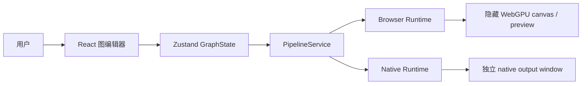

# Open Quartz 架构设计

> 面向实时异构视频管线的图编辑器与双宿主运行时
>
> 文档状态：架构基线（2026-07-30）
>
> 本文描述**当前真实实现、目标边界和迁移缺口**。`已实现`、`迁移中`、`目标`三种状态必须显式区分；目标设计不能被误读为已接入生产路径。

**阅读顺序**：0–3 给出系统结论、上下文和边界；4–7 定义数据、生命周期、执行和资源；8–11 分解两个宿主、SDK 与 ONNX；12–17 描述应用、运维和验证；18–19 记录迁移状态与架构治理规则。

---

## 0. 设计结论

Open Quartz 是一个以有向无环图（DAG）表达实时媒体处理逻辑的编辑器。一个图可以包含：

- WGSL shader：纹理、标量、向量和系统 uniform；
- image、framebuffer、video、system input；
- CPU math 节点；
- ONNX 推理节点；
- renderer terminal 节点；
- feedback/accumulator 跨帧状态。

系统由三个边界组成：

1. **编辑器边界**：React、React Flow、Zustand 只负责图编辑、项目管理、控制状态和结果展示。
2. **运行时边界**：`PipelineService` 把 Store 状态翻译成 runtime 生命周期、graph 更新、resource 操作和结果事件。
3. **宿主边界**：browser 与 Tauri 使用不同的时钟、媒体、GPU 和 ONNX 实现，但共享 graph、WGSL、计划、状态和错误语义。

当前生产路径仍是 browser runtime：

```text
React UI
  -> Zustand Store
  -> PipelineService
  -> RealtimeHost
  -> Compositor
  -> WebGPUExecutionEngine / browser ONNX
```

Tauri native runtime 已经具备真实 DX12 GPU surface、Rust render thread、native video、native resource readback 和 native ONNX session，但尚未由 `PipelineService` 选择为生产路径：

```text
Tauri WebView UI
  -> NativePipelineRuntime
  -> Tauri commands/events
  -> Rust render thread
  -> Engine / ExecutionPlan / GpuExecutor
  -> native wgpu surface + native ORT
```

这不是两个独立产品。目标是共享语义、分离宿主实现，而不是强迫两个宿主共享不可移植的 GPU 对象。

---

## 1. 目标、非目标与约束

### 1.1 目标

1. 让用户以图的方式组合 shader、媒体、数学运算和 AI 推理。
2. 让静态图只执行必要的 render pass，让动态图按宿主时钟连续执行。
3. 让 graph metadata、GPU resource、媒体解码器和 ONNX session 具有清晰的所有权。
4. 让 browser 和 Tauri 共享 graph contract、WGSL contract、执行计划和可观察事件。
5. 让高频 frame path 保持宿主本地：不把每帧 command、JSON 或像素发送到 WebView。
6. 让 graph hot update 尽可能保留未变化的 pipeline、target、feedback 和媒体资源。
7. 让失败可定位到 node、revision、resource generation 或宿主 capability。

### 1.2 非目标

- 不把 Tauri WebView 当作 native GPU canvas。native 最终输出使用独立 output window。
- 不把 browser `GPUTexture`、Tauri `wgpu::Texture`、ONNX session 或 FFmpeg child process 序列化到项目文件。
- 不把 native wgpu device 与 DirectML device interop 描述成已完成的零拷贝能力；当前 capability 明确为不共享。
- 不为未来 3D patch、分布式渲染或多进程图执行提前设计协议。Three.js 依赖存在，但不是当前 2D pipeline 的执行核心。
- 不在 browser 与 native 之间共享宿主对象；只共享可序列化的 graph、plan、输入和事件语义。

### 1.3 硬约束

| 约束 | 规则 |
|---|---|
| 高频路径 | browser 使用 `requestAnimationFrame`；native 使用 Rust render thread；两者都不发送每帧 JSON command |
| 大资源 | image 使用 raw RGBA upload；video 使用宿主 decoder；model 使用 model ID/path；禁止把 bytes 放入 graph snapshot |
| GPU 所有权 | 一个 runtime 独占自己的 GPU object；Store 不应保存 native GPU object |
| Graph | 节点 ID 稳定；edge handle 决定端口连接；拓扑和 node data 变化才触发 plan rebuild |
| Feedback | shader 声明 `previousFrame` 才启用 ping-pong；位置变化不能清空反馈状态 |
| Output | 最终输出不逐帧经过 WebView；preview/screenshot 是显式、按需的 readback |
| 协议 | FFI/Tauri 错误必须保留结构化 code、message、nodeId/details |

---

## 2. 系统上下文

### 2.1 用户可见系统



编辑器的主窗口是控制面：节点、连线、参数、项目文件、播放状态和 preview 选择。运行时是数据面：graph 编译、GPU submission、媒体解码、推理和 output 资源。

### 2.2 两种宿主拓扑

#### Browser：当前生产路径

```text
Browser document
  ├── React UI
  │     ├── Header
  │     ├── NodeGraph
  │     └── SidePanel
  ├── Zustand GraphState
  ├── PipelineService
  ├── RealtimeHost
  │     ├── Clock
  │     ├── MouseState
  │     ├── HTMLVideoElement / VideoSource
  │     └── Compositor
  │           └── WebGPUExecutionEngine
  └── browser ONNX session
        ├── onnxruntime-web WebGPU EP
        └── onnxruntime-web WASM fallback
```

browser runtime 在隐藏 canvas 上执行 WebGPU，renderer mirror/preview 由 `RealtimeHost` 转发到 UI。browser 的最终 screenshot 仍未完成真正的异步 WebGPU readback：`Compositor.captureScreenshot()` 当前返回 `null`，不能写成已实现能力。

#### Tauri：native capability path

```text
Tauri main window / WebView
  ├── React UI
  ├── NativePipelineRuntime
  │     ├── graph metadata command
  │     ├── image raw-byte command
  │     ├── video resource command
  │     ├── preview/readback command
  │     └── frame/error event listener
  └── Tauri command/event bridge
          │
          ▼
Rust native render thread
  ├── NativeGpuRuntime
  │     ├── Engine::new_native()
  │     ├── ExecutionPlan
  │     ├── GpuExecutor
  │     ├── native video sources / FFmpeg
  │     └── SurfacePresenter
  ├── wgpu Device + Queue
  ├── native output Window / Surface
  └── NativeOnnxState
        └── ort CPU / DirectML sessions
```

native output window与 WebView 解耦。WebView 不需要持有 `wgpu::Surface`、`wgpu::Texture` 或 decoder frame。

---

## 3. 分层架构与依赖规则

### 3.1 分层

```text
┌──────────────────────────────────────────────────────────────┐
│ Presentation                                                │
│ React components / React Flow / CSS                         │
├──────────────────────────────────────────────────────────────┤
│ Application state                                            │
│ Zustand GraphState / slices / project persistence            │
├──────────────────────────────────────────────────────────────┤
│ Application orchestration                                    │
│ PipelineService                                              │
├──────────────────────────────────────────────────────────────┤
│ Runtime adapters                                             │
│ RealtimeHost adapter     NativePipelineRuntime adapter       │
├──────────────────────────────────────────────────────────────┤
│ Shared semantics                                             │
│ Rust graph / plan / WGSL / FFI contract / error / events     │
├──────────────────────────────────────────────────────────────┤
│ Host implementations                                         │
│ WebGPU + HTML media + browser ORT    wgpu + FFmpeg + ort     │
└──────────────────────────────────────────────────────────────┘
```

### 3.2 目录职责

| 目录 | 责任 | 不应负责 |
|---|---|---|
| `src/components` | UI 展示、用户输入、节点编辑 | 直接创建 runtime、直接读 GPU texture |
| `src/store` | graph、项目、播放、UI 选择、错误和 preview 状态 | 执行 shader、拥有 native resource |
| `src/services` | Store 与 runtime 的唯一 orchestration 层 | 编译 shader 或实现 GPU backend |
| `src/engine` | browser runtime 的 clock、video、Compositor、WebGPU、browser ONNX | 读取 Tauri state；反向 import Store |
| `src/sdk` | WASM parser/client、native Tauri adapter、边界类型 | 业务 UI 状态管理 |
| `src/catalog` | shader、math、ONNX 静态注册表 | 持有 GPU/session 生命周期 |
| `crates/open_quartz/src/types` | Rust graph/project/node/port schema | 宿主 UI 状态 |
| `crates/open_quartz/src/graph` | 拓扑、dirty set、graph plan 原语 | GPU submission |
| `crates/open_quartz/src/wgsl` | WGSL parse、compile、validate | React/UI 状态 |
| `crates/open_quartz/src/engine` | typed frame、execution plan、dirty execution、feedback state | native surface 生命周期 |
| `crates/open_quartz/src/gpu` | wgpu device/backend、targets、pipelines、upload/readback | Tauri command registration |
| `crates/open_quartz/src/onnx` | native ORT provider、tensor preprocess/postprocess | Tauri WebView events |
| `src-tauri/src` | window、IPC、native render thread、FFmpeg process、resource packaging | React graph editing |

### 3.3 依赖方向

允许的方向：

```text
components -> store / services / catalog
store      -> types / catalog / utils / sdk parser
services   -> store + runtime host
engine     -> types / catalog / sdk parser contract
sdk        -> types / contract / Tauri bridge
Rust       -> Rust types / graph / wgsl / engine / gpu / onnx
Tauri      -> open_quartz + Tauri APIs + native media
```

禁止的方向：

- `executionEngine.ts`、`RealtimeHost`、Rust engine 直接 import Zustand store；
- component 直接调用 `invoke()`；
- Store 保存 `wgpu`/WebGPU pipeline、texture、surface、FFmpeg child 或 ONNX session；
- Rust render thread通过 React callback 直接更新 UI；
- runtime 用字符串匹配错误替代结构化错误码。

### 3.4 当前迁移债务

当前代码仍存在两个需要收敛的边界：

1. `PipelineService` 直接持有 `RealtimeHost`，尚未根据宿主 capability 选择 `NativePipelineRuntime`。
2. `src/sdk/PipelineRuntime.ts` 定义的早期 `PipelineRuntime` 形状与 `RealtimeHost`、`NativePipelineRuntime` 的实际异步资源 API 尚未完全统一。

后续应建立一个真实可实现的 runtime facade，而不是继续让两个 adapter 各自扩展不兼容的方法集合。

---

## 4. 核心数据模型

### 4.1 GraphState

Zustand `GraphState` 当前包含：

- `nodes: Node<ShaderNodeData>[]`；
- `edges: Edge[]`；
- `selectedNodeId`、`activeRendererId`；
- project name/path；
- output preview/data、node errors；
- `loopState`、fps、current time/frame；
- undo/redo history；
- screenshot callback。

`gpuDevice` 目前仍用于 browser edit-time shader validation；它不是 graph serialization 的一部分，也不是 native runtime 状态。长期目标是把 validation device 从 Store 移到 validation service，删除 UI state 对 GPU object 的依赖。

### 4.2 节点与端口

当前 `ShaderNodeData` 的主要节点类型：

```typescript
type NodeType =
  | 'shader'
  | 'input'
  | 'constant'
  | 'onnx'
  | 'renderer'
  | 'math';
```

端口 data type 分为：

- GPU/WGSL 类型：`float`、`int`、`uint`、`bool`、`vec*`、`mat*`、`sampler2D` 等；
- 逻辑类型：`roi`、`mesh`、`json`；
- `auto`：Math 节点用于宽类型连接。

输入 mode：

- `image`：image resource；
- `framebuffer`：指定尺寸/格式的 GPU target；
- `video`：browser HTML video 或 native FFmpeg source；
- `system`：time、delta、frame、mouse、resolution。

### 4.3 Graph semantics

- graph 是节点和 edge 的有向图；
- execution plan 对 graph 做拓扑排序；
- cycle 被记录为 `cycle`，不能假设循环图拥有完整拓扑序；
- input/constant/shader/onnx/renderer/math 对应不同执行命令；
- renderer 是优先输出节点；若没有 renderer，则使用没有 downstream edge 的 terminal node；
- 未连接的 builtin port 从 frame inputs 填充；已连接的 port 优先使用 upstream texture/value；
- `previousFrame` 是 feedback 声明，不是普通输入 port。

### 4.4 Graph snapshot 与 resource descriptor

graph snapshot 只应保存可持久化 metadata：

```text
node id/type/position
node data: shader template、ports、uniform values、resource key/path、尺寸/格式
edges: source/sourceHandle/target/targetHandle
```

不允许保存：

```text
GPUTexture / GPUBuffer / wgpu::Texture / wgpu::Buffer
HTMLVideoElement / FFmpeg Child / ORT Session
raw decoded pixels / output readback bytes
```

Native adapter 在 `setGraph` 前调用 `stripGraphResourcePayloads()`，把 image/video 大 payload 从 graph JSON 中移除；resource bytes 和 decoder descriptor 随后通过独立命令提交。browser 当前仍直接从 browser graph metadata 建立 HTML/WebGPU resource，未来应统一为相同的 resource descriptor API。

---

## 5. 生命周期与状态机

### 5.1 Application 生命周期

```text
App mount
  -> PipelineService.attach(canvas)
  -> subscribe GraphState
  -> user PLAY
  -> create runtime / initialize GPU
  -> setGraph + reconcile resources
  -> play / render
  -> graph hot update, preview selection, pause/resume
  -> STOP
  -> release video, GPU plan, callbacks, device references
  -> App unmount -> detach
```

`App.tsx` 当前只创建 `PipelineService`、挂载 hidden canvas、渲染 UI。服务必须在 unmount 时取消 Store subscription；runtime 必须在 stop/close 时停止 frame loop 和异步 resource listener。

### 5.2 Shared Engine state

Rust `Engine` 状态：

```text
empty -> ready -> running -> paused -> stopped -> disposed
```

主要操作：

- `setGraph`：解析 graph、建立 execution plan、增加 revision、更新 node generations；
- `markDirty`：标记节点及其 downstream；
- `runFrame`：接收 typed frame inputs，生成内部 execution commands；
- `pause/resume/stop`：只改变合法生命周期状态和执行策略；
- `drainEvents`：取出结构化 engine events；
- `dispose`：终止后续执行和旧 generation 的事件。

### 5.3 Graph revision 与 node generation

- `revision` 表示 graph snapshot 版本；
- `node generation` 表示 node resource/semantic contract 的版本；
- position-only graph update 不应增加需要重建 GPU resource 的 generation；
- shader code、ports、edges、尺寸、格式或 source descriptor 改变时，相关 node 及 downstream 变 dirty；
- 删除 node 必须释放其 texture、target、video source、session 和 pending async work。

### 5.4 Browser scheduling

`RealtimeHost` 根据图判断 static/dynamic：

- video、动态 system source、`iTime`/`iFrame`/`iMouse` 或 feedback 会使 pipeline dynamic；
- static pipeline 在资源加载完成后执行单帧，并在 async ONNX 完成时安排补帧；
- dynamic pipeline 使用 `requestAnimationFrame` 连续执行；
- `Clock` 提供 time、delta、frame、date；`MouseState` 提供 mouse；
- pause 会冻结 clock 和 video；resume 恢复；stop 取消 RAF、销毁 video 和 compositor。

### 5.5 Native scheduling

Tauri native render worker：

- Rust thread 约 16 ms tick；
- `playing=true` 时调用 `NativeGpuRuntime::render_next()`；
- video frames 在 render thread 内从 decoder slot 上传到 GPU；
- `Engine::run_frame` 生成命令；`GpuExecutor::execute_commands` 消费命令；
- `SurfacePresenter` 把最终 texture呈现到 native output window；
- 每 6 帧发送一次 `native-runtime-frame` metadata event；错误发送 `native-runtime-error` 并停止播放；
- frame command 不通过 Tauri IPC 返回给 WebView。

---

## 6. 图编译与执行

### 6.1 统一计划生成

Rust `build_execution_plan_with_options()` 执行：

```text
ProjectNode[] + Edge[]
  -> graph node/edge representation
  -> topological sort
  -> upstream port map
  -> connected builtin detection
  -> target size/format resolution
  -> WGSL compile
  -> WGSL validation
  -> feedback detection
  -> output node selection
  -> ExecutionPlan
```

`ExecutionPlan` 包含：

- `sorted_ids`；
- `NodeExecutionPlan[]`；
- upstream mapping；
- builtin ports；
- target dimensions/format；
- compiled shader and validation errors；
- feedback flag；
- output nodes；
- default size；
- cycle flag。

browser 当前还保留独立的 `WebGPUExecutionEngine.prepare()` 逻辑；Rust plan 已用于 WASM contract 和 native runtime。Stage F/G 前应继续消除 browser/native 的计划语义漂移，但不能让 browser GPU object 进入 Rust。

### 6.2 Dirty execution

Rust `ExecutionEngine` 保持：

- `DirtySet`；
- feedback read/write index；
- first-frame clear 标记；
- math scalar cache；
- node list 和 execution plan。

每帧只取按拓扑序排列的 dirty nodes。动态节点自动 dirty；上游 resource upload 会显式 `mark_dirty`。shader、math、onnx、renderer 生成不同的 `ExecutionCommand`。

### 6.3 Shader execution

WGSL compile contract 负责：

1. 从用户 code 和 ports 建立 binding plan；
2. 注入 system uniforms、sampler、texture、feedback bindings；
3. 对 native video 输入选择普通 sampled texture；
4. 对 browser video 保留 `texture_external` 语义；
5. 去除冲突的用户声明；
6. 通过 `naga` 验证并返回 source mapping/diagnostics。

Rust parser 已由 `src/sdk/wgslParser.ts` 作为同步 production parser 使用：`main.tsx` 在 React mount 前调用 `initializeSdk()`，后续 `parseWgslShader()` 通过 `requireSdk()` 使用 WASM binding。

### 6.4 Feedback

feedback shader 通过引用 `previousFrame` 声明跨帧状态：

```text
frame N:
  feedback[read] -> shader -> feedback[write]
  swap(read, write)
```

首帧清空由 `feedbackClearColor`/plan 决定。position-only graph update 必须保留 feedback indices 和 GPU ping-pong texture；shader contract、尺寸、格式改变时才重建。

### 6.5 Math、input、ONNX、renderer

| 节点 | 计划阶段 | 执行阶段 |
|---|---|---|
| input | resource/constant descriptor | 标记 resource ready；不产生 shader command |
| math | 保留 upstream scalar mapping | CPU 计算，缓存 scalar output |
| shader/constant | compile、bindings、target、feedback | GPU render pass |
| ONNX | 计划 input/output contract | browser 已接入；native session 已接入但尚未接入 graph texture/tensor path |
| renderer | 选择 output target | browser mirror/native surface present |

---

## 7. 资源架构

### 7.1 Resource registry

runtime 逻辑上维护以下资源集合：

```text
images[nodeId]    -> image texture + descriptor
videos[nodeId]    -> browser VideoSource 或 native NativeVideoSource
models[nodeId]    -> browser model/session 或 native ORT session
pipelines[key]    -> compiled pipeline/bind group layout
renderTargets[id] -> target + feedback ping-pong
outputs[nodeId]   -> readable output texture descriptor
```

Store 只保存 descriptor/key/path，不保存以上对象。

### 7.2 Image

Browser：

- `imageDataUrl` 通过 `Image.decode()`、canvas 2D 转 RGBA；
- `rawDataUrl` 通过 fetch bytes，按 `fbWidth`/`fbHeight`/`fbFormat` 解码；
- `WebGPUExecutionEngine` 将 image 作为 texture source。

Native：

- TS adapter 校验 `width * height * 4`；
- 以 raw `Uint8Array` body 发送到 `native_gpu_upload_image`；
- node/width/height 通过 headers 发送；
- Rust 直接 `queue.write_texture` 或对应 backend upload；
- descriptor 未变化时不重复发送；
- 删除或切换 source 时调用 `native_gpu_remove_texture`。

### 7.3 Video

Browser：

- `VideoSource` 管理 HTMLVideoElement、camera stream 或 file URL；
- 每帧将 video element 传给 browser WebGPU path；
- `copyExternalImageToTexture`/external texture 是 browser 宿主行为。

Native：

- `NativeVideoSource` 通过 FFmpeg probe 输入尺寸和 fps；
- decoder child 输出 raw RGBA；
- reader thread 写入 generation-tagged frame slot；
- render thread 调用 `upload_latest()`，只上传新 generation；
- `GpuExecutor` 使用普通 sampled texture；
- pause 停 decoder，resume 重启 decoder，file source 保存 position；
- `NativeVideoDevice` 通过平台 backend discovery 返回 id/label。

必须满足：decoder frame 不通过 Tauri IPC 传输；同一个 frame 只允许一个 native upload owner；同 node 的 video descriptor 替换会丢弃旧 decoder并由后续 frame 更新/复用 texture；从 video 切换到非 video 时必须在同步 replacement image 前 detach source并移除旧 texture。

### 7.4 Render targets 与 output

每个 shader/renderer target descriptor 至少包含：

```text
width, height, texture format, filter/wrap, feedback flag
```

target 重建条件：

- 尺寸改变；
- format 改变；
- shader binding/output contract 改变；
- feedback layout 改变。

output readback payload 当前格式：

```text
u32 width little-endian
u32 height little-endian
width * height * 4 RGBA8 bytes
```

Native `read_output` 只接受 `rgba8unorm` output。Browser output readback仍由 `Compositor.readNodeOutput()`负责；真正的 browser screenshot API 尚未完成。

### 7.5 Resource reconciliation

每次 native graph update 的实际同步顺序：

```text
1. set graph metadata
2. reconcile video resources
     2.1 attach/update wanted descriptors
     2.2 detach stale descriptors
3. reconcile image resources
     3.1 upload/update wanted descriptors
     3.2 remove stale descriptors
4. changed resource nodes become dirty
5. render on next host tick
```

顺序不是实现细节：从 video 切换到 image 时，stale video detach 会移除 node texture，因此必须在 replacement image upload 前完成。反方向切换时，video descriptor 先建立，随后 image reconciliation 删除旧 image texture；首个 decoder frame再上传新的 video texture。

---

## 8. 浏览器运行时

### 8.1 组件关系

```text
RealtimeHost
  ├── Clock
  ├── MouseState
  ├── VideoSource map
  └── Compositor
        ├── WebGPUExecutionEngine
        ├── WebGPUBackend
        ├── RenderTarget / TextureHandle
        └── browser ONNX inference
```

`RealtimeHost` 负责 lifecycle、static/dynamic scheduling、video reconciliation、preview selection 和回调；`Compositor` 负责 plan preparation、render、readback 和 renderer mirror；`WebGPUExecutionEngine` 负责 shader/target/uniform/binding/execution。

### 8.2 Browser ONNX

browser ONNX 当前支持：

- catalog model 与 custom model；
- `onnxruntime-web` WebGPU/WASM backend；
- super-resolution、background removal、depth、generic image-to-image、detection、segmentation；
- preprocessing、postprocessing、overlay 和 backend reporting；
- async completion 后 static pipeline 补帧；
- video/upstream dynamic input 触发 per-frame inference。

browser ONNX 与 Rust native ORT 是两套 session host；它们共享 model/task semantics，但不共享 session object。

### 8.3 Browser 当前限制

- `PipelineService` 是 browser-only；
- `captureScreenshot()` 仍是 TODO；
- browser 与 native 的统一 `PipelineRuntime` contract 尚未完成；
- Store 仍能看到 browser `GPUDevice`；
- browser path 的大 resource lifecycle 尚未完全复用 native descriptor reconciliation 模型。

---

## 9. 原生运行时

### 9.1 NativeGpuRuntime 所有权

`NativeGpuRuntime` 独占：

- output `Window` 和 `wgpu::Surface`；
- `SurfaceConfiguration`；
- shared `GpuBackend`；
- `GpuExecutor`；
- native `Engine`；
- output node id、clock/frame counters、mouse；
- `HashMap<String, NativeVideoSource>`。

`NativeRuntimeState` 负责跨 command 共享 runtime mutex、render worker、alive/playing flags，并在 Drop 时 shutdown worker。

### 9.2 Native frame

```text
render_next()
  -> compute time/delta/frame
  -> upload latest video frames
  -> Engine::run_frame()
  -> borrow pending internal commands
  -> GpuExecutor::execute_commands()
  -> resolve output texture
  -> resize/configure surface if necessary
  -> SurfacePresenter::present()
  -> emit metadata event every 6 frames
```

`Engine::pending_commands()` 只在 Rust 内部给 `GpuExecutor` 使用。它不是 Tauri response，也不是 WebView payload。

### 9.3 Native command categories

| 类别 | 当前命令 | 传输内容 |
|---|---|---|
| 初始化 | `native_gpu_initialize` | capability/runtime info |
| graph | `native_gpu_set_graph` | graph JSON metadata |
| image | `native_gpu_upload_image` / `native_gpu_remove_texture` | raw RGBA 或 node descriptor |
| video | `native_gpu_attach_video` / `native_gpu_detach_video` | source kind/path/config |
| control | play/pause/resume/stop/mouse | small scalar/control data |
| output | `native_gpu_render_once` / `native_gpu_read_output` | metadata或显式 RGBA readback |
| events | `native_gpu_drain_events` | structured Engine event batch |
| model | native ONNX capabilities/load/unload | model ID、provider options |
| close | `native_gpu_close` | no payload |

### 9.4 Native output event

`native-runtime-frame` 只包含：

```typescript
interface NativeFrameRendered {
  frame: number;
  revision: number;
  outputNodeId: string;
  width: number;
  height: number;
}
```

`NativePipelineRuntime` 收到该事件后：

1. 更新 frame/output size callback；
2. 若设置 preview node，合并 pending readback 请求；
3. 调用 `native_gpu_read_output`；
4. 校验 8-byte header、尺寸和 RGBA payload；
5. 转成 data URL 或 callback data。

---

## 10. Rust SDK 与 FFI

### 10.1 Crate 模块

```text
crates/open_quartz/src/
  types/       Rust graph/project/node/port schema
  graph/       topo sort、dirty set、graph planning
  wgsl/        parser、compiler、validation
  engine/      plan、typed frame、execution commands、feedback
  gpu/         backend、targets、executor、readback
  onnx/        ort session、providers、pre/postprocessing
  ffi/         Engine、events、errors、JSON/WASM exports
```

crate 可构建 `rlib`/`cdylib`，WASM 目标不启用 native ORT，native target启用动态加载的 `ort`/`ort-sys`。

### 10.2 WASM public contract

Rust FFI 暴露：

- `api_version()`、`capabilities_json()`；
- `Engine` constructor、`setGraph`、`markDirty`、`runFrame`、`setVideoNodes`；
- lifecycle：pause、resume、stop、dispose；
- revision、lastFrame、pendingCommandCount、engineState；
- `drainEvents`；
- parser/compiler/validator/plan/preprocess/postprocess helpers。

WASM `runFrame()` 返回 `void`。execution commands 保持 Rust 内部，只暴露 command count 和 events；这条规则适用于未来 native/browser 统一的高频 path。

### 10.3 Tauri adapter contract

`NativePipelineRuntime` 是低频 control/resource adapter，不是每帧 client scheduler：

- initialize 时注册 frame/error listeners；
- graph update 发送 metadata；
- image bytes 通过 raw body；
- video/model 发送 descriptor/ID；
- preview/screenshot 显式 readback；
- `close()` 清理 listeners、resource maps 和 native runtime。

### 10.4 JSON 与 bytes 规则

| 数据 | 允许的边界编码 |
|---|---|
| graph snapshot | JSON，低频 |
| shader source/diagnostics | JSON，编辑或编译时 |
| time/delta/frame | numeric arguments，禁止 JSON frame blob |
| mouse/date/resolution | 固定长度 typed array/array |
| image | raw `Uint8Array`，禁止 base64 graph payload |
| video | path/device/config，frame bytes 留在 native thread |
| model | model ID/path；native 从 app data 加载 |
| output | metadata event；显式 readback 才传 RGBA |
| errors/events | structured JSON/typed union |

---

## 11. ONNX 架构

### 11.1 Browser session path

```text
Input GPU texture
  -> RGBA/tensor preprocessing
  -> onnxruntime-web WebGPU/WASM session
  -> task-specific postprocess
  -> output texture / overlay / logical result
```

browser path 可以使用 WebGPU EP；其目标是维持 shader → ONNX → shader 的单 JS `GPUDevice` 语义，避免不必要的 CPU readback。

### 11.2 Native session path

```text
Tauri model ID
  -> app-data model path
  -> NativeOnnxState.sessions[nodeId]
  -> ort Session
  -> CPU 或 DirectML (+ optional CPU fallback)
  -> TensorOutput
```

native capability 当前明确：

```text
cpu: true
DirectML: Windows capability
sharedWgpuDevice: false
```

native session 已能加载模型并运行 identity/CPU/DirectML contract，但 `ExecutionCommand::onnx` 尚未连接 native GPU texture/tensor resource、异步完成事件和 graph-level six-task execution。因此 Stage F 仍是未完成的主线。

### 11.3 Model ownership

- catalog model：由 registry/catalog 提供 ID、URL、task metadata；
- custom model：项目保存 path/name metadata；
- browser model manager：负责下载、缓存、introspection、session；
- native model state：按 node ID 持有 ORT session；
- graph snapshot 不包含 model bytes；
- node 删除或 stop 时必须卸载 session/取消 pending task。

---

## 12. 项目文件与资源持久化

### 12.1 文件格式

当前 project file version：`0.4.0`。

```typescript
interface ProjectFile {
  version: string;
  name: string;
  createdAt: string;
  updatedAt: string;
  graph: {
    nodes: ProjectNode[];
    edges: ProjectEdge[];
  };
}
```

保存规则：

- video 的 `videoUrl` 不写入项目文件；保留 `videoFilePath`/device metadata；
- prebuilt shader 的 `shaderCode` 清空，只保存 `shaderTemplateId`；
- image/resource path 和 dimensions 保存为 metadata；
- runtime GPU objects、decoded bytes、sessions 不保存。

加载规则：

- 严格检查 version；
- 根据 `shaderTemplateId` 从 catalog 恢复 code；
- Tauri 根据 `videoFilePath` 生成 WebView asset URL供 browser preview 使用；
- native adapter 使用 native path，不依赖 `videoUrl` 作为 FFmpeg source；
- 资源文件被移动时保留 node，但通过 node error 报告不可用 source。

### 12.2 兼容策略

项目版本升级必须提供显式 migration；禁止静默把未知版本当当前版本解析。新增 node data 字段应允许缺省，改变端口/edge semantics 时必须增加版本或 migration test。

---

## 13. UI 与应用编排

### 13.1 UI 组件

```text
App
  └── ReactFlowProvider
        ├── Header
        ├── NodeGraph
        │     └── node components / handles / canvas
        └── SidePanel
              └── selected node editors / preview / errors
```

UI 只通过 Store action 修改 graph。节点组件不应直接触碰 WebGPU、Tauri invoke 或 Rust Engine。

### 13.2 Store slices

Store 当前由以下 slice 组合：

- `graphSlice`：nodes、edges、node factories、connect/remove/update、undo/redo、load/clear graph；
- `transportSlice`：play/pause/resume/stop、fps/time/frame；
- `projectSlice`：project name 与 saved file path；
- `uiSlice`：selection、preview、errors、screenshot callback、browser GPU device。

`helpers.ts` 提供 node factory、system source、catalog/model helper 和共享 counters。catalog 是静态数据，不应成为 runtime singleton 的替代品。

### 13.3 PipelineService

`PipelineService` 订阅 Store，并处理：

- stopped → playing：创建/初始化 runtime，设置 preview，提交 graph；
- playing ↔ paused：转发 lifecycle；
- playing 状态下 nodes/edges 改变：调用 graph hot update；
- selected node 改变：同步 preview node；
- runtime callbacks：写回 fps/time/frame、output preview/data、size、backend、errors；
- stop/detach：取消 callback/subscription、释放 runtime。

目标实现应将 `RealtimeHost` 与 `NativePipelineRuntime` 放在同一 adapter selection 后面：

```text
PipelineService
  -> RuntimeFactory(capabilities, host)
       -> BrowserPipelineRuntime
       -> NativePipelineRuntime
```

选择逻辑必须显式、可测试、可观测；不得创建两个 runtime 后用隐藏 fallback 运行。

---

## 14. 错误、事件与可观察性

### 14.1 Structured SDK errors

Rust SDK 使用 `SdkErrorCode`：

```text
disposed
invalid-frame
invalid-graph
invalid-resource
invalid-state
not-prepared
unknown-node
protocol-mismatch
invalid-response
```

错误最少包含：

```typescript
{
  code: string;
  message: string;
  nodeId?: string;
  details?: string;
}
```

TS 通过 `decodeSdkError()` 统一解析；UI 只展示 message，日志和测试保留 code/nodeId/details。

该结构化协议当前完整覆盖 Rust SDK/WASM `Engine` 边界；部分 Tauri commands 和 `native-runtime-error` 仍返回普通 `String`。把 Tauri host error 映射为同一 `SdkErrorPayload` 是 runtime facade 收敛的一部分，不能把现状描述为已完成。

### 14.2 Engine events

Engine events 当前包括：

- state；
- graph-ready；
- resource-invalidated；
- resource-released；
- frame-planned。

Native runtime frame/error events属于 Tauri host event，不能和 Engine event 混成同一字符串协议。adapter 负责把宿主 event 映射到应用可观察状态。

### 14.3 失败边界

- graph parse/plan error：阻止该 revision 进入运行；
- shader validation error：node error，保留上一份可执行 plan（若宿主支持）；
- missing image/video/model：resource error，禁止上传空 resource；
- GPU device/surface loss：停止 host，释放 resource，发出 runtime error；
- preview readback failure：不影响主 render loop，只更新 preview error；
- decoder EOF：file loop 按 config 重启或保持 stopped；camera decoder error 必须停止 source。

---

## 15. 性能模型

### 15.1 高频路径

Browser：

```text
rAF -> Clock -> video map -> Compositor.render -> renderer mirror
```

Native：

```text
Rust worker -> video upload -> Engine.run_frame -> GpuExecutor -> present
```

两条路径都不应：

- 每帧 JSON stringify graph；
- 每帧 Tauri invoke；
- 每帧 GPU→CPU→GPU；
- 每帧发送 output pixels 到 WebView；
- 重新创建未改变的 pipeline/target/video decoder。

### 15.2 可测量指标

任何性能结论必须使用同一 graph、同一分辨率、同一模型和同一 host 记录：

- render frame time / p50 / p95；
- GPU submission time；
- video decode/upload time；
- ONNX preprocessing/inference/postprocessing time；
- graph rebuild time；
- resource upload/reuse count；
- preview readback count/bytes；
- dropped/late frame count；
- native IPC command/event count。

未有 benchmark 数据前，禁止使用“零拷贝”“10x”“实时无开销”等无法验证的收益描述。native video 当前是 decoder thread → RGBA texture upload，不应称为 decoder output zero-copy。

---

## 16. 安全、平台和打包

### 16.1 Tauri 边界

当前 Tauri 配置：

- frontend dev/build 分别使用 Vite；
- asset protocol enabled，scope 当前为 `**`；
- Tauri commands 集中注册于 `src-tauri/src/lib.rs`；
- native output window label 为 `native-output`；
- model、image、video bytes 不应通过任意 command 直接执行 shell。

当前 CSP 为 `null`，asset scope 较宽。正式发布前必须按实际 asset/model/video path 收紧 CSP 和 asset scope；不能因为本地 Tauri 环境而把路径输入视为可信。

### 16.2 Native runtime assets

平台 runtime 资源：

- Windows：FFmpeg、FFmpeg notice、`onnxruntime.dll`、`DirectML.dll`；
- macOS/Linux：FFmpeg、FFmpeg notice；
- `npm run prepare:runtime` 构建 WASM SDK、复制 ORT、复制平台 FFmpeg；
- Tauri bundle 通过平台 conf 文件把 runtime 资源放入 app `runtime/` 目录。

FFmpeg 是外部发行物，打包和发布必须保留对应 notice/license 文件。

### 16.3 Platform capability

| 能力 | Browser | Windows native | macOS/Linux native |
|---|---:|---:|---:|
| WebGPU shader graph | 已实现 | native wgpu 已实现 | 代码路径已配置，需目标平台 smoke |
| HTML video input | 已实现 | 不作为 native source | 不作为 native source |
| FFmpeg file video | browser URL | 已实现 | 配置/代码路径 |
| FFmpeg camera | browser MediaStream | DirectShow | AVFoundation/V4L2 path |
| native ORT CPU | browser ORT/WASM | 已实现 | native session path |
| DirectML | 不适用 | capability-dependent | 不适用 |
| wgpu/ORT shared device | browser 单 JS device | 未实现，显式 false | 未实现 |

---

## 17. 构建与测试策略

### 17.1 日常命令

```bash
npm run build
npx tsc -b --noEmit
npx vitest run
cargo test --manifest-path crates/open_quartz/Cargo.toml --all-targets
cargo test --manifest-path src-tauri/Cargo.toml --all-targets
cargo clippy --manifest-path crates/open_quartz/Cargo.toml --all-targets -- -D warnings
cargo clippy --manifest-path src-tauri/Cargo.toml --all-targets -- -D warnings
```

### 17.2 测试层级

1. **Pure contract tests**：types、serialization、error/event decoding、WGSL parser/compiler、graph topo/dirty。
2. **Rust engine tests**：revision/generation、feedback preservation、typed frame、execution command、resource lifecycle。
3. **GPU tests**：shader cascade、uniform、feedback、target reuse、readback。
4. **Browser adapter tests**：RealtimeHost lifecycle、ONNX completion、video reconciliation、preview selection。
5. **Native adapter tests**：command payload、raw image upload、video descriptor、camera discovery、event coalescing、resource replacement。
6. **Smoke tests**：真实 Chromium/WASM、真实 native DX12 surface、FFmpeg multi-frame decode、DirectML identity、installer resource inclusion。

### 17.3 必须守护的 contract

- port label 与 port ID preservation；
- graph edge handle 到 upstream binding 的映射；
- position-only update 不重置 feedback；
- image/video descriptor 不重复 upload；
- stale video detach 不删除 replacement image；
- decoder 每个 generation 都是完整 RGBA frame；
- native frame event 不带 pixels；
- `read_output` header 与 byte length 一致；
- disposed runtime 不再发 event；
- DirectML 不可用时 capability 与 fallback 行为显式。

---

## 18. 当前状态与路线图

### 18.1 已完成

- React/React Flow/Zustand graph editor；
- WGSL parser/compiler/validation，Rust WASM parser 已成为 production parser；
- browser WebGPU shader/math/input/feedback/renderer pipeline；
- browser ONNX preprocessing、inference、postprocessing 和 async static rerender；
- Rust graph topology、dirty set、execution plan、typed frame、revision/generation/event lifecycle；
- native wgpu `GpuBackend`、`GpuExecutor`、pipeline/target/readback；
- Tauri native output window 和 Rust render thread；
- native image upload/reuse、FFmpeg file/camera decoder、video texture binding、camera discovery；
- native preview/screenshot/output readback adapter；
- native ORT CPU/DirectML session capability和 model-ID load；
- Windows runtime packaging及 FFmpeg/ORT/DirectML smoke。

### 18.2 当前未完成

1. `PipelineService` 尚未根据 host/capability 选择 native runtime。
2. browser/native 的真实 runtime facade 尚未统一，`PipelineRuntime.ts` 仍包含早期契约。
3. native `ExecutionCommand::onnx` 尚未连接 texture/tensor resource 与 async completion。
4. native graph 尚未覆盖完整 ONNX task set、cascade 和静态补帧语义。
5. browser screenshot readback 尚未实现。
6. camera device discovery 尚未接入 SidePanel 的跨平台 UI 选择流程。
7. Tauri CSP/asset scope 尚未按发布安全要求收紧。

### 18.3 Stage F：ONNX graph cutover

必须完成：

- native texture → tensor 和 tensor → texture contract；
- native ONNX async completion event；
- ONNX node dirty propagation；
- browser/native task result parity；
- cascaded ONNX graph；
- video-driven per-frame ONNX；
- DirectML/CPU fallback observability；
- native output/preview 与 ONNX output size/data event。

### 18.4 Stage G：production runtime switch

只有同时满足以下条件，才允许修改 `PipelineService`：

- browser/native shared graph semantics contract tests 全部通过；
- runtime facade 方法、错误、events、resource lifecycle 已统一；
- native Stage F ONNX parity 完成；
- Tauri window close、stop、dispose、device loss 无悬挂 worker/video/session；
- browser path 仍保留且不会被 native fallback 静默替代；
- Tauri 与 browser 各自的 smoke、installer、性能基线均通过。

切换应是显式 host selection：

```text
if isTauri && nativeCapabilities.gpuExecution && stageFReady:
    use NativePipelineRuntime
else:
    use BrowserPipelineRuntime
```

禁止同时启动两个 runtime，再用其中一个作为隐式 fallback。

---

## 19. 架构变更规则

后续任何架构改动必须回答以下问题：

1. 这是 UI、Store、service、adapter、shared Rust 还是 host-specific 责任？
2. 新数据是 graph metadata、低频 descriptor、typed frame input、resource bytes 还是 event？
3. 它的所有权在哪个 runtime？谁在 stop/dispose 时释放？
4. 它是否进入高频 frame path？如果是，为什么不会产生 JSON/IPC/pixel traffic？
5. browser 与 native 是否共享 observable semantics，还是明确的 platform capability 差异？
6. graph revision、node generation、dirty set 和 feedback state 如何变化？
7. 失败如何编码、如何定位到 node/resource/revision？
8. 是否有对应的 contract test 和 host smoke test？
9. 文档描述的是已实现能力、迁移中的能力，还是目标能力？

最重要的不变量：

```text
Graph metadata 可以跨边界。
GPU object、decoder frame、model session 不跨边界。
Frame clock 留在执行宿主。
Pixels 只在显式 preview/screenshot 时跨边界。
Rust Engine 保持 graph/execution semantics。
Host adapter 保持 surface/media/ONNX/GPU ownership。
Production switch 必须一次性、显式、可回滚地完成。
```
